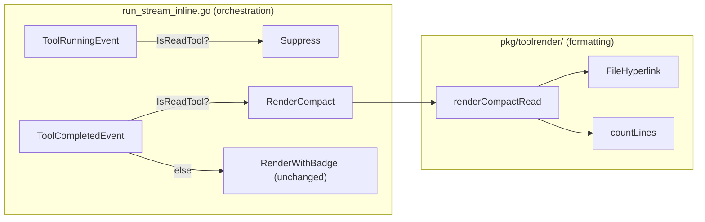

# Phase 2.1: Read Tool Compact Rendering

## Target Output

```
● Read(path/to/file.go)          <-- path is an OSC 8 clickable hyperlink
    Read 125 lines                <-- dim, indented result summary
```

Failed reads:

```
● Read(path/to/missing.go)
    ✗ file not found
```

Replacing the current verbose format:

```
📖 Read  path/to/file.go  (1.5 KB, 33 lines, 4ms)  ✓
     │ package main
     │ import "fmt"
     │ func main() {
     ⋮ 122 more lines
```

## Architectural Approach

The change touches two layers with clear responsibilities:




- `**toolrender**`: New `RenderCompact(tc, opts)` function handles formatting. For Phase 2.1, only read tools get compact treatment; all others fall through to `RenderWithBadge`. As Phases 2.2-2.4 land, branches are added to `RenderCompact` and the fallback shrinks.
- `**run_stream_inline.go**`: Decides *when* to render. Uses `IsReadTool` to suppress running events for reads and route completed events to `RenderCompact`.

## Design Decisions (Pre-Approved)

- **Running event suppression for reads**: Confirmed. Reads are fast (<100ms); showing both running and completed is redundant in compact mode.
- **Read grouping deferred**: Confirmed. Grouping (3+ sequential reads collapsed) ships in Phase 2.1b.
- `**CompactOptions` struct for DI**: `RenderCompact` accepts a `CompactOptions` with `HyperlinksEnabled bool` and `WorkingDir string`. The inline renderer creates this once at init. No env var reads inside formatting functions (per coding guidelines).
- **OSC 8 / `stripANSI` gap is NOT a blocker**: Compact read output goes to stderr via `statusf`. It does not flow through `MeasureColorizedString` or `TrimColorizedString` (those are used by table rendering). The gap only matters if hyperlinked strings enter width-computed contexts — not the case here.
- `**ansi.StringWidth()` for OSC 8 verification deferred**: Compact reads don't use `truncateANSI`. No width calculation needed. Empirical verification remains on the list for phases that truncate hyperlinked strings.

## Files to Create

### 1. `[client-apps/cli/pkg/toolrender/render_compact.go](client-apps/cli/pkg/toolrender/render_compact.go)` (~80-100 lines)

New file with compact rendering logic:

```go
// CompactOptions configures compact tool rendering. Created once per renderer
// lifecycle and passed to RenderCompact on each call.
type CompactOptions struct {
    HyperlinksEnabled bool
    WorkingDir        string
}

// RenderCompact returns a compact display of a tool call. For implemented
// tools, this produces a terse two-line format (header + result summary).
// For tools not yet converted to compact format, falls back to
// RenderWithBadge with the tool's status badge.
func RenderCompact(tc ToolCallInfo, opts CompactOptions) string

// IsReadTool reports whether toolName represents a file read tool.
func IsReadTool(toolName string) bool
```

Internal function `renderCompactRead` builds the two-line format:

- Line 1: `bulletStyle.Render("●") + " " + labelStyle.Render("Read") + "(" + displayPath + ")"`
- Line 2: `dimStyle.Render("    Read " + formatLineCount(countLines(tc.Result)))`
- Path wrapped in `FileHyperlink(displayPath, absolutePath, opts.HyperlinksEnabled)`
- Relative paths resolved via `filepath.Join(opts.WorkingDir, path)` when `WorkingDir` is set
- Failed reads: second line shows `"    ✗ " + truncate(tc.Error, 60)`
- New style: `bulletStyle = lipgloss.NewStyle().Foreground(lipgloss.Color("2"))` (green bullet)

### 2. `[client-apps/cli/pkg/toolrender/render_compact_test.go](client-apps/cli/pkg/toolrender/render_compact_test.go)` (~150-200 lines)

Tests covering:

- Read tool: compact format with line count
- Read tool: OSC 8 hyperlink present when enabled
- Read tool: plain text when hyperlinks disabled
- Read tool: relative path resolution with WorkingDir
- Read tool: failed read with error message
- Read tool: empty result (0 lines)
- `IsReadTool`: true for "read", "read_file"; false for "shell", "write", unknown
- `RenderCompact` fallback: non-read tool returns `RenderWithBadge` format

## Files to Modify

### 3. `[client-apps/cli/cmd/stigmer/root/run_stream_inline.go](client-apps/cli/cmd/stigmer/root/run_stream_inline.go)`

Three changes:

**a. Add `compactOpts` to `inlineRenderer` struct** (lines 32-39):

```go
type inlineRenderer struct {
    cfg         inlineRenderConfig
    compactOpts toolrender.CompactOptions  // initialized once in renderInline
    // ... existing fields ...
}
```

**b. Initialize in `renderInline`** (after line 45):

```go
r := &inlineRenderer{
    cfg: cfg,
    compactOpts: toolrender.CompactOptions{
        HyperlinksEnabled: toolrender.HyperlinksEnabled(cfg.status),
        WorkingDir:        "", // populated from execution context if available
    },
}
```

Note: `WorkingDir` source needs investigation. The inline renderer may not currently have access to the agent's working directory. If unavailable, `FileHyperlink` receives the path as-is — hyperlinks still work for absolute paths (most backend paths are absolute). This is acceptable for Phase 2.1; relative path resolution can be added when the working directory becomes available.

**c. Update `renderToolRunning` and `renderToolCompleted`** (lines 171-179):

```go
func (r *inlineRenderer) renderToolRunning(e executiontui.ToolRunningEvent) {
    if toolrender.IsReadTool(e.ToolCall.Name) {
        return // suppress — completed event shows the result
    }
    line := toolrender.RenderWithBadge(e.ToolCall, toolrender.StateBadge("running"))
    r.statusf("%s\n", line)
}

func (r *inlineRenderer) renderToolCompleted(e executiontui.ToolCompletedEvent) {
    line := toolrender.RenderCompact(e.ToolCall, r.compactOpts)
    r.statusf("%s\n", line)
}
```

### 4. `[client-apps/cli/pkg/toolrender/BUILD.bazel](client-apps/cli/pkg/toolrender/BUILD.bazel)`

Add `render_compact.go` to `srcs` and `render_compact_test.go` to test `srcs`.

## Not In Scope (Deferred)

- **Read grouping** (3+ sequential reads collapsed): Phase 2.1b
- **Write/Edit compact rendering**: Phase 2.2
- **Shell compact rendering**: Phase 2.3
- **Other tools (glob, search, delete, think)**: Phase 2.4
- `**stripANSI` OSC-awareness**: Only needed when hyperlinks flow through width measurement
- `**ansi.StringWidth()` OSC 8 verification**: Only needed when hyperlinks are truncated

## Verification

- `go vet ./client-apps/cli/pkg/toolrender/...` — compiles clean
- `go test ./client-apps/cli/pkg/toolrender/...` — all existing + new tests pass
- `go vet ./client-apps/cli/cmd/stigmer/root/...` — compiles clean (note: pre-existing `run_create.go:114` error from multi-source-workspace project is expected)

