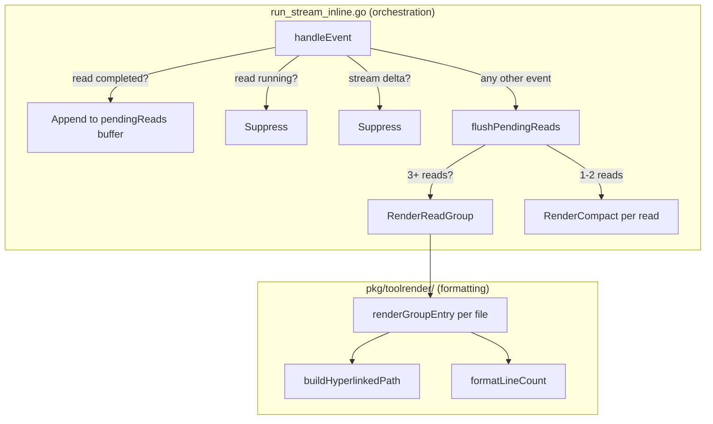

# Phase 2.1b: Read Tool Consecutive-Event Grouping

## Target Output

3 reads (all shown):

```
● Read 3 files
    main.go (125 lines)
    config.go (43 lines)
    util.go (201 lines)
```

4 reads (all shown — avoid pointless "+1 more"):

```
● Read 4 files
    main.go (125 lines)
    config.go (43 lines)
    util.go (201 lines)
    handler.go (87 lines)
```

6 reads (truncated to 3 visible):

```
● Read 6 files
    main.go (125 lines)
    config.go (43 lines)
    util.go (201 lines)
    … +3 more
```

With failures:

```
● Read 4 files (1 failed)
    main.go (125 lines)
    missing.go ✗ file not found
    config.go (43 lines)
    util.go (201 lines)
```

Fewer than 3 reads — no grouping, rendered individually with existing `RenderCompact`:

```
● Read(main.go)
    Read 125 lines
● Read(config.go)
    Read 43 lines
```

## Architecture

Two layers with clear responsibilities:




- **Orchestrator** (`run_stream_inline.go`): Owns the buffering decision — when to accumulate, when to flush, and whether count meets the grouping threshold. This is a rendering-order concern.
- **Formatter** (`render_compact.go`): Owns the visual format — how a group looks. Stateless, pure function. Receives a slice, returns a string.

## Design Decisions (Confirmed)

- **Consecutive-event grouping**: Buffer read completions. Flush when any non-read, non-suppressed event arrives. No timers, no time windows. Deterministic, testable, semantically correct.
- **Threshold = 3**: Fewer than 3 reads render individually via `RenderCompact`. 3+ reads render as a group via `RenderReadGroup`.
- **Smart truncation**: `maxVisibleInGroup = 3`. Show all files when `count <= maxVisibleInGroup + 1` (i.e., 4 or fewer). Truncate to 3 + "... +N more" for 5+. Avoids wasting a line to hide a single entry.
- **Failed reads in groups**: Shown inline with error. Header shows failure count: `● Read N files (M failed)`.
- **File paths are hyperlinked**: Reuses `buildHyperlinkedPath` from Phase 2.1.
- **ToolStreamDeltaEvent does not flush**: It produces no visible output. Flushing on it would break grouping when a concurrent streaming tool (shell) is running alongside reads.
- **Edge case — channel close / context cancel**: `flushPendingReads()` called before returning in `renderInline` to avoid losing buffered reads.

## Files to Modify

### 1. [client-apps/cli/pkg/toolrender/render_compact.go](client-apps/cli/pkg/toolrender/render_compact.go) (~40 lines added)

Add `RenderReadGroup(reads []ToolCallInfo, opts CompactOptions) string`:

- **Header**: `bulletStyle.Render("●") + " " + labelStyle.Render("Read") + " N files"` (+  `(M failed)` if any failures)
- **Body**: Up to `maxVisibleInGroup` entries via internal `renderGroupEntry(tc, opts) string`
  - Success: `"    " + hyperlinkedPath + " (" + formatLineCount(n) + ")"`
  - Failed: `"    " + hyperlinkedPath + " ✗ " + truncate(error, 50)`
- **Footer** (when truncated): `dimStyle.Render("    … +" + remaining + " more")`
- Smart cutoff: `showAll := len(reads) <= maxVisibleInGroup + 1`
- `maxVisibleInGroup = 3` as a file-level const (not exported — formatting detail)

### 2. [client-apps/cli/pkg/toolrender/render_compact_test.go](client-apps/cli/pkg/toolrender/render_compact_test.go) (~120 lines added)

New test functions:

- `TestRenderReadGroup_ThreeFiles` — all shown, no truncation
- `TestRenderReadGroup_FourFiles_AllShown` — smart cutoff, no "+1 more"
- `TestRenderReadGroup_SixFiles_Truncated` — 3 shown + "… +3 more"
- `TestRenderReadGroup_WithFailure_HeaderShowsCount` — "(1 failed)" in header
- `TestRenderReadGroup_AllFailed` — all entries show errors
- `TestRenderReadGroup_HyperlinksEnabled` — paths wrapped in OSC 8
- `TestRenderReadGroup_HyperlinksDisabled` — plain text paths
- `TestRenderReadGroup_SingleFile` — still produces valid output (defensive)

### 3. [client-apps/cli/cmd/stigmer/root/run_stream_inline.go](client-apps/cli/cmd/stigmer/root/run_stream_inline.go) (~30 lines changed)

Three changes:

**a. Add `pendingReads` buffer + threshold const**:

- `pendingReads []toolrender.ToolCallInfo` field on `inlineRenderer`
- `const readGroupThreshold = 3` at package level

**b. Restructure `handleEvent` — intercept before the switch**:

- Read completed events: append to `pendingReads`, return early
- Read running events: return early (suppress — already done, just moved)
- `ToolStreamDeltaEvent`: return early (no flush, no output — already done, just moved)
- All other events: call `r.flushPendingReads()` before entering the switch
- Remove `IsReadTool` check from `renderToolRunning` (reads never reach it now)

**c. Add `flushPendingReads` method**:

- If `len == 0`: return
- If `len >= readGroupThreshold`: call `toolrender.RenderReadGroup`, print via `statusf`
- Else: loop and call `toolrender.RenderCompact` for each, print via `statusf`
- Reset: `r.pendingReads = r.pendingReads[:0]`

**d. Flush on exit paths in `renderInline`**:

- Before `return` on `ctx.Done()`
- Before `return` on channel close (`!ok`)

## Not In Scope

- **Time-based grouping**: Rejected. Non-deterministic, leaky abstraction over network latency.
- **Sub-agent read grouping with indentation**: Phase 2.5.
- **Write/Edit compact rendering**: Phase 2.2.
- **Configurable threshold or maxVisible**: YAGNI. Consts are fine for now.

## Verification

- `go vet ./client-apps/cli/pkg/toolrender/...` — compiles clean
- `go test ./client-apps/cli/pkg/toolrender/...` — all existing + new tests pass
- `go vet ./client-apps/cli/cmd/stigmer/root/...` — compiles clean (pre-existing `run_create.go:114` error from multi-source-workspace project is expected)

