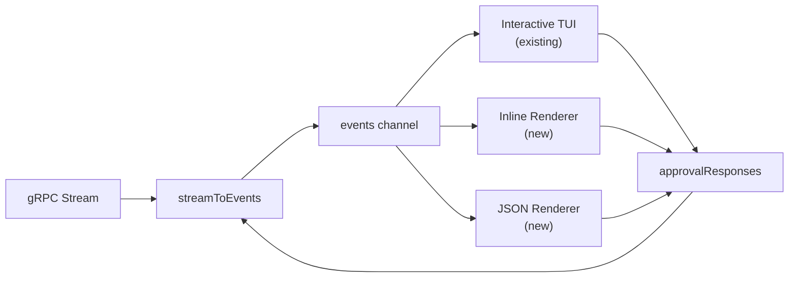

# Phase 2.2: Two-Lane Output Design

## Problem

Agent execution (`stigmer run`, `stigmer draft`) always launches a Bubbletea alt-screen TUI via `tea.NewProgram(model, tea.WithAltScreen())`. Piped or dumb terminals get garbled output. There is no structured output for scripting/CI. The existing `messageStreamRenderer` in `[run_display_stream.go](client-apps/cli/cmd/stigmer/root/run_display_stream.go)` was built for this purpose but operates on proto messages (`[]*agentexecutionv1.AgentMessage`), not on `executiontui.Event` types -- it is unused in production (test-only).

## Design Decisions (Agreed)

- `**--json**` (boolean flag) for NDJSON output -- matches existing `output_flags.go` pattern, avoids conflict with `draft --output` (directory path)
- `**--no-tui**` flag for inline streaming -- descriptive name, does not imply "no colors"
- **stdout/stderr separation** baked in -- subsumes Phase 3.1 for the inline/JSON paths
- **New event-based renderers** instead of reusing `messageStreamRenderer` -- different input types (Event vs proto)

## Architecture

### Output Mode Resolution

```
resolveOutputMode(flags, terminal) → OutputMode
  ├── --json flag                    → JSON
  ├── --no-tui flag                  → Inline (colors if TTY)
  ├── stdout is not a TTY            → Inline (no colors, auto-detected)
  ├── TERM=dumb                      → Inline (no colors, auto-detected)
  └── default                        → Interactive (existing TUI)
```

### Event Consumer Architecture

The event pipeline is unchanged. `streamToEvents` / `snapshotToEvents` produce `executiontui.Event` into a channel. Three consumers:




### Approval in Non-TUI Modes

The `approvalResponses` channel contract remains the same. Non-TUI consumers fulfill it:

- **Inline + TTY**: Use existing `approval.Prompter` (interactive prompt outside alt-screen)
- **Inline + no TTY / JSON**: Auto-respond using `defaultAction` from `--approve-default`; if not set, auto-skip with a warning to stderr

### Follow-up in Non-TUI Modes

Conversational follow-up mode is disabled. `followUpFn` is set to nil. The execution runs to completion and exits. This is the correct behavior for scripting and pipe contexts.

### stdout/stderr Discipline (Phase 3.1 subsumption)

**Inline renderer:**

- **stdout**: AI message content (the "data" -- pipeable, `jq`-able with `--json`)
- **stderr**: Phase changes, tool badges, system messages, approval prompts, progress indicators, errors

**JSON renderer:**

- **stdout**: NDJSON event lines (all events including phase changes, tools, etc.)
- **stderr**: Fatal errors only (connection failures before streaming starts)

## Files

### New Files

- `**[cmd/stigmer/root/output_mode.go](client-apps/cli/cmd/stigmer/root/output_mode.go)`** -- `OutputMode` type, `resolveOutputMode()` function, flag registration helper
- `**[cmd/stigmer/root/run_stream_inline.go](client-apps/cli/cmd/stigmer/root/run_stream_inline.go)**` -- `inlineRenderer` struct and event consumption loop
- `**[cmd/stigmer/root/run_stream_json.go](client-apps/cli/cmd/stigmer/root/run_stream_json.go)**` -- `jsonRenderer` struct and NDJSON event serialization
- Test files for the above

### Modified Files

- `**[cmd/stigmer/root/run_stream.go](client-apps/cli/cmd/stigmer/root/run_stream.go)**` -- Branch `streamAgentExecution` on output mode
- `**[cmd/stigmer/root/run_session.go](client-apps/cli/cmd/stigmer/root/run_session.go)**` -- Branch `resumeSession` on output mode
- `**[cmd/stigmer/root/run_agent_exec.go](client-apps/cli/cmd/stigmer/root/run_agent_exec.go)**` -- Add `--json` and `--no-tui` flags, thread `OutputMode`
- `**[cmd/stigmer/root/run.go](client-apps/cli/cmd/stigmer/root/run.go)**` -- Thread output mode through `executeRun` / `routeRun`
- `**[cmd/stigmer/root/draft_handler.go](client-apps/cli/cmd/stigmer/root/draft_handler.go)**` -- Add flags, thread output mode

### Existing Code to Leverage

- `display.IsTerminal()` in `[pkg/display/terminal.go](client-apps/cli/pkg/display/terminal.go)` -- TTY detection
- `approval.InteractivePrompter` in `[pkg/approval/interactive.go](client-apps/cli/pkg/approval/interactive.go)` -- inline approval prompts
- `toolrender.Render()` in `[pkg/toolrender/render.go](client-apps/cli/pkg/toolrender/render.go)` -- tool call formatting
- `formatNonTUIAIText()` and `systemMsgStyle` in `[run_display.go](client-apps/cli/cmd/stigmer/root/run_display.go)` -- AI text and system message formatting
- `sanitizeSystemContent()` in `[run_display_stream.go](client-apps/cli/cmd/stigmer/root/run_display_stream.go)` -- error content sanitization

## Key Implementation Details

### `inlineRenderer` (run_stream_inline.go)

Core loop: consume events from channel, dispatch to type-specific render methods, handle approvals inline.

State: streaming AI delta tracking (`inAIStream bool`, `streamedBytes int`), running tool names (`map[string]string`), spinner for thinking phases.

Rendering approach: reuse existing formatting functions (`formatNonTUIAIText`, `toolrender.Render`, `systemMsgStyle`, `sanitizeSystemContent`) but route output correctly -- AI content to `data` writer (stdout), status/chrome to `status` writer (stderr).

### `jsonRenderer` (run_stream_json.go)

Each event becomes one JSON line on stdout with structure:

```json
{"type": "ai_stream_delta", "ts": "2026-03-03T12:00:00.000Z", "content": "..."}
{"type": "tool_running", "ts": "...", "tool_call_id": "tc_1", "tool_name": "read_file", "args": {...}}
{"type": "done", "ts": "...", "phase": "completed"}
```

Uses a single `jsonEvent` struct with `Type`, `Timestamp`, and a payload map. No streaming AI state needed -- every delta is a separate JSON line.

### Branching in `streamAgentExecution`

After event channels are created and `streamToEvents` is launched, branch:

```go
switch outputMode {
case OutputInteractive:
    // existing TUI path (unchanged)
case OutputInline:
    return renderInline(ctx, cfg)
case OutputJSON:
    return renderJSON(ctx, cfg)
}
```

The inline/JSON renderers return when `DoneEvent` or `StreamErrorEvent` is received, then the function fetches and returns the final execution (shared epilogue).

## Testing Strategy

- **Unit tests for `resolveOutputMode`**: TTY/non-TTY, TERM=dumb, flag combinations, precedence
- **Unit tests for inline renderer**: Mock event sequences -> captured stdout/stderr output, verify AI content goes to stdout and status to stderr
- **Unit tests for JSON renderer**: Mock event sequences -> parse each stdout line as valid JSON, verify schema
- **Approval tests**: Inline+TTY uses prompter, inline+pipe auto-skips, JSON auto-resolves

## Scope Boundary

This phase does NOT touch:

- The Bubbletea TUI model or view (it remains the default interactive path)
- The workflow streaming path (`streamWorkflowExecution` -- already non-TUI)
- The `messageStreamRenderer` (remains test-only; may be deprecated in a future cleanup)

