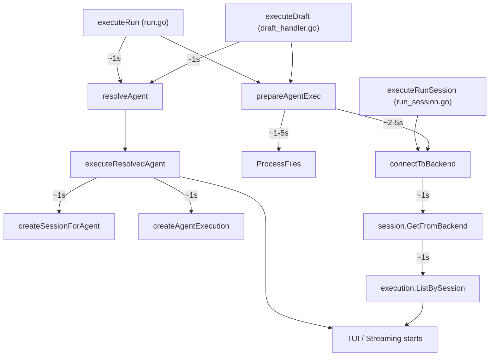

# Phase 2.4: Preparation Phase Spinner

## Problem

Between `stigmer run agent ...` and the TUI appearing, there are 3-10 seconds of silence while the CLI connects to the backend, resolves the agent, processes attachments, creates the session, and creates the execution. The user has zero feedback during this time and may think the CLI is hung.

## Architecture Overview

Three distinct command paths need spinner coverage:




All network-bound steps (shaded above) are candidates for spinner label updates.

## Design

### Approach: Pass `*spinner.Spinner` through the call chain

Each call site (run, draft, session) creates its own spinner writing to `os.Stderr`, starts it immediately, and passes it to downstream functions that update labels at each step. The spinner is stopped right before TUI/streaming begins.

This follows the existing pattern established by `streamWorkflowExecution` in [run_stream.go](client-apps/cli/cmd/stigmer/root/run_stream.go), which already uses `pkg/spinner` for workflow progress.

**Why `os.Stderr`:** Phase 2.2 established stdout = data, stderr = status/chrome. The spinner is status chrome. This means `stigmer run agent --json | jq` shows the spinner on stderr while JSON flows through stdout.

### Key insight: `Spinner.Start()` already doubles as "restart after stop"

```89:109:client-apps/cli/pkg/spinner/spinner.go
func (s *Spinner) Stop() {
	s.mu.Lock()
	if !s.active {
		s.mu.Unlock()
		return
	}

	close(s.stop)
	s.active = false
	s.mu.Unlock()

	// Wait for goroutine to finish before clearing the line
	<-s.done
	s.clearLine()
}
```

When `Stop()` is called and then `Start()` again, it creates new channels and restarts the animation with a fresh timer. When `Start()` is called while already active, it just updates the label (same as `Update`). This means draft's stop-print-restart pattern works naturally.

## Required Fix: Spinner TTY Detection

The spinner currently checks `display.IsTerminal()` which hardcodes `os.Stdout.Fd()`:

```39:41:client-apps/cli/pkg/display/terminal.go
func IsTerminal() bool {
	return term.IsTerminal(int(os.Stdout.Fd()))
}
```

This is wrong when the spinner writes to stderr. If stdout is piped (`stigmer run --json | jq`) but stderr is a terminal, the spinner should still animate. Fix: check the writer's own fd instead.

Add a private `isWriterTerminal` helper to the spinner package:

```go
func isWriterTerminal(w io.Writer) bool {
    if f, ok := w.(*os.File); ok {
        return term.IsTerminal(int(f.Fd()))
    }
    return false
}
```

Then replace `display.IsTerminal()` with `s.isWriterTerminal()` in `Start()`. This:

- Fixes stderr spinners (new behavior)
- Is identical to current behavior for stdout spinners (`os.Stdout` is `*os.File`)
- Keeps `bytes.Buffer` spinners as no-ops (existing tests pass unchanged)
- Removes the `display` package dependency from `spinner`

## Files to Modify

### 1. [pkg/spinner/spinner.go](client-apps/cli/pkg/spinner/spinner.go) -- TTY fix

- Add `isWriterTerminal(w io.Writer) bool` using `term.IsTerminal` on the writer's fd
- Replace `display.IsTerminal()` in `Start()` with `s.isWriterTerminal()`
- Remove `display` import, add `os` and `golang.org/x/term` imports

### 2. [pkg/spinner/spinner_test.go](client-apps/cli/pkg/spinner/spinner_test.go) -- TTY tests

- Add `TestIsWriterTerminal_File` (checks `*os.File`)
- Add `TestIsWriterTerminal_Buffer` (checks `bytes.Buffer` returns false)

### 3. [cmd/stigmer/root/run_agent_exec.go](client-apps/cli/cmd/stigmer/root/run_agent_exec.go) -- Core changes

`**prepareAgentExec**`: Add `sp *spinner.Spinner` parameter. Update spinner at key steps:

- Before `connectToBackend`: `sp.Update("Connecting...")`
- Before `ProcessFiles`: `sp.Update("Processing attachments...")`

`**executeResolvedAgent**`: Add `sp *spinner.Spinner` parameter. Replace `climsg.Info` progress messages with spinner updates:

- Before `createSessionForAgent`: `sp.Update("Creating workspace...")`
- Before `createAgentExecution`: `sp.Update("Creating execution...")`
- After execution created: `sp.Stop()` then `climsg.Success("Session started: ses-xxx")`

The intermediate `climsg.Info` messages ("Creating workspace session...", "Starting execution with N input file(s)...", "Starting session...") become spinner labels instead. The final `climsg.Success("Session started: ...")` remains as a static line after the spinner stops.

### 4. [cmd/stigmer/root/run.go](client-apps/cli/cmd/stigmer/root/run.go) -- Run path

`**executeRun**`: Create `spinner.New(os.Stderr)`, call `sp.Start("Preparing...")`, pass to `prepareAgentExec`.

`**routeRun**`: Add `sp *spinner.Spinner` parameter. For agents: update to "Resolving agent...", pass to `executeResolvedAgent`. For workflows: `sp.Stop()` (workflow path has its own spinner).

### 5. [cmd/stigmer/root/draft_handler.go](client-apps/cli/cmd/stigmer/root/draft_handler.go) -- Draft path

`**executeDraft**`: Create spinner, pass to `prepareAgentExec`. After agent resolution: `sp.Stop()`, print "Using system agent: ..." and attachment count as static messages. The spinner restarts inside `executeResolvedAgent`.

### 6. [cmd/stigmer/root/run_session.go](client-apps/cli/cmd/stigmer/root/run_session.go) -- Session path

`**executeRunSession**`: Create spinner with `sp.Start("Connecting...")`. Pass to `openSession`.

`**openSession**`: Add `sp *spinner.Spinner` parameter. Update labels:

- Before `session.GetFromBackend`: `sp.Update("Loading session...")`
- Before `execution.ListBySession`: `sp.Update("Loading session history...")`
- After data loaded: `sp.Stop()`, then existing `climsg.Info` session display

## Expected User Experience

**Run agent:**

```
$ stigmer run agent my-agent -m "hello"
  Connecting... (1s)
  Resolving agent... (2s)
  Creating execution... (3s)
  Session started: ses-xxx
[TUI appears]
```

**Draft:**

```
$ stigmer draft skill -m "create a linter"
  Connecting... (1s)
  Resolving agent... (2s)
  Using system agent: skill-creator
  Creating execution... (1s)
  Session started: ses-xxx
[TUI appears]
```

**Session re-attach:**

```
$ stigmer run ses-01abc123
  Connecting... (1s)
  Loading session... (2s)
  Session: ses-01abc123 (my conversation)
  Re-attaching to session...
[TUI appears]
```

**Piped / JSON (spinner on stderr, data on stdout):**

```
$ stigmer run agent my-agent --json | jq
  [stderr: spinner animates]
  [stdout: JSON events flow]
```

## Error Path Safety

Every call site must ensure `sp.Stop()` is called on error paths to prevent goroutine leaks. The pattern:

```go
sp := spinner.New(os.Stderr)
sp.Start("Connecting...")

result, err := doWork()
if err != nil {
    sp.Stop()
    return err
}
```

Alternatively, `defer sp.Stop()` at the top works since `Stop()` on an already-stopped spinner is a no-op.

## Test Strategy

- **Spinner package**: Unit test `isWriterTerminal` with `*os.File` and `bytes.Buffer`
- **Preparation flow**: Test that `sp.Stop()` is called on all error paths (no goroutine leaks). Since the spinner is a no-op with `bytes.Buffer`, integration tests focus on the preparation logic correctness, not spinner animation
- **Manual verification**: Confirm spinner UX across all three paths (run, draft, session) and output modes (interactive, inline, JSON)

## Scope Boundaries

- Only the agent execution preparation path is in scope. The `discover` command is not modified
- The existing workflow spinner (`streamWorkflowExecution`) remains unchanged (it correctly uses stdout for its context)
- No changes to the TUI itself -- the TUI's built-in header spinner handles the "pending" phase after streaming starts

