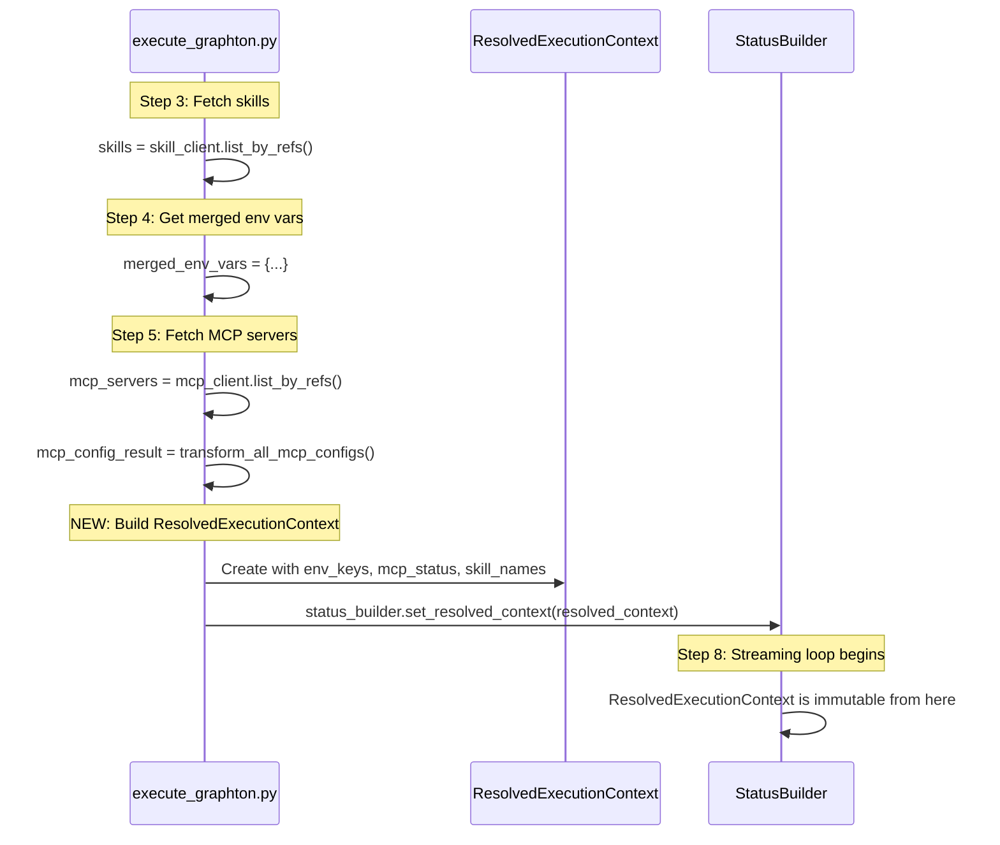

# Phase 2.5: Add ResolvedExecutionContext

## Objective

Create a `ResolvedExecutionContext` proto message that captures what resources the agent actually had access to during execution. This enables:

- **Debugging**: Understanding what environment/tools were available when investigating failures
- **Auditing**: Tracking what resources each execution consumed
- **Security review**: Verifying which secrets (by key name only) were exposed
- **UX transparency**: Showing users what their agent can access

## Proto Design

### New Message: ResolvedExecutionContext

```protobuf
// ResolvedExecutionContext captures the resolved configuration state at execution time.
// Populated once after all resources are resolved, before the agent begins processing.
//
// ## Purpose
//
// Provides visibility into what the agent actually had access to during execution:
// - Which environment variables were available (keys only, not values for security)
// - Which MCP servers were configured and their resolution status
// - Which skills were injected into the agent's context
//
// ## Timing
//
// Populated in execute_graphton.py after Steps 3-5 complete (skills, env vars, MCP servers)
// but before the streaming loop begins. This represents the "snapshot" of resolved state.
//
// ## Security Considerations
//
// - Environment values are NEVER included (only keys)
// - MCP server credentials are not exposed
// - This is safe to include in status responses to clients
message ResolvedExecutionContext {
  // Environment variable keys available to the agent (NOT values for security).
  // Represents the merged result of: template env_spec + instance environment_refs + runtime_env.
  // Keys are sorted alphabetically for consistent ordering.
  repeated string environment_keys = 1;

  // MCP servers referenced by the agent and their resolution status.
  // Key: MCP server slug (e.g., "github-mcp", "slack-mcp")
  // Value: true if server was successfully resolved and configured, false if resolution failed
  //
  // Note: This tracks configuration resolution, not runtime connection status.
  // A server showing "true" means it was found and transformed successfully;
  // actual WebSocket/stdio connection happens later in the Graphton runtime.
  map<string, McpServerResolutionStatus> mcp_servers = 2;

  // Names of skills injected into the agent's system prompt.
  // Each skill's SKILL.md content is appended to the instructions.
  // Sorted alphabetically for consistent ordering.
  repeated string skill_names = 3;
}

// McpServerResolutionStatus captures the resolution outcome for a single MCP server.
// Provides richer information than a simple boolean for better debugging.
message McpServerResolutionStatus {
  // Whether the MCP server was successfully resolved and configured.
  bool resolved = 1;

  // Human-readable status message.
  // Examples: "Configured successfully", "Server not found", "Missing required env var: API_KEY"
  string message = 2;

  // Number of tools enabled from this MCP server.
  // 0 if resolution failed or server has no tools.
  int32 enabled_tool_count = 3;
}
```

### Why McpServerResolutionStatus Instead of map<string, bool>

The original plan suggested `map<string, bool>`, but I recommend a richer structure because:

1. **Debugging**: A simple bool doesn't explain *why* resolution failed (server not found? missing env var?)
2. **Visibility**: Knowing how many tools were enabled per server aids understanding
3. **Consistency**: Other proto messages in this codebase use descriptive status objects
4. **Future-proofing**: Can add fields like `server_type` (stdio/http) without breaking changes

If you prefer the simpler `map<string, bool>` for MVP, that's a valid tradeoff.

### Wiring to AgentExecutionStatus

```protobuf
message AgentExecutionStatus {
  // ... existing fields 1-11, 99 ...

  // Resolved execution context showing what resources the agent had access to.
  // Populated once before streaming begins. Immutable after initial population.
  ResolvedExecutionContext resolved_context = 12;
}
```

## Implementation Strategy

### File Changes

| File | Changes |

|------|---------|

| [apis/ai/stigmer/agentic/agentexecution/v1/api.proto](apis/ai/stigmer/agentic/agentexecution/v1/api.proto) | Add `ResolvedExecutionContext`, `McpServerResolutionStatus` messages; wire to `AgentExecutionStatus` field 12 |

| [backend/services/agent-runner/worker/activities/execute_graphton.py](backend/services/agent-runner/worker/activities/execute_graphton.py) | Build and populate `ResolvedExecutionContext` after resource resolution (after Step 5, before Step 6) |

| [backend/services/agent-runner/tests/test_status_builder.py](backend/services/agent-runner/tests/test_status_builder.py) | Add `TestResolvedExecutionContext` test class |

### Implementation Flow




### StatusBuilder Method Addition

Add a simple setter method to StatusBuilder for clean encapsulation:

```python
def set_resolved_context(
    self,
    environment_keys: List[str],
    mcp_servers: Dict[str, Tuple[bool, str, int]],  # slug -> (resolved, message, tool_count)
    skill_names: List[str],
) -> None:
    """
    Set the resolved execution context.
    
    Called once after all resources are resolved, before streaming begins.
    This captures the "snapshot" of what the agent has access to.
    
    Args:
        environment_keys: Environment variable keys (NOT values) available to agent
        mcp_servers: Dict mapping server slug to (resolved, message, enabled_tool_count)
        skill_names: Names of skills injected into system prompt
    """
    from ai.stigmer.agentic.agentexecution.v1.api_pb2 import (
        ResolvedExecutionContext,
        McpServerResolutionStatus,
    )
    
    resolved_context = ResolvedExecutionContext(
        environment_keys=sorted(environment_keys),  # Consistent ordering
        skill_names=sorted(skill_names),            # Consistent ordering
    )
    
    # Build MCP server status map
    for slug, (resolved, message, tool_count) in mcp_servers.items():
        resolved_context.mcp_servers[slug].CopyFrom(
            McpServerResolutionStatus(
                resolved=resolved,
                message=message,
                enabled_tool_count=tool_count,
            )
        )
    
    self.current_status.resolved_context.CopyFrom(resolved_context)
    
    self.logger.info(
        f"[CONTEXT] Resolved execution context: "
        f"env_keys={len(environment_keys)}, "
        f"mcp_servers={len(mcp_servers)}, "
        f"skills={len(skill_names)}"
    )
```

### execute_graphton.py Integration Point

After Step 5 (MCP servers) completes, before Step 6 (Create Graphton agent):

```python
# Step 5.5: Build ResolvedExecutionContext for status visibility
# Captures what resources the agent actually has access to
mcp_server_status = {}

# Track which MCP servers were requested vs successfully resolved
requested_mcp_slugs = {usage.mcp_server_ref.slug for usage in mcp_server_usages} if mcp_server_usages else set()
resolved_mcp_slugs = set(mcp_servers_config.keys())

for slug in requested_mcp_slugs:
    if slug in resolved_mcp_slugs:
        # Count enabled tools for this server
        tool_count = len(mcp_tools_config.get(slug, []) or [])
        mcp_server_status[slug] = (True, "Configured successfully", tool_count)
    else:
        mcp_server_status[slug] = (False, "Server not found or resolution failed", 0)

# Extract skill names (already fetched in Step 3)
skill_names = [s.metadata.name for s in skills] if skill_refs else []

# Set resolved context on status builder
status_builder.set_resolved_context(
    environment_keys=list(merged_env_vars.keys()),
    mcp_servers=mcp_server_status,
    skill_names=skill_names,
)
```

## Test Plan

### Test Class: TestResolvedExecutionContext

```python
class TestResolvedExecutionContext:
    """Tests for ResolvedExecutionContext population (Phase 2.5)."""

    def test_set_resolved_context_populates_proto(self, status_builder):
        """Verify set_resolved_context creates properly structured proto."""
    
    def test_environment_keys_sorted_alphabetically(self, status_builder):
        """Verify environment keys are sorted for consistent ordering."""
    
    def test_skill_names_sorted_alphabetically(self, status_builder):
        """Verify skill names are sorted for consistent ordering."""
    
    def test_mcp_server_resolved_status(self, status_builder):
        """Verify MCP server with resolved=True has correct fields."""
    
    def test_mcp_server_failed_status(self, status_builder):
        """Verify MCP server with resolved=False captures error message."""
    
    def test_empty_context_all_fields_empty(self, status_builder):
        """Verify empty inputs produce empty but valid proto."""
    
    def test_context_immutable_after_set(self, status_builder):
        """Verify calling set_resolved_context twice overwrites (warn in logs)."""
    
    def test_env_keys_only_no_values(self, status_builder):
        """Verify environment values are NOT captured (security)."""
    
    def test_large_env_count_handled(self, status_builder):
        """Verify handling of many environment variables (100+)."""
    
    def test_mcp_tool_count_accurate(self, status_builder):
        """Verify enabled_tool_count reflects actual tool configuration."""
```

## Proto Documentation Standards

Following the patterns established in Phase 2.4 (UsageMetrics):

1. **Section divider comment** before the new message
2. **Multi-line doc comment** explaining purpose, scope, timing
3. **Per-field comments** with examples where helpful
4. **Security callouts** prominently documented

## Stub Regeneration

After proto changes, regenerate stubs:

- Python: `bazel build //apis/stubs/python/...`
- Go: `bazel build //apis/stubs/go/...`

The stigmer-cloud repo stubs (Java, TypeScript, Dart) will be regenerated separately.

## Acceptance Criteria

- `ResolvedExecutionContext` proto message defined with comprehensive documentation
- `McpServerResolutionStatus` proto message defined for rich MCP status
- Field 12 wired to `AgentExecutionStatus.resolved_context`
- `StatusBuilder.set_resolved_context()` method implemented
- Integration in `execute_graphton.py` after Step 5, before Step 6
- Environment keys sorted alphabetically (no values exposed)
- Skill names sorted alphabetically
- MCP servers capture resolution status with error messages
- 10+ unit tests covering all scenarios
- All existing tests still pass (no regressions)
- Structured logging with `[CONTEXT]` prefix
- Proto stubs regenerated (Python, Go)

## Risk Mitigation

| Risk | Mitigation |

|------|------------|

| Proto field number conflict | Verified field 12 is available in AgentExecutionStatus |

| Performance impact | ResolvedExecutionContext populated once (not per-event) |

| Security leak of env values | Only keys stored; code review; test verification |

| Breaking existing tests | Run full test suite after each change |

| MCP status misinterpretation | Clear documentation that this is resolution status, not connection status |