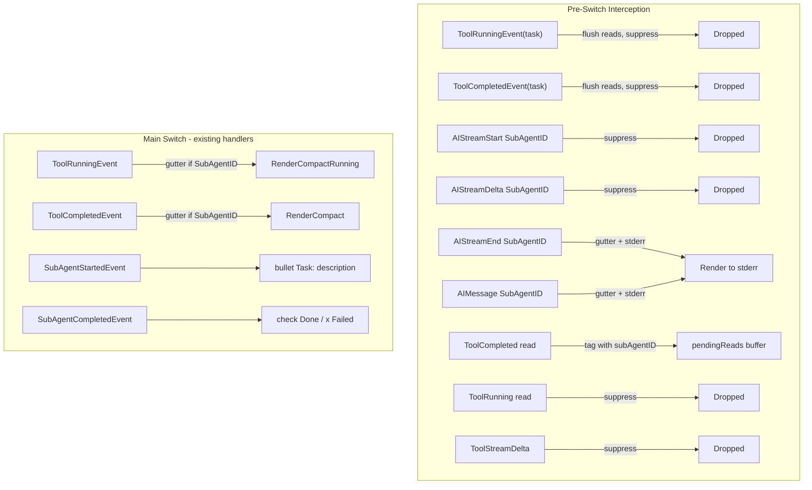

# Phase 2.5: Sub-Agent Tool Grouping

## Core Principle

**Reuse, don't reinvent.** Inner tools render with the same `RenderCompact` / `RenderCompactRunning` functions as top-level tools. The inline renderer adds a dim  `|` gutter prefix. No second-class sub-agent experience.

## Target Output

```
[bullet] Task: Explore CLI rendering
  | [bullet] Read(file1.go)
  |     Read 45 lines
  | [bullet] Shell(go test ./...)
  |     ok  pkg/foo  0.5s
  |     ok  pkg/bar  1.2s
  |     ... +15 more lines
  | [agent] I found the rendering issue in...
  [check] Done (5 tools)
```

Failed sub-agent:

```
[bullet] Task: Explore CLI rendering
  | [bullet] Shell(go build ./...)
  |     [x] compilation failed
  [x] Failed (2 tools)
```

## Architecture: Event Flow




## Key Design Decisions

**1. Task tool events suppressed.** The backend emits two parallel event streams per sub-agent: tool lifecycle (`ToolRunningEvent`/`ToolCompletedEvent` for the `task` tool) and sub-agent lifecycle (`SubAgentStartedEvent`/`SubAgentCompletedEvent`). These are redundant. We suppress the tool events and use the lifecycle events for header/footer because they carry richer data (Description, Name, ToolCount, Status).

**2. Flush reads before suppressing task events.** A top-level read might be buffered when the task tool running event arrives. Suppressing without flushing would orphan those reads. Both task tool interceptions must call `flushPendingReads()` before returning.

**3. Sub-agent AI on stderr, non-streaming.** Sub-agent reasoning is intermediate processing, not the final agent response. Rendering on stderr preserves the `stdout = main agent data` contract. We suppress `AIStreamStart`/`AIStreamDelta` and emit full content on `AIStreamEnd`/`AIMessage` to avoid character-by-character streaming with per-line gutter insertion.

**4. Read grouping preserved in sub-agent context.** `pendingReads` gets tagged with `subAgentID`. Flush logic applies `GutterWrap` when the ID is non-empty. Grouping threshold (3+) works identically to top-level.

**5. Always expanded in inline mode.** Collapse/expand requires raw terminal cursor control (Phases 3-4). Phase 2.5 builds the gutter structure (header / gutter lines / footer) that a future collapse/expand layer operates on.

## Implementation

### File 1: [render_compact.go](client-apps/cli/pkg/toolrender/render_compact.go)

Add three things:

- `IsTaskTool(name string) bool` -- predicate matching `IsReadTool`, `IsWriteOrEditTool` pattern. Checks `toolDisplayMap` for label `"Task"`.
- `GutterWrap(s string) string` -- prepends dim-styled  `|` to each line of a multi-line string. Uses a new `gutterStyle` (lipgloss dim foreground, color "8") for the pipe character.
- Update `hasCompactRenderer` to include `"Task"` -- semantic correctness since Task now has visual representation via lifecycle events.

### File 2: [run_stream_inline.go](client-apps/cli/cmd/stigmer/root/run_stream_inline.go)

**State change** -- replace `pendingReads []toolrender.ToolCallInfo` with:

```go
type pendingRead struct {
    tc         toolrender.ToolCallInfo
    subAgentID string
}
```

**Pre-switch interception additions** (in `handleEvent`, before the flush + switch):

1. `ToolRunningEvent` where `IsTaskTool(e.ToolCall.Name)` and `e.SubAgentID == ""` -- flush pending reads, return (suppress)
2. `ToolCompletedEvent` where `IsTaskTool(e.ToolCall.Name)` and `e.SubAgentID == ""` -- flush pending reads, return (suppress)
3. `AIStreamStartEvent` with `SubAgentID != ""` -- return (suppress, content comes in End)
4. `AIStreamDeltaEvent` with `SubAgentID != ""` -- return (suppress)
5. `AIStreamEndEvent` with `SubAgentID != ""` -- render `e.Content` with gutter prefix to stderr, return
6. `AIMessageEvent` with `SubAgentID != ""` -- render `e.Content` with gutter prefix to stderr, return

Existing read/stream-delta interceptions unchanged, except read buffering now captures `e.SubAgentID`.

**Main switch handler changes:**

- `renderToolRunning` -- if `e.SubAgentID != ""`, apply `GutterWrap` to `RenderCompactRunning` output
- `renderToolCompleted` -- if `e.SubAgentID != ""`, apply `GutterWrap` to `RenderCompact` output
- `renderSubAgentStarted` -- change from `"Sub-agent started: label"` to `"[bullet] Task: description"` using `bulletStyle` + `labelStyle`
- `renderSubAgentCompleted` -- change from `"Sub-agent ID badge (N tools)"` to `"  [check] Done (N tools)"` or `"  [x] Failed (N tools)"`

**flushPendingReads changes:**

- Extract `ToolCallInfo` slice from `pendingRead` wrappers
- Apply `GutterWrap` to the rendered output when `subAgentID != ""`
- Invariant: all pending reads share the same sub-agent context (events don't interleave across agents), so checking `pendingReads[0].subAgentID` is sufficient

### File 3: [render_compact_test.go](client-apps/cli/pkg/toolrender/render_compact_test.go)

New tests:

- `TestGutterWrap_SingleLine`, `TestGutterWrap_MultiLine`, `TestGutterWrap_EmptyString`
- `TestIsTaskTool_TaskReturnsTrue`, `TestIsTaskTool_ShellReturnsFalse`, `TestIsTaskTool_UnknownReturnsFalse`
- `TestHasCompactRenderer_TaskReturnsTrue` (update existing false test)
- Integration tests: `TestGutterWrap_WithRenderCompactRead`, `TestGutterWrap_WithRenderCompactShell`, `TestGutterWrap_WithRenderCompactWrite` -- verify gutter + existing renderers produce correct nested output
- `TestGutterWrap_WithRenderReadGroup` -- verify grouped reads under gutter

### File 4: BUILD.bazel (if needed)

Only if new dependencies are introduced (unlikely -- `GutterWrap` uses existing lipgloss + strings).

## Scope Boundaries

**Included:** Gutter rendering, task event suppression, sub-agent AI redirection, read grouping with sub-agent context, lifecycle handler updates, tests.

**Excluded (future):**

- Collapse/expand in inline mode (requires Phase 3-4 terminal control)
- Nested sub-agents (architecturally supported via additional gutter levels, not implemented until real usage)
- Sub-agent AI character streaming (buffered approach is sufficient)
- Approval UX changes (`ApprovalNeededEvent` already has `FromSubAgent` / `SubAgentName` context)

