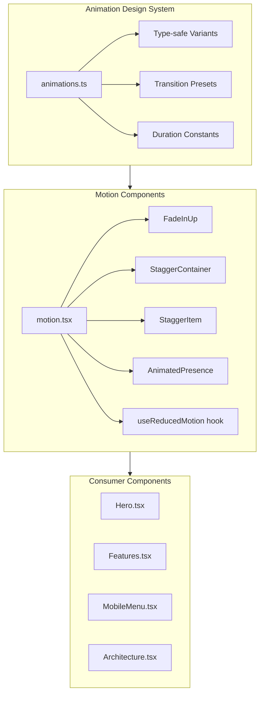

# Phase 2: Reusable Animation Components

## Objective

Build a type-safe, performant, and accessible animation system that brings visual richness to stigmer.ai while maintaining the engineering standards expected of a foundational platform. This phase establishes the animation primitives that all subsequent phases will build upon.

## Current State

- **Framer Motion**: Installed (v12.31.1) in [site/package.json](site/package.json)
- **CSS Tokens**: Glow/glass utilities already in [site/src/app/globals.css](site/src/app/globals.css)
- **Missing**: Animation design system (`animations.ts`) and motion components (`motion.tsx`)

## Architecture Overview



## Implementation Plan

### Task 1: Create Animation Design System

**File**: [site/src/lib/animations.ts](site/src/lib/animations.ts)

This is the single source of truth for all animation configuration. Key design decisions:

- **Type-safe variants**: Use `as const` assertions for full type inference
- **Composable presets**: Separate variants from transitions for flexibility
- **CSS variable sync**: Reference CSS duration tokens where appropriate
- **Performance focus**: Prefer GPU-accelerated properties (transform, opacity)

**Contents**:

```typescript
/**
 * Animation Design System for Stigmer
 * 
 * Centralized, type-safe animation configuration.
 * All motion components consume these variants and transitions.
 */

// Variant definitions - animation states
export const fadeInUp = {
  hidden: { opacity: 0, y: 20 },
  visible: { opacity: 1, y: 0 },
} as const;

export const fadeInDown = {
  hidden: { opacity: 0, y: -20 },
  visible: { opacity: 1, y: 0 },
} as const;

export const fadeIn = {
  hidden: { opacity: 0 },
  visible: { opacity: 1 },
} as const;

export const scaleIn = {
  hidden: { opacity: 0, scale: 0.95 },
  visible: { opacity: 1, scale: 1 },
} as const;

export const slideInRight = {
  hidden: { opacity: 0, x: 50 },
  visible: { opacity: 1, x: 0 },
  exit: { opacity: 0, x: 50 },
} as const;

export const slideInLeft = {
  hidden: { opacity: 0, x: -50 },
  visible: { opacity: 1, x: 0 },
  exit: { opacity: 0, x: -50 },
} as const;

// Container variant for staggered children
export const staggerContainer = {
  hidden: {},
  visible: {
    transition: {
      staggerChildren: 0.1,
      delayChildren: 0.1,
    },
  },
} as const;

// Transition presets - timing and easing
export const transitions = {
  spring: { type: "spring", stiffness: 300, damping: 30 },
  springBouncy: { type: "spring", stiffness: 400, damping: 25 },
  smooth: { duration: 0.4, ease: [0.25, 0.1, 0.25, 1] },
  fast: { duration: 0.2, ease: "easeOut" },
  slow: { duration: 0.6, ease: [0.25, 0.1, 0.25, 1] },
} as const;

// Duration constants (in seconds) - sync with CSS variables
export const durations = {
  instant: 0.1,
  fast: 0.15,
  normal: 0.3,
  slow: 0.5,
  slower: 0.8,
} as const;
```

### Task 2: Create Motion Wrapper Components

**File**: [site/src/components/ui/motion.tsx](site/src/components/ui/motion.tsx)

Production-grade motion components with:

- **Full TypeScript support**: Proper generics and forwarded refs
- **Accessibility first**: Built-in `useReducedMotion` support
- **Composable API**: Works with any element type via polymorphism
- **Performance optimized**: `viewport={{ once: true }}`, GPU properties only

**Contents** (key components):

```typescript
"use client";

import { forwardRef, type ReactNode } from "react";
import {
  motion,
  useReducedMotion,
  AnimatePresence as FramerAnimatePresence,
  type HTMLMotionProps,
  type Variants,
} from "framer-motion";
import {
  fadeInUp,
  staggerContainer,
  transitions,
} from "@/lib/animations";

// Re-export AnimatePresence for convenience
export const AnimatePresence = FramerAnimatePresence;

// Hook for consumers to check motion preference
export { useReducedMotion } from "framer-motion";

interface MotionProps extends HTMLMotionProps<"div"> {
  children: ReactNode;
  /** Disable animations (useful for SSR or testing) */
  disabled?: boolean;
  /** Custom variants override */
  variants?: Variants;
}

/**
 * FadeInUp - Entrance animation with upward motion
 * 
 * Animates on scroll into view, respects reduced motion.
 */
export const FadeInUp = forwardRef<HTMLDivElement, MotionProps>(
  ({ children, disabled, variants = fadeInUp, ...props }, ref) => {
    const prefersReducedMotion = useReducedMotion();
    
    if (disabled || prefersReducedMotion) {
      return <div ref={ref} {...props}>{children}</div>;
    }
    
    return (
      <motion.div
        ref={ref}
        initial="hidden"
        whileInView="visible"
        viewport={{ once: true, margin: "-100px" }}
        variants={variants}
        transition={transitions.smooth}
        {...props}
      >
        {children}
      </motion.div>
    );
  }
);
FadeInUp.displayName = "FadeInUp";

/**
 * StaggerContainer - Parent for staggered child animations
 */
export const StaggerContainer = forwardRef<HTMLDivElement, MotionProps>(
  ({ children, disabled, variants = staggerContainer, ...props }, ref) => {
    const prefersReducedMotion = useReducedMotion();
    
    if (disabled || prefersReducedMotion) {
      return <div ref={ref} {...props}>{children}</div>;
    }
    
    return (
      <motion.div
        ref={ref}
        initial="hidden"
        whileInView="visible"
        viewport={{ once: true }}
        variants={variants}
        {...props}
      >
        {children}
      </motion.div>
    );
  }
);
StaggerContainer.displayName = "StaggerContainer";

/**
 * StaggerItem - Child element within StaggerContainer
 */
export const StaggerItem = forwardRef<HTMLDivElement, MotionProps>(
  ({ children, disabled, variants = fadeInUp, ...props }, ref) => {
    const prefersReducedMotion = useReducedMotion();
    
    if (disabled || prefersReducedMotion) {
      return <div ref={ref} {...props}>{children}</div>;
    }
    
    return (
      <motion.div
        ref={ref}
        variants={variants}
        transition={transitions.smooth}
        {...props}
      >
        {children}
      </motion.div>
    );
  }
);
StaggerItem.displayName = "StaggerItem";
```

### Task 3: Update MobileMenu with AnimatePresence

**File**: [site/src/components/layout/MobileMenu.tsx](site/src/components/layout/MobileMenu.tsx)

Transform the current CSS-based transitions to Framer Motion `AnimatePresence` for proper exit animations. This demonstrates the motion system in action.

**Changes**:

- Import `motion` and `AnimatePresence` from framer-motion
- Wrap the backdrop and menu panel in `AnimatePresence`
- Add `initial`, `animate`, `exit` props for smooth enter/exit
- Respect reduced motion preferences

### Task 4: Add Card Glass Variant

**File**: [site/src/components/ui/card.tsx](site/src/components/ui/card.tsx)

Add a `glass` variant that leverages the CSS glass utilities already defined in globals.css.

**Changes**:

- Add `glass` variant to `cardVariants`:
```typescript
glass: [
  "glass",  // Uses CSS utility from globals.css
  "border border-[var(--glass-border)]",
  "hover:border-[var(--glass-border-hover)]",
  "hover:shadow-[var(--glow-primary)]",
  "transition-all duration-300",
],
```


## Quality Standards

All code will meet these criteria:

- **Zero TypeScript errors**: Full type coverage, no `any` types
- **Zero ESLint violations**: Clean code that passes all linting
- **Accessible by default**: `useReducedMotion` integrated into every component
- **SSR compatible**: No window/document references during render
- **Performance optimized**: Only GPU-accelerated properties animated
- **Documentation**: JSDoc comments on all exported functions

## File Changes Summary

| File | Action | Description |

|------|--------|-------------|

| `site/src/lib/animations.ts` | Create | Animation variants and transitions design system |

| `site/src/components/ui/motion.tsx` | Create | Reusable motion wrapper components |

| `site/src/components/layout/MobileMenu.tsx` | Modify | Add AnimatePresence for exit animations |

| `site/src/components/ui/card.tsx` | Modify | Add glass variant with glow effects |

## Testing Checklist

After implementation:

- [ ] `npm run typecheck` - Zero TypeScript errors
- [ ] `npm run lint` - Zero ESLint errors (excluding console.log in build scripts)
- [ ] `npm run build` - Build succeeds
- [ ] Manual test: MobileMenu opens/closes with smooth animations
- [ ] Manual test: Set `prefers-reduced-motion: reduce` - animations disabled
- [ ] Manual test: FadeInUp animates on scroll into view
- [ ] Manual test: Stagger animations work with multiple items

## Definition of Done

- All 4 files created/modified with production-quality code
- All quality gates passed (typecheck, lint, build)
- Components respect `prefers-reduced-motion`
- MobileMenu demonstrates AnimatePresence pattern
- Card has working glass variant with glow on hover
- Changelog entry created documenting the changes