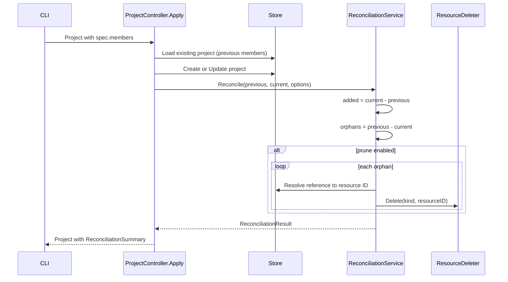

# Phase 2: Backend Reconciliation Simplification

## Situation

Phase 1 changed `ProjectSpec` from embedded full resources (`agents`, `workflows`, `mcp_servers`, `skills`) to `repeated ApiResourceReference members`. The entire reconciliation package was built around the old model: parse full resources from spec, fetch actual resources from DB via ownership annotations, build dependency graphs, compute spec-level diffs, execute creates/updates/deletes in topological order.

None of that machinery applies anymore. Resources are now applied individually by the CLI. The server just needs to compare membership lists and optionally prune orphans.

## End-State Architecture

After Phase 2, the reconciliation flow is:




## Files Overview

### Delete (11 production + 11 test files, ~10,000 LOC total)

All in `backend/services/stigmer-server/pkg/domain/project/reconcile/`:


| File                              | Reason                                            |
| --------------------------------- | ------------------------------------------------- |
| `desired_state.go` + test         | Held full resource maps; now just references      |
| `actual_state.go` + test          | Fetched full resources from DB; now unnecessary   |
| `diff.go` + test                  | Spec-level comparison; replaced by set difference |
| `dependency_graph.go` + test      | Topological sort; CLI applies individually        |
| `dependency_discoverer.go` + test | Proto reflection; not needed                      |
| `graph_builder.go` + test         | Built dep graph; not needed                       |
| `execution_order.go` + test       | Dependency-aware ordering; not needed             |
| `resource_change.go` + test       | Full resource change objects; not needed          |
| `reconciliation_plan.go` + test   | Change container; not needed                      |
| `change_type.go` + test           | Create/Update/Delete enum; not needed             |
| `resource_key.go` + test          | Composite key type; replaced by reference key     |


### Rewrite (4 files)

- **[reconciliation_service.go](backend/services/stigmer-server/pkg/domain/project/reconcile/reconciliation_service.go)** — Simplified interface: `Reconcile(ctx, previousMembers, currentMembers, options)` instead of taking a full project
- **[service.go](backend/services/stigmer-server/pkg/domain/project/reconcile/service.go)** — Set difference + orphan deletion orchestration. No more `parseDesiredState`, `fetchActualState`, `BuildDependencyGraph`, `ComputeDiff`
- **[reconciliation_result.go](backend/services/stigmer-server/pkg/domain/project/reconcile/reconciliation_result.go)** — Uses `*apiresource.ApiResourceReference` instead of the deleted `*projectv1.ResourceChangeRecord`
- **[execution_engine.go](backend/services/stigmer-server/pkg/domain/project/reconcile/execution_engine.go)** — Stripped to `ResourceDeleter` interface + adapter. Only delete operations remain. Create/Update/prepareForCreate/prepareForUpdate/buildChangeRecord all removed.

### Keep As-Is (2 files)

- **[reconciliation_options.go](backend/services/stigmer-server/pkg/domain/project/reconcile/reconciliation_options.go)** — Prune and dry-run options still apply
- **[reconciliation_error.go](backend/services/stigmer-server/pkg/domain/project/reconcile/reconciliation_error.go)** — Error tracking still needed

### Modify (controller + server)

- **[apply.go](backend/services/stigmer-server/pkg/domain/project/controller/apply.go)** — Must capture previous members BEFORE persist, then pass both lists to reconciliation
- **[project_controller.go](backend/services/stigmer-server/pkg/domain/project/controller/project_controller.go)** — Update comments/docs for new model
- **[server.go](backend/services/stigmer-server/pkg/server/server.go)** — Update wiring for simplified reconciliation types

### Rewrite Tests

- `**service_test.go`** — New tests for set-difference reconciliation
- `**execution_engine_test.go`** — Simplified to test orphan deletion only
- `**reconciliation_result_test.go**` — Updated for `ApiResourceReference`
- **Controller tests** (`apply_test.go`, `create_test.go`, `update_test.go`, `get_test.go`, `delete_test.go`, `get_by_reference_test.go`, `project_controller_test.go`) — Remove all references to old fields (`Agents`, `Workflows`, `McpServers`, `Skills`, `Runtime`, `ProjectRuntime`)

## Key Design Details

### New `ReconciliationService` Interface

```go
type ReconciliationService interface {
    Reconcile(
        ctx context.Context,
        previousMembers []*apiresource.ApiResourceReference,
        currentMembers []*apiresource.ApiResourceReference,
        options *ReconciliationOptions,
    ) (*ReconciliationResult, error)
}
```

Takes two flat lists and returns the result. No project object needed — the service just does set math.

### New `ReconciliationResult`

All `*projectv1.ResourceChangeRecord` fields become `*apiresource.ApiResourceReference`:

```go
type ReconciliationResult struct {
    added   []*apiresource.ApiResourceReference  // new members (current - previous)
    removed []*apiresource.ApiResourceReference  // orphans pruned (previous - current, actually deleted)
    errors  []ReconciliationError
}
```

Note: The proto `ReconciliationSummary` has fields `created`, `updated`, `deleted`. In the reference model, `updated` has no meaning (the server doesn't know if a retained member was updated by the CLI). `ToProtoSummary()` will map: `added` -> `created`, `removed` -> `deleted`, `updated` stays empty.

### New `ResourceDeleter`

Replaces the full `ResourceController` interface and `ExecutionEngine`:

```go
type ResourceDeleter interface {
    Delete(ctx context.Context, kind apiresourcekind.ApiResourceKind, resourceID string) error
}
```

The `ResourceDeleterAdapter` wraps `DownstreamClients` (same struct, but only delete methods are used). `DownstreamClients` and client interfaces remain unchanged since they're used elsewhere for bootstrap.

### Reference Resolution for Orphan Deletion

To delete an orphaned resource, we need its resource ID. We have `kind` + `slug` from the `ApiResourceReference`. The service uses `store.FindByField` to resolve:

```go
func (s *impl) resolveResourceID(ctx context.Context, ref *apiresource.ApiResourceReference) (string, error) {
    // Use store.FindByField to look up resource by kind + slug, extract metadata.id
}
```

### Updated `Apply()` Flow

```go
func (c *ProjectController) Apply(ctx context.Context, project *projectv1.Project) (*projectv1.Project, error) {
    // 1. Validate, resolve slug, check existence (existing pipeline)
    // 2. Extract previous members from loaded existing project
    //    - If shouldCreate: previousMembers = nil
    //    - If shouldUpdate: previousMembers = existingProject.GetSpec().GetMembers()
    // 3. Delegate to Create or Update (persist)
    // 4. Reconcile(previousMembers, persistedProject.GetSpec().GetMembers(), options)
    // 5. Set summary in response
}
```

The critical change: we must capture previous members BEFORE Create/Update overwrites them. The `LoadForApplyStep` already loads the existing resource — we extract members from it.

## What Is NOT Changing

- **Atomic apply** (`stigmer apply -f`) — Unchanged, doesn't touch Project at all
- **Store interface** — No changes to `store.Store`
- **Downstream controllers** — Agent, Workflow, McpServer, Skill controllers are untouched
- **Client interfaces** — `AgentClient`, `WorkflowClient`, etc. stay the same
- **Proto files** — No proto changes (Phase 1 already handled this)

## Risk: Proto-Generated Code

`ResourceChangeRecord` was removed from the proto in Phase 1. The generated Go stubs no longer have `projectv1.ResourceChangeRecord`. Any code referencing it will fail to compile. This is expected and will be fixed as part of this phase.

## Execution Order

Steps must be done atomically (code won't compile in intermediate states). The logical order within the change:

1. Delete obsolete files
2. Update BUILD.bazel (remove deleted files, update deps)
3. Rewrite reconciliation core (service, result, engine)
4. Update controller (Apply flow, docs)
5. Update server wiring
6. Rewrite tests
7. Verify compilation (`bazel build`)

