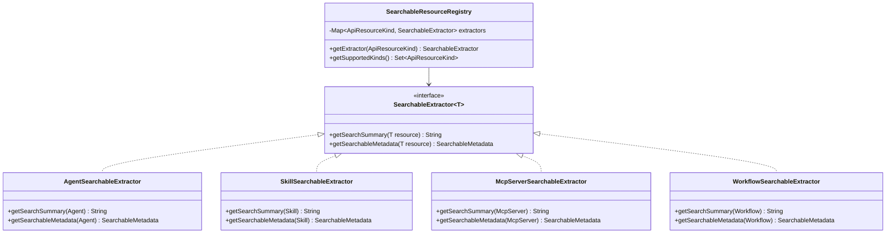

# Phase 2: Domain Interface and Value Objects

## Critical Architecture Insight

The original plan specified adding a `Searchable` interface to domain aggregates. However, after deep codebase analysis, I discovered that **domain entities are protobuf-generated classes** - they cannot implement custom interfaces or have methods added.

**Adaptation**: Replace the `Searchable` interface with a **Strategy Pattern** using `SearchableExtractor<T>`. This maintains the Open-Closed Principle while working within protobuf constraints.

---

## Architecture Overview




---

## Files to Create

All files in: `backend/services/stigmer-service/src/main/java/ai/stigmer/query/search/`

### 1. Value Objects (Immutable, Validated on Construction)

#### `valueobject/SearchQuery.java`

Encapsulates the search query string with validation.

```java
public record SearchQuery(String value) {
    private static final int MAX_LENGTH = 500;
    private static final SearchQuery EMPTY = new SearchQuery("");
    
    public SearchQuery {
        value = value == null ? "" : value.strip();
        if (value.length() > MAX_LENGTH) {
            throw new IllegalArgumentException(
                "Search query exceeds maximum length of " + MAX_LENGTH);
        }
    }
    
    public static SearchQuery empty() { return EMPTY; }
    public static SearchQuery of(String value) { return new SearchQuery(value); }
    public boolean isEmpty() { return value.isEmpty(); }
}
```

#### `valueobject/SearchCriteria.java`

Encapsulates all search parameters with validation and computed properties.

```java
public record SearchCriteria(
    Set<ApiResourceKind> kinds,
    SearchQuery query,
    String orgFilter,
    boolean excludePublic,
    int pageNumber,
    int pageSize
) {
    private static final Set<ApiResourceKind> SEARCHABLE_KINDS = Set.of(
        ApiResourceKind.agent,
        ApiResourceKind.skill,
        ApiResourceKind.mcp_server,
        ApiResourceKind.workflow
    );
    
    public SearchCriteria {
        // Defensive copy, filter to searchable kinds only
        kinds = kinds == null ? Set.of() 
            : kinds.stream()
                .filter(SEARCHABLE_KINDS::contains)
                .collect(Collectors.toUnmodifiableSet());
        query = query == null ? SearchQuery.empty() : query;
        orgFilter = orgFilter == null ? "" : orgFilter.strip();
        pageNumber = Math.max(1, pageNumber);
        pageSize = Math.clamp(pageSize, 1, 100);
    }
    
    public boolean isDiscoverMode() { return kinds.isEmpty(); }
    public boolean hasQuery() { return !query.isEmpty(); }
    
    public Set<ApiResourceKind> effectiveKinds() {
        return kinds.isEmpty() ? SEARCHABLE_KINDS : kinds;
    }
}
```

#### `valueobject/AuthorizedResourceIds.java`

Encapsulates FGA-authorized resource IDs per kind.

```java
public record AuthorizedResourceIds(
    Map<ApiResourceKind, Set<String>> idsByKind
) {
    public AuthorizedResourceIds {
        Objects.requireNonNull(idsByKind, "idsByKind must not be null");
        // Defensive copy - deep immutability
        idsByKind = idsByKind.entrySet().stream()
            .collect(Collectors.toUnmodifiableMap(
                Map.Entry::getKey,
                e -> Set.copyOf(e.getValue())
            ));
    }
    
    public static AuthorizedResourceIds empty() {
        return new AuthorizedResourceIds(Map.of());
    }
    
    public Set<String> getIds(ApiResourceKind kind) {
        return idsByKind.getOrDefault(kind, Set.of());
    }
    
    public boolean hasAccessTo(ApiResourceKind kind) {
        return !getIds(kind).isEmpty();
    }
    
    public int totalCount() {
        return idsByKind.values().stream()
            .mapToInt(Set::size)
            .sum();
    }
}
```

### 2. Metadata and DTO

#### `SearchableMetadata.java`

Extracted metadata for search result display.

```java
public record SearchableMetadata(
    ApiResourceKind kind,
    String id,
    String name,
    String slug,
    String org,
    ApiResourceVisibility visibility,
    List<String> tags,
    Instant createdAt,
    Instant updatedAt
) {
    public SearchableMetadata {
        Objects.requireNonNull(kind, "kind must not be null");
        Objects.requireNonNull(id, "id must not be null");
        name = name == null ? "" : name;
        slug = slug == null ? "" : slug;
        org = org == null ? "" : org;
        visibility = visibility == null 
            ? ApiResourceVisibility.visibility_private : visibility;
        tags = tags == null ? List.of() : List.copyOf(tags);
    }
    
    public String qualifiedSlug() {
        return org.isEmpty() ? slug : org + "/" + slug;
    }
}
```

#### `SearchResultDto.java`

Display-optimized projection for search results.

```java
public record SearchResultDto(
    SearchableMetadata metadata,
    String description,
    float score
) {
    public SearchResultDto {
        Objects.requireNonNull(metadata, "metadata must not be null");
        description = description == null ? "" : description;
        score = Math.clamp(score, 0.0f, 1.0f);
    }
    
    public static SearchResultDto of(
            SearchableMetadata metadata, 
            String description) {
        return new SearchResultDto(metadata, description, 1.0f);
    }
    
    public SearchResultDto withScore(float score) {
        return new SearchResultDto(this.metadata, this.description, score);
    }
}
```

### 3. Strategy Pattern (Replaces Searchable Interface)

#### `SearchableExtractor.java`

Interface for extracting searchable data from protobuf resources.

```java
/**
 * Strategy interface for extracting searchable data from API resources.
 * 
 * Each resource type has its own extractor that knows how to extract
 * the description and metadata from its specific protobuf structure.
 * This follows the Strategy Pattern since protobuf classes cannot
 * implement custom interfaces.
 * 
 * @param <T> The protobuf message type (Agent, Skill, etc.)
 */
public interface SearchableExtractor<T extends Message> {
    
    /**
     * Returns the resource kind this extractor handles.
     */
    ApiResourceKind getKind();
    
    /**
     * Extracts the display summary for search results.
     * This is the description shown in search result listings.
     */
    String getSearchSummary(T resource);
    
    /**
     * Extracts metadata needed for search result display.
     */
    SearchableMetadata getSearchableMetadata(T resource);
    
    /**
     * Returns combined searchable text for full-text indexing.
     * Used by MongoDB text index.
     */
    default String getSearchableText(T resource) {
        var metadata = getSearchableMetadata(resource);
        return String.join(" ",
            metadata.name(),
            getSearchSummary(resource),
            String.join(" ", metadata.tags())
        );
    }
}
```

#### `extractor/AgentSearchableExtractor.java`

```java
@Component
public class AgentSearchableExtractor implements SearchableExtractor<Agent> {
    
    @Override
    public ApiResourceKind getKind() {
        return ApiResourceKind.agent;
    }
    
    @Override
    public String getSearchSummary(Agent agent) {
        // Agent uses description if available, falls back to instructions
        if (agent.hasSpec()) {
            var spec = agent.getSpec();
            if (!spec.getDescription().isEmpty()) {
                return spec.getDescription();
            }
            return spec.getInstructions();
        }
        return "";
    }
    
    @Override
    public SearchableMetadata getSearchableMetadata(Agent agent) {
        var meta = agent.getMetadata();
        var status = agent.getStatus();
        var audit = status.hasAudit() ? status.getAudit() : null;
        
        return new SearchableMetadata(
            ApiResourceKind.agent,
            meta.getId(),
            meta.getName(),
            meta.getSlug(),
            meta.getOrg(),
            meta.getVisibility(),
            meta.getTagsList(),
            audit != null ? Instant.ofEpochSecond(
                audit.getCreatedAt().getSeconds(),
                audit.getCreatedAt().getNanos()) : Instant.EPOCH,
            audit != null ? Instant.ofEpochSecond(
                audit.getUpdatedAt().getSeconds(),
                audit.getUpdatedAt().getNanos()) : Instant.EPOCH
        );
    }
}
```

#### `extractor/SkillSearchableExtractor.java`

```java
@Component
public class SkillSearchableExtractor implements SearchableExtractor<Skill> {
    
    @Override
    public ApiResourceKind getKind() {
        return ApiResourceKind.skill;
    }
    
    @Override
    public String getSearchSummary(Skill skill) {
        return skill.hasSpec() ? skill.getSpec().getDescription() : "";
    }
    
    // ... similar getSearchableMetadata implementation
}
```

#### `extractor/McpServerSearchableExtractor.java` and `extractor/WorkflowSearchableExtractor.java`

Follow the same pattern - extract `spec.description` and metadata.

### 4. Registry

#### `SearchableResourceRegistry.java`

```java
/**
 * Registry mapping ApiResourceKind to its SearchableExtractor.
 * 
 * This enables the search query handler to work with any searchable
 * resource type without type-switching. Adding a new searchable
 * resource only requires implementing SearchableExtractor and
 * registering it (auto-discovered via @Component).
 */
@Component
@RequiredArgsConstructor
@Slf4j
public class SearchableResourceRegistry {
    
    private final Map<ApiResourceKind, SearchableExtractor<?>> extractors;
    
    @Autowired
    public SearchableResourceRegistry(List<SearchableExtractor<?>> extractorList) {
        this.extractors = extractorList.stream()
            .collect(Collectors.toUnmodifiableMap(
                SearchableExtractor::getKind,
                Function.identity(),
                (a, b) -> {
                    throw new IllegalStateException(
                        "Duplicate extractor for kind: " + a.getKind());
                }
            ));
        log.info("Initialized SearchableResourceRegistry with {} extractors: {}",
            extractors.size(), extractors.keySet());
    }
    
    @SuppressWarnings("unchecked")
    public <T extends Message> SearchableExtractor<T> getExtractor(
            ApiResourceKind kind) {
        var extractor = extractors.get(kind);
        if (extractor == null) {
            throw new IllegalArgumentException(
                "No extractor registered for kind: " + kind);
        }
        return (SearchableExtractor<T>) extractor;
    }
    
    public Set<ApiResourceKind> getSupportedKinds() {
        return extractors.keySet();
    }
    
    public boolean isSupported(ApiResourceKind kind) {
        return extractors.containsKey(kind);
    }
}
```

---

## Directory Structure

```
backend/services/stigmer-service/src/main/java/ai/stigmer/
└── query/                              # NEW: CQRS Query Layer
    └── search/
        ├── SearchableExtractor.java
        ├── SearchableMetadata.java
        ├── SearchableResourceRegistry.java
        ├── SearchResultDto.java
        ├── extractor/
        │   ├── AgentSearchableExtractor.java
        │   ├── SkillSearchableExtractor.java
        │   ├── McpServerSearchableExtractor.java
        │   └── WorkflowSearchableExtractor.java
        └── valueobject/
            ├── AuthorizedResourceIds.java
            ├── SearchCriteria.java
            └── SearchQuery.java
```

---

## Design Principles Applied

1. **Strategy Pattern**: `SearchableExtractor` allows polymorphic resource handling without modifying protobuf classes
2. **Value Objects**: All data classes are immutable records with validation on construction
3. **Defensive Copying**: Collections are copied to ensure immutability
4. **Open-Closed Principle**: New searchable resources only require a new extractor
5. **Fail-Fast**: Invalid states rejected at construction time
6. **Type Safety**: Generic typing ensures compile-time correctness
7. **CQRS Alignment**: Query layer is separate from domain layer

---

## Validation Requirements

After implementation:

- All value objects reject invalid input on construction
- Collections are deeply immutable (modifications throw)
- Registry auto-discovers all extractors at startup
- Each extractor correctly extracts from its protobuf type
- Unit tests verify validation rules and edge cases

