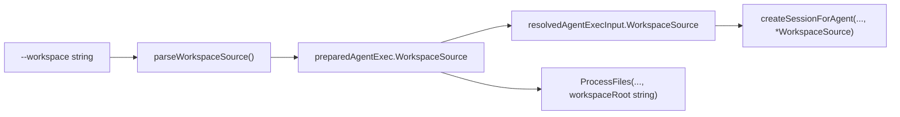
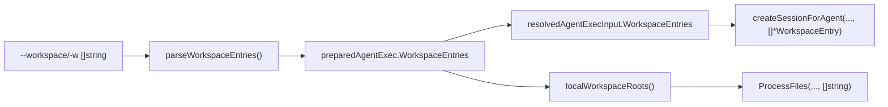

# Phase 2: CLI Multi-Workspace Support

## Domain Analysis (Architect Review)

The current singular workspace flow is clean and well-structured:




Phase 1 replaced `SessionSpec.workspace_source` (field 6) with `repeated WorkspaceEntry workspace_entries` (field 7). The CLI currently has compile errors because it still references the removed field. Phase 2 migrates the entire CLI pipeline to the new schema.

**Design validation** -- the plan from T01 is sound, with three observations:

1. **Parsing layer is permissive, provisioning layer enforces constraints.** `parseWorkspaceEntries` accepts mixed local+git entries. The restriction that mixed mode isn't supported yet belongs in Phase 3 (backend provisioner), not the CLI parser. This is correct separation of concerns.
2. **Name collision on duplicate basenames.** Two workspaces with the same derived name (e.g., two repos both named "app") produce a clear error. The inline naming syntax (`--workspace "url#name=custom"`) is deferred. This is the right MVP tradeoff -- explicit errors over implicit magic.
3. **Workspace file refs in multi-root.** `WorkspaceFileRefs` (on `AgentExecutionSpec`) currently stores workspace-relative paths. With multiple roots, a relative path is ambiguous. **See open question in Section 2d below -- needs a decision before implementation.**

---

## Section 2a: Flag + Parsing (Gaps 3, 4, 5)

### `run_agent_exec.go` -- Flag type change

```go
// Before (line 37):
WorkspaceFlag   string

// After:
WorkspaceFlags  []string
```

```go
// Before (line 67):
cmd.Flags().StringVar(&f.WorkspaceFlag, "workspace", "",
    "workspace source: HTTPS git URL or local filesystem path")

// After:
cmd.Flags().StringArrayVarP(&f.WorkspaceFlags, "workspace", "w", []string{},
    "workspace source: HTTPS git URL or local filesystem path (can be repeated)")
```

`StringArrayVarP` (not `StringSliceVar`) -- no CSV splitting, consistent with `--attach` and `--env` patterns already in this file. The `-w` shorthand follows the codebase convention (`-m`, `-v`, `-o`).

### `run_workspace.go` -- New parsing + name derivation

Keep `parseWorkspaceSource` as-is (internal helper, existing tests remain valid). Add three new functions:

`**parseWorkspaceEntries**` -- the new public API:

```go
func parseWorkspaceEntries(workspaces []string, branch, commit string) ([]*sessionv1.WorkspaceEntry, error)
```

Logic:

- `len == 0` + branch/commit set -> error
- `len == 0` + no branch/commit -> return nil (no workspace, same as today)
- `len > 1` + branch/commit set -> error with message: `"--branch and --commit are only valid with a single git workspace"`
- For each workspace string: call `parseWorkspaceSource(ws, branch, commit)` (branch/commit are empty strings when len > 1 due to validation above), derive name, check uniqueness
- Return `[]*sessionv1.WorkspaceEntry`

`**deriveEntryName**` -- auto-name from workspace value:

```go
func deriveEntryName(workspace string) (string, error)
```

Delegates to `deriveGitRepoName` or `deriveLocalDirName` based on `isGitURL`.

- Git: `url.Parse` -> last non-empty path segment, strip `.git` suffix, strip trailing `/`
- Local: `resolveLocalPath` (reuses existing function) -> `filepath.Base`
- Edge case: filesystem root `/` or empty derivation -> error

**Estimated file size:** ~108 -> ~170 lines (within the 250-line guideline).

### `run_workspace_test.go` -- New test cases

Existing `TestParseWorkspaceSource_`* tests remain unchanged (they test the internal helper).

New tests to add:

- `TestParseWorkspaceEntries_Empty` -- nil workspaces, no branch -> nil result
- `TestParseWorkspaceEntries_SingleLocal` -- one local path -> one entry, correct name
- `TestParseWorkspaceEntries_SingleGit` -- one git URL -> one entry, correct name
- `TestParseWorkspaceEntries_SingleGitWithBranch` -- branch applied to entry
- `TestParseWorkspaceEntries_MultipleLocal` -- two local dirs -> two entries with distinct names
- `TestParseWorkspaceEntries_MultipleBranchRejected` -- two workspaces + branch -> error
- `TestParseWorkspaceEntries_DuplicateNameRejected` -- two paths with same basename -> error
- `TestDeriveEntryName_GitURLs` -- table-driven: `.git` suffix, no suffix, trailing slash, nested paths
- `TestDeriveEntryName_LocalPaths` -- table-driven: absolute, relative `.`, `~/...`, nested

---

## Section 2b: Plumbing Structs (Gaps 10, 11, 12)

### `run_agent_exec.go` -- Struct field migration

Both structs change from singular to plural:

```go
// preparedAgentExec (line 102):
// Before:
WorkspaceSource *sessionv1.WorkspaceSource
// After:
WorkspaceEntries []*sessionv1.WorkspaceEntry

// resolvedAgentExecInput (line 206):
// Before:
WorkspaceSource *sessionv1.WorkspaceSource
// After:
WorkspaceEntries []*sessionv1.WorkspaceEntry
```

### `run_agent_exec.go` -- `prepareAgentExec` caller update

```go
// Before (line 128):
workspaceSource, err := parseWorkspaceSource(flags.WorkspaceFlag, flags.BranchFlag, flags.CommitFlag)

// After:
workspaceEntries, err := parseWorkspaceEntries(flags.WorkspaceFlags, flags.BranchFlag, flags.CommitFlag)
```

And the struct initialization at the bottom updates `WorkspaceSource: workspaceSource` -> `WorkspaceEntries: workspaceEntries`.

### `run.go` -- `routeRun` pass-through

[run.go](client-apps/cli/cmd/stigmer/root/run.go) lines 269-282 and 286:

```go
// Before (line 274):
WorkspaceSource: prep.WorkspaceSource,

// After:
WorkspaceEntries: prep.WorkspaceEntries,

// Before (line 286):
if prep.WorkspaceSource != nil {

// After:
if len(prep.WorkspaceEntries) > 0 {
```

### `draft_handler.go` -- Pass-through

[draft_handler.go](client-apps/cli/cmd/stigmer/root/draft_handler.go) line 93:

```go
// Before:
WorkspaceSource: prep.WorkspaceSource,

// After:
WorkspaceEntries: prep.WorkspaceEntries,
```

No other changes -- the draft handler is a pure pass-through.

---

## Section 2c: Session Creation (Gap 7)

### `run_create.go` -- Signature + body update

[run_create.go](client-apps/cli/cmd/stigmer/root/run_create.go) lines 99-124:

```go
// Before:
func createSessionForAgent(agentInstanceID, orgID string, workspaceSource *sessionv1.WorkspaceSource, conn *grpc.ClientConn) (*sessionv1.Session, error) {
    // ...
    Spec: &sessionv1.SessionSpec{
        AgentInstanceId: agentInstanceID,
        Subject:         "Auto-created session",
        WorkspaceSource: workspaceSource,  // COMPILE ERROR: field removed in Phase 1
    },

// After:
func createSessionForAgent(agentInstanceID, orgID string, entries []*sessionv1.WorkspaceEntry, conn *grpc.ClientConn) (*sessionv1.Session, error) {
    // ...
    Spec: &sessionv1.SessionSpec{
        AgentInstanceId:  agentInstanceID,
        Subject:          "Auto-created session",
        WorkspaceEntries: entries,
    },
```

### `run_agent_exec.go` -- `executeResolvedAgent` caller update

[run_agent_exec.go](client-apps/cli/cmd/stigmer/root/run_agent_exec.go) lines 224-232:

```go
// Before:
if input.WorkspaceSource != nil {
    // ...
    session, err := createSessionForAgent(instanceID, input.OrgID, input.WorkspaceSource, input.Conn)

// After:
if len(input.WorkspaceEntries) > 0 {
    // ...
    session, err := createSessionForAgent(instanceID, input.OrgID, input.WorkspaceEntries, input.Conn)
```

---

## Section 2d: Local Workspace Roots + Attachments (Gaps 6, 8, 9)

### `run.go` -- `localWorkspaceRoot` -> `localWorkspaceRoots`

[run.go](client-apps/cli/cmd/stigmer/root/run.go) lines 22-31:

```go
// Before:
func localWorkspaceRoot(ws *sessionv1.WorkspaceSource) string

// After:
func localWorkspaceRoots(entries []*sessionv1.WorkspaceEntry) []string
```

Iterates entries, extracts `.GetSource().GetLocalPath().GetPath()` for each local-path entry. Skips git entries (they have no local root). Returns nil if no local entries.

### `run_attachments.go` -- `ProcessFiles` multi-root containment

[run_attachments.go](client-apps/cli/cmd/stigmer/root/run_attachments.go) line 50:

```go
// Before:
func (p *AttachmentProcessor) ProcessFiles(paths []string, workspaceRoot string) (*AttachmentResult, error)

// After:
func (p *AttachmentProcessor) ProcessFiles(paths []string, workspaceRoots []string) (*AttachmentResult, error)
```

Inner loop changes from checking one root to iterating roots (first match wins). `workspaceRelativePath` is unchanged -- it's called per (path, root) pair.

### `run_agent_exec.go` -- `prepareAgentExec` caller

```go
// Before (line 166):
localRoot := localWorkspaceRoot(workspaceSource)
res, err := processor.ProcessFiles(flags.AttachFlags, localRoot)

// After:
localRoots := localWorkspaceRoots(workspaceEntries)
res, err := processor.ProcessFiles(flags.AttachFlags, localRoots)
```

### OPEN QUESTION: Workspace file ref ambiguity in multi-root

Currently `WorkspaceFileRefs` stores workspace-root-relative paths (e.g., `src/App.tsx`). With multiple roots, a relative path is ambiguous -- the backend doesn't know which root it belongs to.

Two options:

- **A) Absolute paths**: always store the absolute file path. Unambiguous, simple. The backend can compute relative paths per-entry if needed. Slight contract change but `WorkspaceFileRefs` is `repeated string` with no documented format constraint.
- **B) Prefixed paths**: store `{entry_name}/{relative_path}`. Requires the backend to parse the prefix. More structured but couples to the naming scheme.

**My recommendation: Option A (absolute paths) for multi-root, keep relative for single-root** (backward compatible). The backend is the system prompt generator, and for multi-root local mode, the system prompt already lists absolute paths. Consistency.

This decision affects ~5 lines of code in `ProcessFiles`. I will pause and wait for your input before implementing this part.

---

## Help Text + Examples Update

[run.go](client-apps/cli/cmd/stigmer/root/run.go) long-form help text needs updates:

- `--workspace URL|PATH` -> `--workspace, -w URL|PATH` with note "(can be repeated)"
- Add multi-workspace examples:

```
  # Run with multiple workspaces (multi-root)
  stigmer run agent code-reviewer -w ./frontend -w ./backend -m "Review both"
  

```

---

## Compilation Verification

After all four sections, the code should compile cleanly. The data flow becomes:




---

## Note: `run_agent_exec.go` is 287 lines (over the 250-line guideline)

This file was already over the limit before our changes. Our changes are field renames and caller updates -- no net growth. Splitting it (e.g., into `run_agent_exec_flags.go`, `run_agent_exec_prepare.go`, `run_agent_exec.go`) is a worthwhile cleanup but orthogonal to Phase 2. I recommend deferring it to avoid mixing refactoring with feature work in the same diff. Your call.