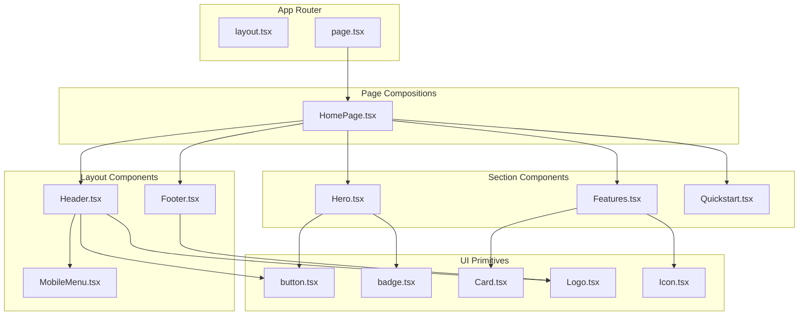

# Phase 2: Core Components Implementation

## Current State Assessment

Phase 1 delivered solid infrastructure:

- Next.js 15 with App Router and static export
- Tailwind CSS 4 with HSL design tokens
- `Button` and `Badge` components (shadcn/ui pattern)
- Well-structured utilities: `cn()`, date formatters, `SITE_CONFIG`, `NAV_LINKS`, `FOOTER_LINKS`, `FEATURES`

The constants already define navigation and features - we leverage these directly.

---

## Architecture




---

## Component Specifications

### 1. UI Primitives (New)

#### 1.1 Logo Component

**File:** `src/components/ui/logo.tsx`

**Purpose:** Branded logo with multiple size variants for header/footer reuse.

**Interface:**

```typescript
interface LogoProps {
  size?: "sm" | "md" | "lg";
  showText?: boolean;  // Logo mark only vs. mark + wordmark
  className?: string;
}
```

**Behavior:**

- Gradient logo mark ("S" or SVG icon)
- Optional wordmark text
- Responsive sizing
- Server component (no "use client")

---

#### 1.2 Icon Component

**File:** `src/components/ui/icon.tsx`

**Purpose:** Type-safe wrapper around lucide-react icons for consistent sizing and styling.

**Interface:**

```typescript
interface IconProps {
  name: IconName;  // Union type of allowed icon names
  size?: "sm" | "md" | "lg";
  className?: string;
}
```

**Why:** Centralizes icon usage, ensures consistent sizing, enables easy icon swaps.

---

#### 1.3 Card Component

**File:** `src/components/ui/card.tsx`

**Purpose:** Flexible card primitive for feature cards, content blocks.

**Interface:**

```typescript
interface CardProps extends React.HTMLAttributes<HTMLDivElement> {
  variant?: "default" | "elevated" | "bordered";
}

// Plus: CardHeader, CardContent, CardFooter subcomponents
```

**Pattern:** Forward ref, composable subcomponents.

---

### 2. Layout Components

#### 2.1 Header Component

**File:** `src/components/layout/Header.tsx`

**Requirements:**

- Fixed position with backdrop blur
- Logo (links to home)
- Desktop navigation from `NAV_LINKS`
- Mobile hamburger menu (sheet/drawer pattern)
- GitHub star count badge (optional, client component)
- Semantic `<header>` with `<nav>` inside

**Design Decisions:**

- Desktop: horizontal nav links + GitHub button
- Mobile (< 768px): hamburger icon opens slide-out menu
- Height: 64px (`h-16`)
- Z-index: 50 (above page content)

**Accessibility:**

- `aria-label` on nav
- `aria-expanded` on mobile menu trigger
- Focus trap in mobile menu
- Escape key closes menu

**Structure:**

```typescript
// Server component shell
const Header = () => (
  <header className="fixed top-0 w-full z-50 bg-background/95 backdrop-blur-sm border-b border-border">
    <div className="max-w-7xl mx-auto px-4 sm:px-6 lg:px-8 h-16 flex items-center justify-between">
      <Logo />
      <DesktopNav />     {/* Hidden on mobile */}
      <MobileMenuTrigger /> {/* Hidden on desktop */}
    </div>
  </header>
);
```

---

#### 2.2 MobileMenu Component

**File:** `src/components/layout/MobileMenu.tsx`

**Requirements:**

- Slide-out drawer from right
- Full navigation links
- Close button with X icon
- Overlay backdrop
- Body scroll lock when open
- Smooth open/close animations

**State:** Client component with `useState` for open/closed.

**Accessibility:**

- Focus trap within menu
- `aria-modal="true"` on menu container
- Return focus to trigger on close

---

#### 2.3 Footer Component

**File:** `src/components/layout/Footer.tsx`

**Requirements:**

- Multi-column grid layout from `FOOTER_LINKS`
- Logo + tagline column
- Product links column
- Resources links column
- Community links column (with external link indicators)
- Bottom bar: copyright + license

**Design:**

- 4-column on desktop, 2-column on tablet, stacked on mobile
- External links: open in new tab with `rel="noopener noreferrer"`
- External link icon indicator

---

### 3. Section Components

#### 3.1 Hero Section

**File:** `src/components/sections/Hero.tsx`

**Requirements:**

- Full viewport height minus header (`min-h-[calc(100vh-4rem)]`)
- Gradient background effects
- Logo/brand element
- Primary headline (from `SITE_CONFIG.tagline` or custom)
- Subheadline (value proposition)
- Badge chips (Open Source, CLI-first, etc.)
- Primary CTA: "Get Started" button
- Secondary CTA: "View on GitHub" outline button
- Install command snippet with copy button

**Visual Effects:**

- Radial gradient at center
- Subtle grid or dot pattern
- Floating accent blurs

---

#### 3.2 Features Section

**File:** `src/components/sections/Features.tsx`

**Requirements:**

- Section heading with gradient text
- 6-card grid from `FEATURES` constant
- Each card: icon + title + description
- Hover effects (subtle elevation, glow)
- Responsive: 1 col mobile, 2 col tablet, 3 col desktop

**Card Design:**

- Icon in gradient container
- Title in white/foreground
- Description in muted-foreground
- Subtle border + background

---

#### 3.3 Quickstart Section

**File:** `src/components/sections/Quickstart.tsx`

**Requirements:**

- Section heading
- Installation command with syntax highlighting
- Copy-to-clipboard button with feedback
- Brief "next steps" or link to docs

**Code Display:**

```
go install github.com/stigmer/stigmer/cmd/stigmer@latest
```

---

### 4. Page Composition

#### 4.1 HomePage Component

**File:** `src/components/pages/HomePage.tsx`

**Purpose:** Assembles all sections into the complete landing page.

**Structure:**

```tsx
const HomePage = () => (
  <div className="min-h-screen bg-background">
    <Header />
    <main className="pt-16">
      <Hero />
      <Features />
      <Quickstart />
    </main>
    <Footer />
  </div>
);
```

---

## File Structure

```
src/components/
├── layout/
│   ├── Header.tsx           # Fixed header with navigation
│   ├── MobileMenu.tsx       # Slide-out mobile navigation
│   └── Footer.tsx           # Multi-column footer
├── pages/
│   └── HomePage.tsx         # Landing page composition
├── sections/
│   ├── Hero.tsx             # Hero section with CTAs
│   ├── Features.tsx         # Feature cards grid
│   └── Quickstart.tsx       # Installation command
└── ui/
    ├── button.tsx           # (exists)
    ├── badge.tsx            # (exists)
    ├── card.tsx             # New: flexible card primitive
    ├── logo.tsx             # New: branded logo component
    └── icon.tsx             # New: type-safe icon wrapper
```

---

## Quality Standards

**Type Safety:**

- Explicit interfaces for all component props
- Forward refs for DOM-exposing components
- Strict mode compliance
- No `any` types

**Accessibility:**

- Semantic HTML (`<header>`, `<nav>`, `<main>`, `<footer>`, `<section>`)
- ARIA attributes where needed
- Keyboard navigation support
- Focus management in modals

**Performance:**

- Server components by default
- Client components only where state/interactivity needed
- Minimal bundle size (no heavy dependencies)
- Proper code splitting

**Maintainability:**

- JSDoc comments on exports
- Consistent naming conventions
- Single responsibility per component
- Leverage existing constants (no hardcoded strings)

---

## Implementation Order

1. **UI primitives first** - Logo, Icon, Card (building blocks)
2. **Layout components** - Header, MobileMenu, Footer (structural)
3. **Section components** - Hero, Features, Quickstart (content)
4. **HomePage composition** - Wire everything together
5. **Update page.tsx** - Replace placeholder with HomePage

This order ensures each layer has its dependencies ready.

---

## Key Files to Leverage

- `src/lib/constants.ts` - `SITE_CONFIG`, `NAV_LINKS`, `FOOTER_LINKS`, `FEATURES`
- `src/lib/utils.ts` - `cn()` for class merging
- `src/app/globals.css` - Design tokens (primary, accent, muted, etc.)
- `src/components/ui/button.tsx` - Pattern reference for CVA + forwardRef

