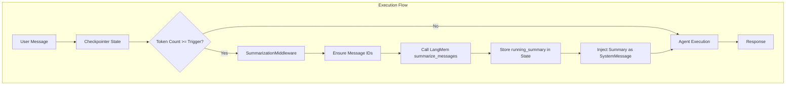
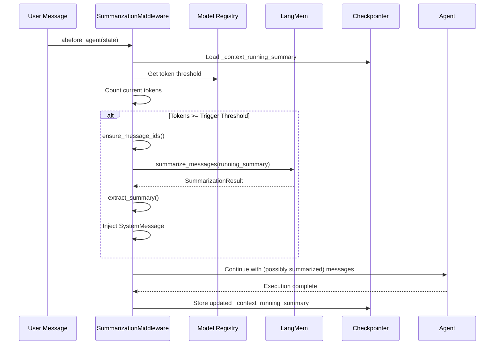

# Phase 2: Context Summarization - Graphton Integration

## Architecture Overview

This integration follows Graphton's established patterns: middleware for lifecycle hooks, Model Registry for configuration, and checkpointer state for persistence. The design prioritizes clean abstractions, zero technical debt, and comprehensive testing.




## Key Design Decisions

1. **Middleware Pattern** - Follow `LoopDetectionMiddleware` pattern exactly (implements `AgentMiddleware` protocol)
2. **Token Counting** - Use Model Registry's `token_counter_method` for accurate counting per provider
3. **State Storage** - Store `running_summary` in checkpointer state under `_context_running_summary` key
4. **Message IDs** - Auto-generate UUIDs for messages without IDs (LangMem requirement)
5. **Summary Injection** - Inject summary as a SystemMessage after the original system prompt
6. **Economy-Tier Models** - Use Model Registry's `get_summarization_model()` for cost efficiency

## Files to Create

### 1. SummarizationConfig ([backend/libs/python/graphton/src/graphton/core/summarization_config.py](backend/libs/python/graphton/src/graphton/core/summarization_config.py))

Configuration dataclass with Model Registry integration:

```python
@dataclass(frozen=True)
class SummarizationConfig:
    """Configuration for context summarization."""
    enabled: bool
    trigger_threshold: int      # From ModelMetadata.summarization_trigger_threshold
    target_tokens: int          # From ModelMetadata.summarization_target_tokens
    max_summary_tokens: int     # From ModelMetadata.max_summary_tokens
    summarization_model: str    # From ModelRegistry.get_summarization_model()
    token_counter_method: TokenCounterMethod
    
    @classmethod
    def for_model(cls, model_id: str, enabled: bool = True) -> "SummarizationConfig":
        """Create config with model-appropriate defaults from registry."""
```

### 2. Token Counter ([backend/libs/python/graphton/src/graphton/core/token_counter.py](backend/libs/python/graphton/src/graphton/core/token_counter.py))

Unified token counting with method dispatch:

```python
class TokenCounter:
    """Token counting using Model Registry method dispatch."""
    
    @classmethod
    def count_messages(cls, messages: list[BaseMessage], method: TokenCounterMethod) -> int:
        """Count tokens using the appropriate strategy."""
```

Supports:

- `TIKTOKEN_CL100K` - GPT-4, GPT-3.5 (tiktoken `cl100k_base`)
- `TIKTOKEN_O200K` - GPT-4o, o1 (tiktoken `o200k_base`)
- `ANTHROPIC_NATIVE` - Claude models (anthropic tokenizer)
- `APPROXIMATE` - Fallback (chars / 4)

### 3. SummarizationMiddleware ([backend/libs/python/graphton/src/graphton/core/summarization_middleware.py](backend/libs/python/graphton/src/graphton/core/summarization_middleware.py))

Core middleware implementing `AgentMiddleware` protocol:

```python
class SummarizationMiddleware(AgentMiddleware):
    """Middleware for automatic context summarization.
    
    Follows the same lifecycle pattern as LoopDetectionMiddleware:
    - abefore_agent: Check token count, summarize if needed
    - aafter_step: Optional mid-execution summarization (future)
    - aafter_agent: Store updated running_summary in state
    """
```

Key responsibilities:

- Ensure messages have IDs before summarization
- Create LangChain model instance for summarization
- Call `langmem.short_term.summarize_messages()`
- Extract summary from `result.running_summary.summary`
- Store `running_summary` in checkpointer state
- Inject summary as SystemMessage into conversation

### 4. Message ID Utilities ([backend/libs/python/graphton/src/graphton/core/message_utils.py](backend/libs/python/graphton/src/graphton/core/message_utils.py))

Helper functions for message handling:

```python
def ensure_message_ids(messages: list[BaseMessage]) -> list[BaseMessage]:
    """Ensure all messages have unique IDs (required by LangMem)."""

def extract_summary_from_result(result: Any) -> str:
    """Extract summary text from LangMem SummarizationResult."""
```

## Files to Modify

### 1. [backend/libs/python/graphton/src/graphton/core/agent.py](backend/libs/python/graphton/src/graphton/core/agent.py)

Add `summarization_config` parameter to `create_deep_agent()`:

```python
def create_deep_agent(
    model: str | BaseChatModel,
    system_prompt: str,
    # ... existing params ...
    summarization_config: SummarizationConfig | None = None,  # NEW
) -> CompiledStateGraph:
```

Integration point (~line 351, after loop detection middleware):

```python
# Add summarization middleware if configured
if summarization_config and summarization_config.enabled:
    summarization_middleware = SummarizationMiddleware(
        config=summarization_config,
        checkpointer=checkpointer,
    )
    middleware_list.insert(0, summarization_middleware)  # Run first
```

### 2. [backend/libs/python/graphton/src/graphton/**init**.py](backend/libs/python/graphton/src/graphton/__init__.py)

Export new public API:

```python
from graphton.core.summarization_config import SummarizationConfig
from graphton.core.token_counter import TokenCounter
```

### 3. [backend/libs/python/graphton/src/graphton/core/**init**.py](backend/libs/python/graphton/src/graphton/core/__init__.py)

Export from core module.

### 4. [backend/services/agent-runner/worker/activities/execute_graphton.py](backend/services/agent-runner/worker/activities/execute_graphton.py)

Wire up summarization in agent execution:

```python
from graphton import SummarizationConfig

# After model determination (~line 214)
summarization_config = SummarizationConfig.for_model(
    model_id=model_name,
    enabled=True,  # Or from agent.spec configuration
)

# Pass to create_deep_agent (~line 638)
agent_graph = create_deep_agent(
    # ... existing params ...
    summarization_config=summarization_config,
)
```

## State Management Design

### Checkpointer State Structure

```python
{
    "messages": [...],  # LangGraph standard
    "_context_running_summary": {  # Our addition
        "summary": "Conversation summary text...",
        "summarized_message_ids": {"msg_001", "msg_002", ...},
        "last_summarized_message_id": "msg_042",
        "token_count_at_summarization": 175000,
        "summarization_timestamp": "2026-01-31T12:00:00Z",
    }
}
```

### Summarization Flow




## Test Strategy

### Unit Tests ([backend/libs/python/graphton/tests/core/test_summarization_middleware.py](backend/libs/python/graphton/tests/core/test_summarization_middleware.py))

- `test_config_for_model_*` - SummarizationConfig.for_model() with all providers
- `test_token_counter_*` - Token counting for each method
- `test_message_ids_*` - Message ID generation and preservation
- `test_summary_extraction_*` - Extract from SummarizationResult
- `test_middleware_lifecycle_*` - Full middleware protocol

### Integration Tests ([backend/libs/python/graphton/tests/integration/test_summarization_integration.py](backend/libs/python/graphton/tests/integration/test_summarization_integration.py))

- `test_summarization_triggers_at_threshold` - Verify threshold behavior
- `test_summary_injected_correctly` - SystemMessage position
- `test_running_summary_persists` - Multi-invocation persistence
- `test_no_summarization_below_threshold` - Negative case
- `test_graceful_degradation_unknown_model` - Default handling

### E2E Tests (extend existing evaluation suite)

- Add summarization to 100+ turn conversation tests
- Verify fact retention with real agents
- Measure latency impact

## Dependencies

Add to `backend/libs/python/graphton/pyproject.toml`:

```toml
[tool.poetry.dependencies]
langmem = "^0.0.30"
tiktoken = "^0.7.0"  # For OpenAI token counting
```

## Quality Standards

This implementation adheres to:

1. **Type Safety** - Full type hints, frozen dataclasses, enums for categories
2. **Immutability** - SummarizationConfig is frozen, state modifications explicit
3. **Single Responsibility** - Each class has one job (config, counting, middleware)
4. **Fail-Safe Defaults** - Unknown models get conservative 8K defaults
5. **Comprehensive Logging** - Debug logging for token counts, summarization events
6. **Zero Technical Debt** - Clean abstractions, no shortcuts, full test coverage
7. **Documentation** - Google-style docstrings with examples on all public APIs

## Success Criteria

- Token counting accuracy within 5% of native provider APIs
- Summarization triggers correctly at configured thresholds
- Running summary persists across agent invocations
- No regression in agent execution latency (<100ms overhead when not summarizing)
- All existing tests continue to pass
- New test suite achieves >90% coverage of new code

