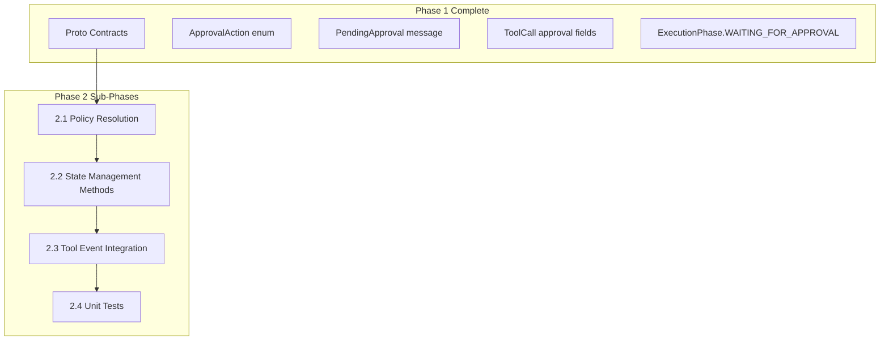

# Phase 2: StatusBuilder Approval State Management

## Architecture Context

StatusBuilder processes LangGraph `astream_events` and builds `AgentExecutionStatus` protos in-memory. Phase 1 added the proto contracts; Phase 2 integrates approval state tracking into StatusBuilder.



---

## Phase 2.1: Approval Policy Resolution (~45 min)

**Goal**: Create a helper module to determine if a tool requires approval based on the policy chain.

**Approval Policy Chain** (highest to lowest priority):

1. `AgentExecutionSpec.auto_approve_all` - Runtime bypass
2. `Agent.McpServerUsage.tool_approval_overrides` - Per-agent customization
3. `McpServer.default_tool_approvals` - Platform defaults

**New File**: `backend/services/agent-runner/worker/activities/graphton/approval_policy.py`

```python
@dataclass
class ApprovalRequirement:
    requires_approval: bool
    message: str  # Template with {{args.field}} placeholders
    
def resolve_tool_approval(
    tool_name: str,
    mcp_server_name: str,
    auto_approve_all: bool,
    tool_approval_overrides: List[ToolApprovalOverride],
    default_tool_approvals: List[ToolApprovalPolicy],
) -> ApprovalRequirement:
    """Resolve approval requirement using policy chain."""
    
def render_approval_message(template: str, tool_args: Dict[str, Any]) -> str:
    """Render approval message template with tool arguments."""
```

**Key Design Decisions**:

- Pure functions with no I/O - easy to test
- Explicit policy chain evaluation order
- Template rendering for dynamic messages

---

## Phase 2.2: State Management Methods (~1 hour)

**Goal**: Add approval state tracking methods to StatusBuilder.

**File**: [status_builder.py](backend/services/agent-runner/worker/activities/graphton/status_builder.py)

**New Instance Variables**:

```python
# Approval state tracking
self._pending_tool_approval: Optional[str] = None  # run_id of pending tool
```

**New Methods**:

```python
def set_tool_waiting_approval(
    self,
    run_id: str,
    tool_name: str,
    tool_args: Dict[str, Any],
    approval_message: str,
    from_sub_agent: bool = False,
    sub_agent_name: str = "",
) -> None:
    """
    Set a tool call to WAITING_APPROVAL status and update execution phase.
    
    1. Find ToolCall by run_id
    2. Set status = TOOL_CALL_WAITING_APPROVAL
    3. Set requires_approval = True
    4. Set approval_message
    5. Set approval_requested_at
    6. Populate pending_approval on AgentExecutionStatus
    7. Set phase = EXECUTION_WAITING_FOR_APPROVAL
    """

def set_tool_approval_decision(
    self,
    run_id: str,
    action: ApprovalAction,
    approved_by: str,
) -> None:
    """
    Record approval decision on a tool call.
    
    1. Find ToolCall by run_id
    2. Set approval_action
    3. Set approval_decided_at
    4. Set approved_by
    5. Update status based on action:
       - APPROVE: Keep WAITING_APPROVAL (execution will set RUNNING)
       - SKIP: Set TOOL_CALL_SKIPPED
       - REJECT: Set TOOL_CALL_FAILED
    6. Clear pending_approval
    7. Restore phase (if not rejected)
    """

def clear_pending_approval(self) -> None:
    """Clear pending approval state and restore IN_PROGRESS phase."""
```

**Integration with Existing Methods**:

- Approval state affects `_get_execution_context()` for sub-agent propagation
- Must handle dual-reference pattern (messages[] and tool_calls[])

---

## Phase 2.3: Tool Event Integration (~1.5 hours)

**Goal**: Integrate approval checks into tool event handling.

**File**: [status_builder.py](backend/services/agent-runner/worker/activities/graphton/status_builder.py)

**Method Modifications**:

### `__init__` Changes:

```python
def __init__(self, execution_id: str, initial_status: Any, approval_config: ApprovalConfig = None):
    # ... existing init ...
    self._approval_config = approval_config  # Contains policy data
    self._pending_tool_approval: Optional[str] = None
```

### `_handle_tool_start_event` Changes:

```python
def _handle_tool_start_event(self, event: Dict[str, Any], namespace: str = "") -> None:
    # ... existing extraction and deduplication ...
    
    # NEW: Check approval requirement BEFORE creating ToolCall
    if self._approval_config and not self._approval_config.auto_approve_all:
        requirement = resolve_tool_approval(
            tool_name=tool_name,
            mcp_server_name=self._get_mcp_server_for_tool(tool_name),
            auto_approve_all=self._approval_config.auto_approve_all,
            tool_approval_overrides=self._approval_config.tool_approval_overrides,
            default_tool_approvals=self._approval_config.default_tool_approvals,
        )
        
        if requirement.requires_approval:
            # Create ToolCall with WAITING_APPROVAL status
            # Populate approval fields
            # Set execution phase
            return  # Don't proceed to RUNNING
    
    # ... existing RUNNING flow ...
```

**New Data Class**:

```python
@dataclass
class ApprovalConfig:
    """Configuration for tool approval policies."""
    auto_approve_all: bool
    tool_approval_overrides: List[ToolApprovalOverride]
    default_tool_approvals: Dict[str, List[ToolApprovalPolicy]]  # mcp_server -> policies
```

---

## Phase 2.4: Unit Tests (~1.5 hours)

**Goal**: Comprehensive test coverage for all new functionality.

**File**: [test_status_builder.py](backend/services/agent-runner/tests/test_status_builder.py)

**Test Classes to Add**:

### `TestApprovalPolicyResolution`:

- `test_auto_approve_all_bypasses_all_policies`
- `test_agent_override_takes_precedence_over_mcp_default`
- `test_mcp_default_applied_when_no_override`
- `test_no_approval_required_when_no_policy_matches`
- `test_approval_message_template_rendering`
- `test_approval_message_handles_missing_args`

### `TestToolWaitingApproval`:

- `test_set_tool_waiting_approval_updates_status`
- `test_set_tool_waiting_approval_populates_pending_approval`
- `test_set_tool_waiting_approval_sets_execution_phase`
- `test_set_tool_waiting_approval_sets_timestamps`
- `test_set_tool_waiting_approval_from_sub_agent`

### `TestToolApprovalDecision`:

- `test_approve_action_keeps_status_for_execution`
- `test_skip_action_sets_skipped_status`
- `test_reject_action_sets_failed_status`
- `test_decision_records_approved_by_and_timestamp`
- `test_decision_clears_pending_approval`

### `TestToolStartApprovalIntegration`:

- `test_tool_start_creates_waiting_approval_when_required`
- `test_tool_start_skips_approval_when_auto_approve_all`
- `test_tool_start_proceeds_to_running_when_no_approval_required`

---

## Key Files

| File | Purpose |

|------|---------|

| [status_builder.py](backend/services/agent-runner/worker/activities/graphton/status_builder.py) | Main implementation |

| [approval_policy.py](backend/services/agent-runner/worker/activities/graphton/approval_policy.py) | New - Policy resolution |

| [test_status_builder.py](backend/services/agent-runner/tests/test_status_builder.py) | Unit tests |

---

## Quality Checkpoints

After each sub-phase:

1. All existing tests pass
2. New tests pass
3. Linter errors resolved
4. Code follows existing patterns in codebase

---

## Risk Mitigation

- **Context Limits**: Each sub-phase is self-contained (~45-90 min of focused work)
- **Dual Reference Pattern**: Careful handling of ToolCall references in both `messages[]` and `tool_calls[]`
- **Backward Compatibility**: `ApprovalConfig` is optional; existing code continues to work
- **Sub-agent Propagation**: `from_sub_agent` flag enables proper surfacing to parent

---

## Not in Scope (Future Phases)

- LangGraph interrupt/resume integration (Phase 3)
- Java handler for SubmitApproval RPC (Phase 4)
- execute_graphton.py integration (Phase 3)
- CLI support (Phase 6)