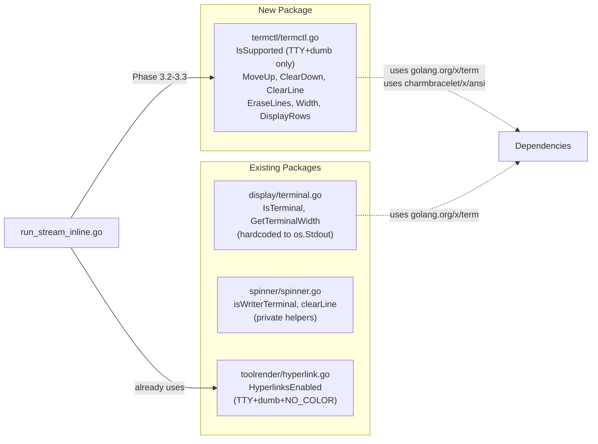

# Phase 3.0: Terminal Cursor Control Primitives

## Domain Analysis

**What this package is**: A low-level, domain-agnostic terminal control library. It writes ANSI CSI sequences (cursor movement, screen erasure) and measures text layout (display rows accounting for wrapping and escape sequences). It does NOT handle rendering, content, or business logic.

**What this package is NOT**: It is not a replacement for `pkg/display/` (which handles formatting, color measurement, terminal width for rendering). `termctl` serves a different audience — cursor manipulation for the collapse-after-approval UX flow.

**Why a new package instead of extending `display/`**: `display/` functions are hard-coded to `os.Stdout` and oriented toward formatting/measurement. `termctl` follows strict DI (all functions take `io.Writer` or accept parameters), is stateless, and is purely about terminal control. Separate concerns, separate packages.

**Relationship to existing code**:




No changes to existing packages. `termctl` is additive.

---

## Interface Blueprint

### Public API (7 functions, all stateless)

```go
package termctl

// IsSupported reports whether w is a terminal that can handle ANSI cursor
// control sequences. Returns false for non-TTY writers and dumb terminals.
// Does NOT check NO_COLOR — cursor control is UX, not decoration.
func IsSupported(w io.Writer) bool

// MoveUp moves the cursor up n lines. No-op when n <= 0.
func MoveUp(w io.Writer, n int)

// ClearDown erases from the cursor position to the end of the screen.
func ClearDown(w io.Writer)

// ClearLine erases the entire current line and moves the cursor to column 0.
func ClearLine(w io.Writer)

// EraseLines erases n lines of previously written output. Moves the cursor
// up n-1 lines, then clears from that position to the end of the screen.
// After this call, the cursor is at column 0 of the topmost erased line.
// The entire sequence is written atomically (single Write call).
// No-op when n <= 0; clears only the current line when n == 1.
func EraseLines(w io.Writer, n int)

// Width returns the terminal width in columns for the writer's underlying
// file descriptor. Returns defaultWidth if w is not an *os.File, not a
// terminal, or the size cannot be determined.
func Width(w io.Writer, defaultWidth int) int

// DisplayRows calculates the number of terminal rows required to display
// text on a terminal of the given column width, accounting for line wrapping
// and ANSI escape sequences (CSI, OSC). A trailing newline does not add an
// extra row. Returns 0 for empty text.
func DisplayRows(text string, width int) int
```

### Design Decisions Baked In

- **DI compliance**: Every function takes `io.Writer` (or pure parameters). No `os.Stdout` references. Callers pass `cfg.status` (stderr) — same as `toolrender.HyperlinksEnabled`.
- **Fire-and-forget writes**: `MoveUp`, `ClearDown`, `ClearLine`, `EraseLines` do not return errors. Terminal control writes are best-effort. This matches the spinner pattern (`fmt.Fprint(s.w, ...)` ignoring error).
- `**EraseLines` is atomic**: Builds the full sequence (`\033[nA\r\033[J`) in a buffer, writes once. Prevents interleaving if other goroutines write to the same writer (defensive, even though the inline renderer is single-goroutine for stderr).
- `**IsSupported` checks TTY + TERM!=dumb only** (confirmed: `NO_COLOR` not checked — cursor control is orthogonal to color preference).
- `**DisplayRows` uses `charmbracelet/x/ansi.StringWidth`**: Already a dependency in `toolrender/BUILD.bazel`. Handles CSI, OSC 8, and Unicode width correctly. No need to roll our own ANSI stripping.
- `**MoveUp(w, 0)` is a no-op**: ANSI spec treats `\033[0A` as "move up 1" (0 defaults to 1). Guard prevents accidental cursor displacement.

### Edge Cases

- `**EraseLines(w, 1)`**: Only clears the current line (no `MoveUp`). Useful for clearing a spinner-like line.
- `**DisplayRows("", width)`**: Returns 0. Empty text occupies no rows.
- `**DisplayRows("hello\nworld\n", 80)`**: Returns 2. Trailing `\n` moves cursor but doesn't create a visible row.
- `**DisplayRows("x" * 160, 80)`**: Returns 2. A 160-char line wraps to 2 rows on an 80-column terminal.
- `**Width(bytes.Buffer{}, 120)**`: Returns 120 (fallback). Buffer is not `*os.File`.

---

## Files

### 1. [client-apps/cli/pkg/termctl/termctl.go](client-apps/cli/pkg/termctl/termctl.go) (new, ~90 lines)

All 7 public functions. Dependencies: `fmt`, `io`, `os`, `strings`, `golang.org/x/term`, `charmbracelet/x/ansi`.

Key implementation notes:

- `IsSupported`: type-assert `w` to `*os.File`, check `term.IsTerminal(f.Fd())`, check `os.Getenv("TERM") != "dumb"`.
- `EraseLines`: build `fmt.Sprintf("\033[%dA\r\033[J", n-1)` into string, single `fmt.Fprint(w, seq)`. Special case `n==1`: just `"\r\033[J"`.
- `DisplayRows`: split on `\n`, trim trailing empty segment, for each line compute `ceil(ansi.StringWidth(line) / width)` (min 1 for non-empty, 1 for empty lines representing blank rows).

### 2. [client-apps/cli/pkg/termctl/termctl_test.go](client-apps/cli/pkg/termctl/termctl_test.go) (new, ~200 lines)

Test categories:

- **ANSI output tests**: Write to `bytes.Buffer`, verify exact byte sequences for `MoveUp`, `ClearDown`, `ClearLine`, `EraseLines`.
- **No-op tests**: `MoveUp(w, 0)`, `MoveUp(w, -1)`, `EraseLines(w, 0)` produce no output.
- `**EraseLines` atomicity**: Verify single-write for combined sequence.
- `**DisplayRows` pure function tests**: Empty string, single line, multi-line, wrapping, trailing newline, ANSI escape sequences in content, empty lines in middle.
- `**IsSupported` with `*bytes.Buffer`**: Returns false (not `*os.File`).
- `**Width` with `*bytes.Buffer`**: Returns default width.

### 3. [client-apps/cli/pkg/termctl/BUILD.bazel](client-apps/cli/pkg/termctl/BUILD.bazel) (new, ~20 lines)

```
go_library: termctl
  srcs: termctl.go
  deps: golang.org/x/term, charmbracelet/x/ansi
  visibility: public

go_test: termctl_test
  srcs: termctl_test.go
  embed: termctl
```

---

## What This Phase Does NOT Do

- No changes to `run_stream_inline.go` — that's Phase 3.2/3.3.
- No changes to `pkg/approval/` — that's Phase 3.1.
- No refactoring of `display/` or `spinner/` — separate concern, separate scope.
- No `SaveCursor`/`RestoreCursor` — YAGNI until proven needed.
- No struct-based API — free functions are sufficient; a convenience struct can be added later if call sites become noisy.

## Verification

- `go vet ./client-apps/cli/pkg/termctl/...`
- `go test ./client-apps/cli/pkg/termctl/...`
- Bazel build verification: `bazel build //client-apps/cli/pkg/termctl:termctl` (may fail due to pre-existing chroma repo issue — `go test` is the reliable path, consistent with prior sessions).

