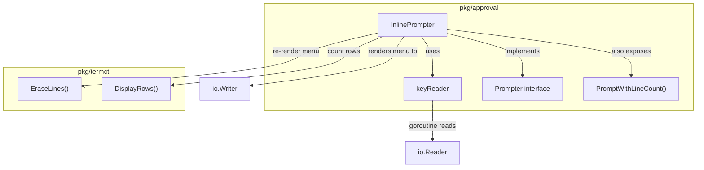
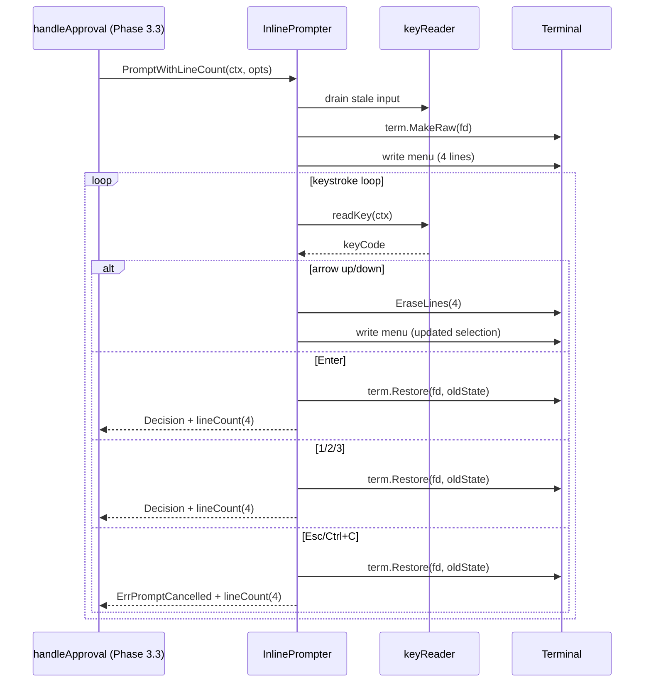

# Phase 3.1: Custom Inline Prompter

## Scope

Build the `InlinePrompter` component as a **standalone, testable unit**. This phase does NOT integrate it into `handleApproval` or `run_stream_inline.go` -- that wiring is Phase 3.3. Phase 3.1 delivers a fully tested component that Phase 3.3 can plug in.

## Why Replace Bubbletea for Inline Mode

The existing `InteractivePrompter` ([interactive.go](client-apps/cli/pkg/approval/interactive.go)) delegates to Bubbletea's `tea.NewProgram`. Bubbletea is a full TUI framework that:

1. **Owns the render loop** -- it writes to stdout/stderr on its own schedule, making line counting opaque
2. **Cannot report exact line count** -- Phase 3.2/3.3 needs to erase the prompt + content above it using `termctl.EraseLines(n)`, which requires knowing exactly how many rows were rendered
3. **Is overkill for a 3-option menu** -- the approval prompt is a simple selection, not a complex TUI

The `InlinePrompter` gives us precise control over every byte written and every row counted.

## Architecture




**Two concerns, two types:**

- `**InlinePrompter`** -- prompt orchestration: raw mode lifecycle, menu rendering, decision return. Accepts `io.Reader` (input) + `io.Writer` (output). No `os.Stdin`/`os.Stderr` references (DI-compliant).
- `**keyReader`** -- keystroke decoding: persistent goroutine reads bytes from the reader, parses escape sequences (arrow keys, Esc vs `\033[A`), delivers typed `keyCode` values via channel.

## Key Design Decisions

### 1. Menu Layout: Vertical Compact (4 lines)

**I am deviating from the original spec** (which showed descriptions like "Execute this tool"). Recommendation:

```
  > Yes
    Skip
    Reject
  arrows/1-3/enter/esc
```

**Why**: Phase 3.2 needs to erase the prompt after the user decides. Every line costs cursor-control complexity. The approval context (tool name, content preview) is printed by the caller ABOVE the prompt -- the user already knows what they're approving. "Yes / Skip / Reject" are self-explanatory. The 1-line hint keeps it discoverable without a help system.

**Total: 4 lines** -- predictable, no wrapping edge cases.

If you prefer the descriptions (6+ lines), let me know. It's a constant change, not an architectural one.

### 2. Persistent Reader Goroutine

The keystroke reader spawns ONE goroutine (lazy, on first prompt) that reads bytes from the `io.Reader` and sends them to a buffered channel. This design:

- **Avoids race conditions** -- multiple prompts share the same reader goroutine (no two goroutines competing for the same fd)
- **Enables escape sequence timeout** -- after reading `\033`, we check the channel with a 50ms timeout to distinguish standalone Esc from arrow key sequences (`\033[A`)
- **Goroutine lifecycle** -- dormant between prompts (blocked on `Read`), active during prompts (raw mode makes bytes available immediately). On process exit, cleaned up by the runtime.

**Tradeoff**: the goroutine cannot be cleanly stopped (terminal reads are blocking and `io.Reader` has no cancel). This is the same limitation Bubbletea has. One goroutine blocked on a syscall uses ~4KB of stack and no CPU. Documented in code.

### 3. Stale Input Draining

Between prompts, the terminal is in cooked mode. If the user types ahead, bytes are OS-buffered. When the next prompt activates raw mode, those bytes flush to the reader goroutine. We drain the byte channel at the start of each prompt to discard stale input. Without this, a stale Enter or arrow key could auto-select an option.

### 4. Rejection Comments: Deferred

The existing Bubbletea `promptModel` has a two-phase flow: select action, then optionally enter a rejection comment ([prompt_model.go](client-apps/cli/pkg/approval/prompt_model.go) lines 155-173). Implementing text input in raw mode requires readline-like functionality (cursor movement, backspace, Ctrl+A/E/K). This is Phase 4's scope (which already plans a readline library for follow-up input). Phase 3.1 delivers the core 3-option decision.

**Impact**: `Decision.Comment` will always be empty from `InlinePrompter`. This is acceptable -- comments are optional and rarely used.

### 5. Interface Compliance

`InlinePrompter` implements `Prompter` (the existing interface) via a `Prompt` method that delegates to `PromptWithLineCount` and discards the line count. This means it is a **drop-in replacement** for the existing `InteractivePrompter` in any call site that uses the `Prompter` interface.

Phase 3.3 will call `PromptWithLineCount` directly for cursor integration.

### 6. Non-TTY Fallback

When the input reader is not a terminal (pipes, CI, tests without TTY):

- If `DefaultAction` is set: return it immediately (non-interactive path)
- If not set: return `ErrNonInteractiveNoDefault`

Same behavior as `InteractivePrompter`. No raw mode, no menu rendering.

## Prompt Flow




## Files

### New: `pkg/approval/inline_prompter.go` (~120-140 lines)

```go
// InlinePrompter implements Prompter using raw terminal mode for
// precise keystroke control and line counting.
type InlinePrompter struct {
    in  io.Reader
    out io.Writer
    fd  int          // terminal fd for raw mode, -1 when not a terminal
    kr  *keyReader   // lazy-initialized on first prompt
}

func NewInlinePrompter(in io.Reader, out io.Writer) *InlinePrompter

// Prompt implements the Prompter interface.
func (p *InlinePrompter) Prompt(ctx context.Context, opts Options) (*Decision, error)

// PromptWithLineCount returns the decision plus the exact number of
// terminal rows rendered by the prompt menu. Used by Phase 3.3 for
// cursor-controlled collapse.
func (p *InlinePrompter) PromptWithLineCount(ctx context.Context, opts Options) (*Decision, int, error)
```

Internal helpers: `renderMenu(selected int) string`, `rerenderMenu(selected, lineCount int)`.

Styles: local lipgloss styles matching the existing `prompt_model.go` pattern (bold for selected, dim for unselected/hint).

### New: `pkg/approval/keyread.go` (~80-100 lines)

```go
type keyCode int

const (
    keyNone keyCode = iota
    keyUp
    keyDown
    keyEnter
    keyEsc
    keyCtrlC
    keyOne
    keyTwo
    keyThree
    keyUnknown
)

type keyReader struct {
    bytes chan byte
    errs  chan error
}

func newKeyReader(in io.Reader) *keyReader
func (kr *keyReader) readKey(ctx context.Context) (keyCode, error)
func (kr *keyReader) drain()
```

The `readKey` method handles escape sequence parsing: reads first byte, if `\033` then checks channel with 50ms timeout for `[` + direction byte. Returns typed `keyCode`.

### New: `pkg/approval/inline_prompter_test.go` (~250-300 lines)

Test categories:

- **Menu rendering**: verify exact string output for each selection state, verify lipgloss styling
- **Key navigation**: feed arrow key sequences via `bytes.Buffer`, assert cursor movement
- **Number key shortcuts**: `'1'` -> ActionApprove, `'2'` -> ActionSkip, `'3'` -> ActionReject
- **Enter confirmation**: navigate + enter, verify correct action
- **Cancellation**: Esc -> ErrPromptCancelled, Ctrl+C -> ErrPromptCancelled
- **Line count**: verify PromptWithLineCount returns exactly 4
- **Non-interactive**: DefaultAction set -> immediate return, no rendering
- **Non-TTY**: bytes.Buffer as input -> non-interactive path
- **Prompter interface**: compile-time check `var _ Prompter = (*InlinePrompter)(nil)`
- **Stale input drain**: pre-load bytes, call drain, verify they're discarded

### Modified: `pkg/approval/BUILD.bazel`

Add `inline_prompter.go` and `keyread.go` to `srcs`. Add `//client-apps/cli/pkg/termctl` to `deps`. Add `inline_prompter_test.go` to test `srcs`.

## What Is NOT In Scope

- **Integration into `handleApproval`** -- Phase 3.3 rewires the approval handler
- **Content streaming during approval** -- Phase 3.2 handles the four-state rendering
- **Cursor collapse after decision** -- Phase 3.3 orchestrates the erase+replace flow
- **Rejection comments** -- deferred until readline infrastructure exists (Phase 4)
- **"Approve all" option** -- deferred per original plan ("ship core 3 options first")
- **Changes to `run_stream_inline.go`** -- this phase is purely `pkg/approval/`

