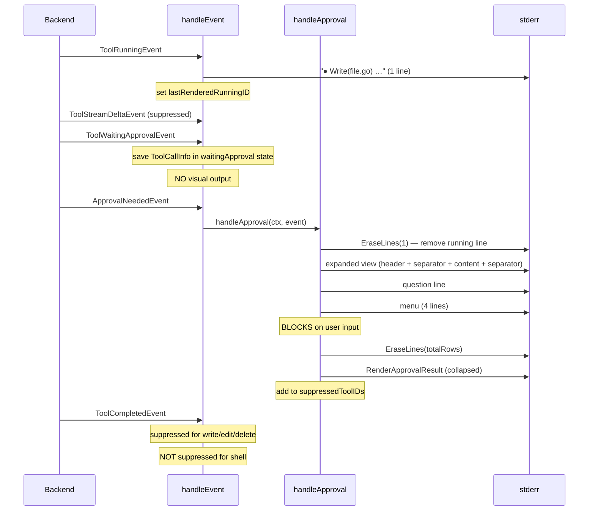

# Phase 3.3: Rewrite handleApproval — Expand / Prompt / Collapse / Suppress

## Domain Analysis

The approval flow has a clear four-phase lifecycle: a tool enters waiting-approval, the user reviews content, makes a decision, and the expanded view collapses into a compact summary. This is orchestration — assembling existing building blocks (termctl, InlinePrompter, render_approval) into a coherent state machine. The orchestration belongs in the command layer (`cmd/root/`) because it is inherently tied to the renderer's mutable state (line tracking, stream state, event dispatch).

**Key architectural tension**: `handleApproval` currently lives in `run_stream_inline.go` (already 525 lines). The rewritten function with its helpers will push this further past the 250-line SRP limit. The approval orchestration is a distinct concern from the event dispatch loop — it deserves its own file.

---

## Scope Boundary: Phase 3.3 vs 3.4

Phase 3.3 does approval orchestration **without live tool content streaming**. Content is extracted from `ToolCallInfo.Args` (saved when `ToolWaitingApprovalEvent` arrives) and displayed all at once. Phase 3.4 adds `ToolStreamDeltaEvent` handling for progressive typewriter-style streaming before approval.

This boundary keeps 3.3 testable and self-contained. The collapse math is identical in both phases — the only difference is whether content was streamed progressively or dumped at once.

---

## Event Flow (Phase 3.3)



---

## Design Decisions

### 1. `renderToolWaitingApproval` becomes state-only (no visual output)

Currently it renders `📝 Write file.go ⏸` — a legacy badge view. Phase 3.3 changes it to save the `ToolCallInfo` and emit nothing. All visual output moves into `handleApproval`, which needs the full line count for collapse. Splitting visual output across two handlers would make the line-count tracking fragile.

### 2. Running-line erasure — track, don't assume

Between `ToolRunningEvent` and `ApprovalNeededEvent`, no other visible output is printed (deltas are suppressed, events don't interleave). So the running line is always the last thing on stderr. However, we still track `lastRenderedRunningID` to guard against the edge case where `ToolRunningEvent` was never emitted. A field on `renderToolRunning` — checked in `handleApproval` — costs nothing and prevents accidental content erasure.

### 3. Expanded view shows full content

The approval view displays ALL content from `ToolCallInfo.Args` (not truncated). The user needs to see what the tool is about to do. For large files, this is temporary — `EraseLines` collapses it after the decision. This matches the Claude Code reference and prepares for Phase 3.4's streaming experience. `DisplayRows` handles line counting with wrapping/ANSI awareness.

### 4. Shell `ToolCompletedEvent` is NOT suppressed

After approving a shell command, the collapsed result shows `└ Approved`. The actual shell output only arrives via `ToolCompletedEvent` (streaming is Phase 3.4). Suppressing it would lose output. So: suppress write/edit/delete completions (their `RenderApprovalResult` already shows the summary), let shell completions through. Phase 3.4 will unify this when shell output streams post-approval.

### 5. Prompter: type-assert, don't change the interface

The `Prompter` interface has only `Prompt()`. `InlinePrompter` adds `PromptWithLineCount()`. Rather than changing the interface (which forces `InteractivePrompter` changes), `handleApproval` type-asserts to `*InlinePrompter`. If the assertion fails, it falls back to `Prompt()` with no collapse (graceful degradation). Call sites switch from `NewInteractivePrompter()` to `NewInlinePrompter(os.Stdin, os.Stderr)` for inline mode.

### 6. Non-interactive fast path

When `defaultAction` is set, `PromptWithLineCount` returns immediately with `menuLines = 0`. In this case, `handleApproval` skips the expanded view entirely — it erases the running line and prints `RenderApprovalResult` directly. No content review is needed because the decision is predetermined.

### 7. Sub-agent approval

When `ApprovalNeededEvent.FromSubAgent` is true, both the expanded view and the collapsed result are gutter-wrapped via `GutterWrap`. The running line was also gutter-wrapped by `renderToolRunning`, so the erasure count remains 1.

### 8. Graceful degradation

When `termctl.IsSupported(cfg.status)` is false (pipe, dumb terminal, CI), cursor control is skipped. The expanded view and collapsed result both appear in the output without erasure. The user sees a longer scrollback but all information is preserved.

---

## File Changes

### New file: `run_stream_inline_approval.go` (~150-180 lines)

Approval orchestration extracted from `run_stream_inline.go` for SRP compliance.

- `waitingApprovalState` struct — holds `ToolCallInfo`, `SubAgentID`, `runningLineRendered bool`
- `handleApproval(ctx, ApprovalNeededEvent)` — the rewritten approval orchestrator
- `resolveApprovalContext(ApprovalNeededEvent)` — returns `ToolCallInfo` from saved state or constructs a fallback
- `buildExpandedView(ToolCallInfo, ApprovalNeededEvent)` — assembles header + separator + content + separator

### Modified: `run_stream_inline.go`

- Remove old `handleApproval` (moves to new file)
- Add `waitingApproval *waitingApprovalState` and `suppressedToolIDs map[string]bool` and `lastRenderedRunningID string` to `inlineRenderer`
- Initialize `suppressedToolIDs` in `renderInline`
- `renderToolRunning`: set `r.lastRenderedRunningID = e.ToolCallID` after printing
- `renderToolWaitingApproval`: save state only, no visual output
- Pre-switch: intercept `ToolCompletedEvent` for IDs in `suppressedToolIDs` (flush reads first, then return)

### Modified: `render_approval.go` (~20 new lines)

Two new public functions:

- `ExpandedApprovalHeader(tc ToolCallInfo, opts CompactOptions) string` — green bullet + `Label(path)`, no suffix or action coloring. Used for the expanded view header.
- `ExpandedApprovalContent(tc ToolCallInfo) string` — extracts full display content using `resolveDisplayContent`. Public wrapper around the existing private helper, needed by `handleApproval` in the command layer.

### Modified: call sites (3 files, ~3 lines each)

Switch prompter creation for inline mode:

- [run_agent_exec.go](client-apps/cli/cmd/stigmer/root/run_agent_exec.go) line 274
- [run_session.go](client-apps/cli/cmd/stigmer/root/run_session.go) lines 92 and 126
- [run_handlers.go](client-apps/cli/cmd/stigmer/root/run_handlers.go) line 293 (if workflow uses inline)

```go
// Before:
prompter := approval.NewInteractivePrompter()
// After (when outputMode == OutputInline):
prompter = approval.NewInlinePrompter(os.Stdin, os.Stderr)
```

### New: tests

- `run_stream_inline_approval_test.go` — approval flow tests (approve/skip/reject with collapse verification, non-interactive fast path, ToolCompletedEvent suppression, sub-agent gutter-wrapping, fallback when ToolWaitingApprovalEvent missing)
- `render_approval_test.go` — tests for `ExpandedApprovalHeader` and `ExpandedApprovalContent`

### Modified: `BUILD.bazel` files

- `cmd/stigmer/root/BUILD.bazel` — add `run_stream_inline_approval.go` to srcs, `run_stream_inline_approval_test.go` to test srcs, add `termctl` dep
- `pkg/toolrender/BUILD.bazel` — no changes needed (new functions in existing file)

---

## handleApproval Pseudocode

```
1. finishAIStreamIfNeeded()
2. tc, subAgentID, runningRendered := resolveApprovalContext(event)
3. canCollapse := termctl.IsSupported(cfg.status)
4. isNonInteractive := cfg.defaultAction != ActionUnspecified

5. IF isNonInteractive:
     IF canCollapse AND runningRendered: EraseLines(1)
     print RenderApprovalResult(tc, defaultAction)
     add to suppressedToolIDs (if not shell)
     send ApprovalResponse
     RETURN

6. IF canCollapse AND runningRendered: EraseLines(1)
7. expanded := buildExpandedView(tc, event)
8. print expanded
9. expandedRows := DisplayRows(expanded, Width(status, 80))

10. question := ApprovalQuestion(tc)
11. print question + newline
12. questionRows := DisplayRows(question + "\n", width)

13. decision, menuRows := InlinePrompter.PromptWithLineCount(ctx, opts)
14. action := actionToString(decision.Action)

15. totalRows := expandedRows + questionRows + menuRows
16. IF canCollapse: EraseLines(totalRows)

17. result := RenderApprovalResult(tc, action, compactOpts)
18. IF subAgentID != "": result = GutterWrap(result)
19. print result

20. IF action != "reject" AND NOT isShellTool(tc): add to suppressedToolIDs
21. send ApprovalResponse
22. reset waitingApproval state
```

---

## Quality Checklist Alignment

- Every new file under 250 lines (target: ~150-180 for approval file)
- Every function under 50 lines (handleApproval ~45 lines with helper extraction)
- All errors wrapped with specific context
- DI: `InlinePrompter` injected via `Prompter` interface; `io.Writer` for terminal output
- `ExpandedApprovalContent` exposes private logic cleanly without leaking internal types
- File split follows SRP: event dispatch vs approval orchestration
