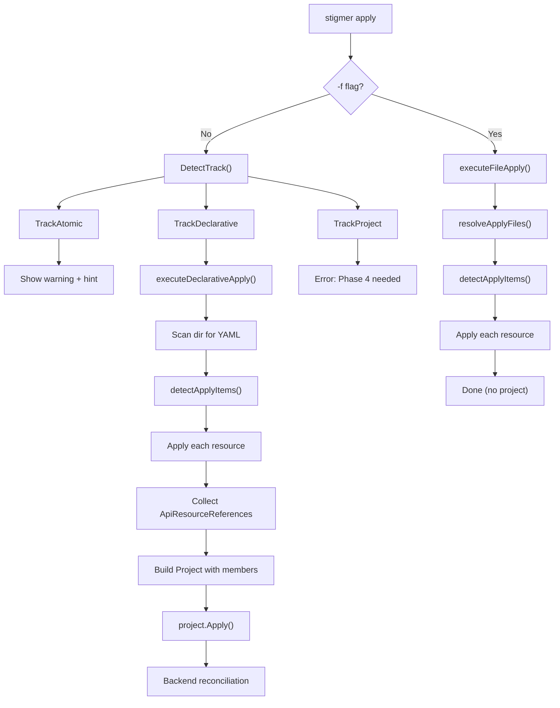

# Phase 3: CLI Declarative Track

## Pre-Condition: Fix Compilation Breakage

Phase 1 removed `ProjectRuntime` enum, `runtime` field, and embedded resource fields (`agents`, `workflows`, `mcp_servers`) from the proto. The CLI currently does **not compile**. We must fix this first.

### Broken Files

- [apply.go](client-apps/cli/cmd/stigmer/root/apply.go) lines 134-165: `getEntryPoint()` falls back to `proj.Spec.Runtime`, `runtimeToStringForApply()` and `getDefaultEntryPointForApply()` reference `projectv1.ProjectRuntime` enum -- all removed
- [apply_project.go](client-apps/cli/cmd/stigmer/root/apply_project.go) lines 34, 51-53, 201, 219-222: References `proj.Spec.Runtime`, `proj.Spec.Agents`, `proj.Spec.Workflows`, `proj.Spec.McpServers`, `r.ResourceId` -- all removed
- [detect_test.go](client-apps/cli/internal/cli/project/detect_test.go): Test fixtures use `runtime: go` and assert `projectv1.ProjectRuntime_python` -- type no longer exists

---

## Architecture




**Key design: the declarative track is a composition of file-mode mechanics (scan + detect + apply each resource) with project-mode mechanics (build project with members + reconcile).**

---

## Detailed Changes

### 1. Track Detection -- `detect.go`

Add `TrackDeclarative` and differentiate based on `entry_point`:

```go
const (
    TrackAtomic      Track = "atomic"
    TrackDeclarative Track = "declarative"
    TrackProject     Track = "project"
)
```

In `DetectTrack()`, after loading the project, check `entry_point`:

- `entry_point` set --> `TrackProject` (SDK)
- `entry_point` empty --> `TrackDeclarative`

### 2. Fix and Update Tests -- `detect_test.go`

- Replace `runtime: go` with `description: ...` in `minimalValidStigmerYAML()` (runtime no longer exists)
- Update `fullValidStigmerYAML()` to use `entry_point` without `runtime`
- Remove `TestDetectTrack_AllRuntimes` and `TestDetectTrack_MissingRuntimeReturnsError` (runtime field deleted)
- Remove assertions on `proj.Spec.Runtime`
- Add tests:
  - `TestDetectTrack_DeclarativeWhenNoEntryPoint` -- stigmer.yaml with only description --> `TrackDeclarative`
  - `TestDetectTrack_ProjectWhenEntryPointSet` -- stigmer.yaml with entry_point --> `TrackProject`
  - `TestTrack_String` includes `"declarative"`
  - `TestDetectTrack_DeclarativeResultHasProject` -- project is populated, entry_point is empty

### 3. Refactor Routing -- `apply.go`

Move track detection out of `executeProjectApply` into the main Run function. This enables clean three-way routing:

```go
if filePath != "" {
    err = executeFileApply(...)
} else {
    detectResult, err := project.DetectTrack(...)
    switch detectResult.Track {
    case project.TrackAtomic:
        renderer.Render(buildAtomicTrackResult())
    case project.TrackDeclarative:
        err = executeDeclarativeApply(detectResult, opts)
    case project.TrackProject:
        err = executeProjectApply(detectResult, opts)
    }
}
```

Delete dead functions: `getEntryPoint()`, `runtimeToStringForApply()`, `getDefaultEntryPointForApply()`.

### 4. SDK Track -- `apply_project.go`

Make `executeProjectApply` accept a `*project.DetectResult` instead of calling `DetectTrack` internally. Return a clear error:

```go
func executeProjectApply(detectResult *project.DetectResult, opts projectApplyOptions) error {
    return fmt.Errorf("SDK track (entry_point: %s) is being upgraded to the reference model.\n\n"+
        "This will be available in the next release.\n"+
        "For now, use declarative mode: remove entry_point from stigmer.yaml\n"+
        "and define resources as YAML files in the same directory",
        detectResult.Project.Spec.EntryPoint)
}
```

Fix `buildDeploymentResult`: replace `r.ResourceId` with `r.Slug` (the field doesn't exist on `ApiResourceReference`). Update hints to check `proj.Spec.Members` instead of `proj.Spec.Agents`/`proj.Spec.Workflows`.

### 5. Reference Collection -- `apply_file.go` and `apply_file_handlers.go`

Modify `applyResourceItem` to return a reference:

```go
func applyResourceItem(item applyItem, fctx *fileApplyContext) (*apiresource.ApiResourceReference, error)
```

Each handler extracts the reference from the successful apply result:

```go
func buildResourceReference(
    metadata *apiresource.ApiResourceMetadata,
    kind apiresourcekind.ApiResourceKind,
) *apiresource.ApiResourceReference {
    return &apiresource.ApiResourceReference{
        Org:  metadata.Org,
        Kind: kind,
        Slug: metadata.Slug,
    }
}
```

`executeFileApply` ignores the returned reference (assigns to `_`).

### 6. New File: `apply_declarative.go`

Core declarative flow:

```go
func executeDeclarativeApply(detectResult *project.DetectResult, opts projectApplyOptions) error {
    // 1. Log project info
    // 2. Scan directory for YAML files (reuse resolveApplyFiles)
    // 3. Filter out stigmer.yaml (it's the marker, not a resource)
    // 4. Detect resource kinds (reuse detectApplyItems)
    // 5. Resolve organization
    // 6. Connect to backend
    // 7. Apply each resource, collect references
    // 8. Build Project with spec.members = collected refs
    // 9. Call project.Apply()
    // 10. Render reconciliation summary
}
```

**stigmer.yaml exclusion**: Filter by filename after scanning -- any file named `stigmer.yaml` is excluded from the resource list. This is simple and explicit.

**Reference collection**: After applying each resource via `applyResourceItem`, collect the returned `*ApiResourceReference` into a slice. This becomes `proj.Spec.Members`.

**Project construction**: Copy metadata from the detected project (name, org). Set `spec.description` from detected project. Set `spec.members` from collected references. `spec.entry_point` remains empty (declarative).

---

## User Experience

```bash
$ cd planton-agents/
$ ls
stigmer.yaml  agent.yaml  mcp-server.yaml

$ stigmer apply
Found project: planton-agents (declarative)
  Directory: /home/user/planton-agents

Scanning for resources...
Found 2 resource(s) in 2 file(s)

Applying Agent from agent.yaml...
Agent created successfully
  ID: abc123
  Slug: my-agent

Applying McpServer from mcp-server.yaml...
MCP server created successfully
  ID: def456
  Slug: my-mcp-server

Deploying project with 2 member(s)...

Deployment successful
  Project: planton-agents (Created)
  Reconciliation:
    Created agent: my-agent
    Created mcp_server: my-mcp-server

Hint: View project: stigmer get project planton-agents
Hint: Update and redeploy: edit YAML files and run 'stigmer apply' again
```

---

## Files Changed Summary

- **Modified**: `detect.go`, `detect_test.go`, `apply.go`, `apply_project.go`, `apply_file.go`, `apply_file_handlers.go`
- **Created**: `apply_declarative.go`
- **No backend changes** (Phase 2 already handles reference-based reconciliation)

## Build Verification

```bash
bazel build //client-apps/cli/...
bazel test //client-apps/cli/...
```

