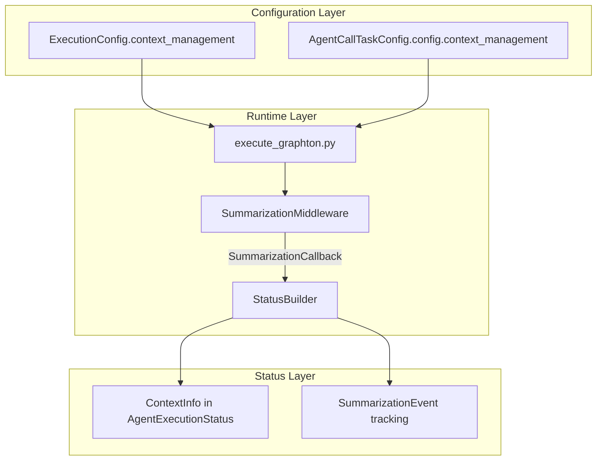

# Phase 3: Context Management Platform Features

## Architecture Overview




---

## Task 1: Proto Definitions

### 1.1 Add `ContextManagementConfig` to `ExecutionConfig`

**File**: [apis/ai/stigmer/agentic/agentexecution/v1/spec.proto](apis/ai/stigmer/agentic/agentexecution/v1/spec.proto)

Add a nested configuration message for context management:

```protobuf
// ContextManagementConfig controls automatic context summarization behavior.
// When not specified, defaults are derived from the Model Registry.
message ContextManagementConfig {
  // Disable automatic context summarization for this execution.
  // Default: false (summarization enabled based on model defaults)
  bool disable_summarization = 1;

  // Custom token threshold to trigger summarization (0 = use model default).
  // When context exceeds this threshold, summarization is triggered.
  // Must be positive if specified.
  int32 custom_trigger_threshold = 2 [(buf.validate.field).int32.gte = 0];

  // Custom target token count after summarization (0 = use model default).
  // Summarization aims to reduce context to this size.
  // Must be positive and less than trigger_threshold if both specified.
  int32 custom_target_tokens = 3 [(buf.validate.field).int32.gte = 0];
}
```

Add to `ExecutionConfig`:

```protobuf
message ExecutionConfig {
  string model_name = 1;
  
  // Context management configuration for this execution.
  // Controls automatic summarization behavior.
  ContextManagementConfig context_management = 2;
}
```

### 1.2 Add `ContextManagementConfig` to `AgentExecutionConfig`

**File**: [apis/ai/stigmer/agentic/workflow/v1/tasks/agent_call.proto](apis/ai/stigmer/agentic/workflow/v1/tasks/agent_call.proto)

Add to `AgentExecutionConfig`:

```protobuf
message AgentExecutionConfig {
  string model = 1;
  int32 timeout = 2;
  float temperature = 3;
  
  // Context management configuration.
  // When specified, overrides model defaults for summarization.
  ai.stigmer.agentic.agentexecution.v1.ContextManagementConfig context_management = 4;
}
```

### 1.3 Add `ContextInfo` and `SummarizationEvent` to `AgentExecutionStatus`

**File**: [apis/ai/stigmer/agentic/agentexecution/v1/api.proto](apis/ai/stigmer/agentic/agentexecution/v1/api.proto)

Add new message definitions and field to status:

```protobuf
// SummarizationEvent records a single summarization occurrence.
// Enables debugging context issues and tracking summarization effectiveness.
message SummarizationEvent {
  // ISO 8601 timestamp when summarization occurred.
  string timestamp = 1;

  // Token count before summarization.
  int32 tokens_before = 2;

  // Token count after summarization.
  int32 tokens_after = 3;

  // Compression ratio achieved (0.0 to 1.0).
  // Example: 0.6 means 60% reduction in tokens.
  float compression_ratio = 4;

  // Time taken to perform summarization in milliseconds.
  int32 duration_ms = 5;

  // Model used for summarization (economy-tier model).
  // Example: "claude-haiku-4", "gpt-4o-mini"
  string summarization_model = 6;

  // Number of messages before summarization.
  int32 messages_before = 7;

  // Number of messages after summarization.
  int32 messages_after = 8;
}

// ContextInfo provides visibility into context window utilization.
// Enables monitoring, debugging, and cost optimization.
message ContextInfo {
  // Current token count in the context window.
  // Updated after each LLM call or summarization.
  int32 current_token_count = 1;

  // Model's maximum context window size in tokens.
  // From Model Registry for the configured model.
  int32 context_window_limit = 2;

  // Token threshold that triggers summarization.
  // When current_token_count exceeds this, summarization runs.
  int32 summarization_trigger_threshold = 3;

  // Target token count after summarization.
  int32 summarization_target_tokens = 4;

  // Whether summarization is enabled for this execution.
  bool summarization_enabled = 5;

  // Summarization events that occurred during this execution.
  // Ordered chronologically.
  repeated SummarizationEvent summarization_events = 6;

  // Context utilization as a percentage (0-100).
  // Calculated as: (current_token_count / context_window_limit) * 100
  float utilization_percent = 7;
}
```

Add to `AgentExecutionStatus`:

```protobuf
message AgentExecutionStatus {
  // ... existing fields ...

  // Context window utilization and summarization tracking.
  // Populated when context management is active.
  ContextInfo context_info = 14;
}
```

---

## Task 2: Python Stubs Generation

After proto changes, regenerate Python stubs:

```bash
cd stigmer-cloud
make build-protos
```

This generates:

- `apis/stubs/python/stigmer/ai/stigmer/agentic/agentexecution/v1/api_pb2.py`
- `apis/stubs/python/stigmer/ai/stigmer/agentic/agentexecution/v1/spec_pb2.py`

---

## Task 3: SummarizationCallback Protocol

**File**: `backend/libs/python/graphton/src/graphton/core/summarization_callback.py` (NEW)

Create a callback protocol for middleware-to-status communication:

```python
"""Callback protocol for summarization event reporting."""

from dataclasses import dataclass
from typing import Protocol

@dataclass(frozen=True)
class SummarizationEventData:
    """Data for a single summarization event."""
    tokens_before: int
    tokens_after: int
    compression_ratio: float
    duration_ms: int
    summarization_model: str
    messages_before: int
    messages_after: int


class SummarizationCallback(Protocol):
    """Protocol for reporting summarization events."""

    def on_summarization_complete(self, event: SummarizationEventData) -> None:
        """Called when summarization completes."""
        ...

    def on_token_count_updated(self, token_count: int) -> None:
        """Called when token count is recalculated."""
        ...
```

---

## Task 4: Update SummarizationMiddleware

**File**: [backend/libs/python/graphton/src/graphton/core/summarization_middleware.py](backend/libs/python/graphton/src/graphton/core/summarization_middleware.py)

Add callback support:

```python
class SummarizationMiddleware(AgentMiddleware):
    def __init__(
        self,
        config: SummarizationConfig,
        callback: SummarizationCallback | None = None,
    ) -> None:
        self.config = config
        self._callback = callback
        # ... existing init ...

    async def _perform_summarization(self, messages: list[BaseMessage]) -> list[BaseMessage]:
        start_time = time.time()
        messages_before = len(messages)
        tokens_before = self._current_token_count
        
        # ... existing summarization logic ...
        
        # Report event via callback
        if self._callback is not None:
            event = SummarizationEventData(
                tokens_before=tokens_before,
                tokens_after=new_token_count,
                compression_ratio=compression_ratio,
                duration_ms=int((time.time() - start_time) * 1000),
                summarization_model=self.config.summarization_model,
                messages_before=messages_before,
                messages_after=len(new_messages),
            )
            self._callback.on_summarization_complete(event)
        
        return new_messages
```

---

## Task 5: StatusBuilder Integration

**File**: [backend/services/agent-runner/worker/activities/graphton/status_builder.py](backend/services/agent-runner/worker/activities/graphton/status_builder.py)

Implement `SummarizationCallback`:

```python
from ai.stigmer.agentic.agentexecution.v1.api_pb2 import (
    # ... existing imports ...
    ContextInfo,
    SummarizationEvent,
)

class StatusBuilder:
    def __init__(self, ...):
        # ... existing init ...
        
        # Context management tracking
        self._context_info: ContextInfo | None = None
        self._summarization_events: list[SummarizationEvent] = []

    def initialize_context_info(
        self,
        model_name: str,
        context_window_limit: int,
        trigger_threshold: int,
        target_tokens: int,
        enabled: bool,
    ) -> None:
        """Initialize context info from model registry data."""
        self._context_info = ContextInfo(
            context_window_limit=context_window_limit,
            summarization_trigger_threshold=trigger_threshold,
            summarization_target_tokens=target_tokens,
            summarization_enabled=enabled,
        )

    def on_summarization_complete(self, event: SummarizationEventData) -> None:
        """Callback from SummarizationMiddleware."""
        if self._context_info is None:
            return

        proto_event = SummarizationEvent(
            timestamp=datetime.utcnow().isoformat() + "Z",
            tokens_before=event.tokens_before,
            tokens_after=event.tokens_after,
            compression_ratio=event.compression_ratio,
            duration_ms=event.duration_ms,
            summarization_model=event.summarization_model,
            messages_before=event.messages_before,
            messages_after=event.messages_after,
        )
        self._summarization_events.append(proto_event)
        self._context_info.current_token_count = event.tokens_after
        self._update_utilization()

    def on_token_count_updated(self, token_count: int) -> None:
        """Called when token count changes."""
        if self._context_info is not None:
            self._context_info.current_token_count = token_count
            self._update_utilization()

    def _update_utilization(self) -> None:
        """Recalculate utilization percentage."""
        if self._context_info and self._context_info.context_window_limit > 0:
            self._context_info.utilization_percent = (
                self._context_info.current_token_count
                / self._context_info.context_window_limit
                * 100
            )

    def finalize_context_info(self) -> None:
        """Add context info to current_status."""
        if self._context_info is not None:
            self._context_info.summarization_events.extend(self._summarization_events)
            self.current_status.context_info.CopyFrom(self._context_info)
```

---

## Task 6: Execute Graphton Integration

**File**: [backend/services/agent-runner/worker/activities/execute_graphton.py](backend/services/agent-runner/worker/activities/execute_graphton.py)

Wire up configuration and callback:

```python
from graphton.core.model_registry import ModelRegistry
from graphton.core.summarization_config import SummarizationConfig

# In execute_graphton() function:

# 1. Parse context management config from ExecutionConfig
context_config = execution_config.context_management if execution_config else None

# 2. Get model metadata from registry
model_metadata = ModelRegistry.get_or_default(model_name)

# 3. Build SummarizationConfig with overrides
if context_config and context_config.disable_summarization:
    summarization_config = SummarizationConfig.disabled()
else:
    summarization_config = SummarizationConfig.for_model(
        model_name,
        trigger_override=context_config.custom_trigger_threshold if context_config else None,
        target_override=context_config.custom_target_tokens if context_config else None,
    )

# 4. Initialize StatusBuilder context info
status_builder.initialize_context_info(
    model_name=model_name,
    context_window_limit=model_metadata.context_window,
    trigger_threshold=summarization_config.trigger_threshold,
    target_tokens=summarization_config.target_tokens,
    enabled=summarization_config.enabled,
)

# 5. Create middleware with callback
summarization_middleware = SummarizationMiddleware(
    config=summarization_config,
    callback=status_builder,  # StatusBuilder implements SummarizationCallback
)

# 6. Finalize context info before returning
status_builder.finalize_context_info()
```

---

## Task 7: Update SummarizationConfig Factory

**File**: [backend/libs/python/graphton/src/graphton/core/summarization_config.py](backend/libs/python/graphton/src/graphton/core/summarization_config.py)

Add override support to factory method:

```python
@classmethod
def for_model(
    cls,
    model_name: str,
    trigger_override: int | None = None,
    target_override: int | None = None,
) -> SummarizationConfig:
    """Create config for model with optional overrides."""
    metadata = ModelRegistry.get_or_default(model_name)
    
    return cls(
        enabled=True,
        trigger_threshold=trigger_override or metadata.summarization_trigger_threshold,
        target_tokens=target_override or metadata.summarization_target_tokens,
        # ... rest of config from metadata ...
    )
```

---

## Task 8: Unit Tests

**File**: `backend/libs/python/graphton/tests/core/test_summarization_callback.py` (NEW)

Test the callback protocol and event data.

**File**: `backend/services/agent-runner/tests/test_status_builder_context.py` (NEW)

Test StatusBuilder context info integration:

- `test_initialize_context_info_sets_fields`
- `test_on_summarization_complete_adds_event`
- `test_on_token_count_updated_recalculates_utilization`
- `test_finalize_context_info_copies_to_status`
- `test_disabled_summarization_no_context_info`

---

## Task 9: Integration Test

**File**: `backend/services/agent-runner/tests/integration/test_context_management_e2e.py` (NEW)

End-to-end test with real model (mocked LLM):

- Execute agent with default config
- Execute agent with custom thresholds
- Execute agent with disabled summarization
- Verify context_info populated in status

---

## Files Summary

**Proto files to modify**:

- [apis/ai/stigmer/agentic/agentexecution/v1/spec.proto](apis/ai/stigmer/agentic/agentexecution/v1/spec.proto) - Add ContextManagementConfig
- [apis/ai/stigmer/agentic/agentexecution/v1/api.proto](apis/ai/stigmer/agentic/agentexecution/v1/api.proto) - Add ContextInfo, SummarizationEvent
- [apis/ai/stigmer/agentic/workflow/v1/tasks/agent_call.proto](apis/ai/stigmer/agentic/workflow/v1/tasks/agent_call.proto) - Add context_management to AgentExecutionConfig

**Python files to modify**:

- [summarization_config.py](backend/libs/python/graphton/src/graphton/core/summarization_config.py) - Add override support
- [summarization_middleware.py](backend/libs/python/graphton/src/graphton/core/summarization_middleware.py) - Add callback
- [status_builder.py](backend/services/agent-runner/worker/activities/graphton/status_builder.py) - Implement callback
- [execute_graphton.py](backend/services/agent-runner/worker/activities/execute_graphton.py) - Wire up integration

**New Python files**:

- `graphton/core/summarization_callback.py` - Callback protocol
- `agent-runner/tests/test_status_builder_context.py` - Unit tests
- `agent-runner/tests/integration/test_context_management_e2e.py` - Integration tests

---

## Definition of Done

- Proto definitions compile with `make build-protos`
- Python stubs regenerated
- All unit tests pass
- Integration tests pass
- No linter errors
- Documentation comments complete (Google-style)
- Changelog entry created

