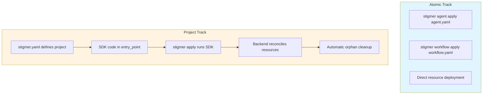

# Phase 4.7: Integration and Documentation Excellence

## Context and Vision

Phase 4 introduced the Project entity as an aggregate root - a fundamental shift in how Stigmer manages resources. This documentation must convey that significance while making it accessible and actionable. We're not just documenting features; we're establishing a new paradigm in agentic platform design.

The Dual-Track Interface (Atomic Track for experimentation, Project Track for production) is architecturally elegant. Our examples and documentation must reflect that elegance.

## Architecture Overview




## Deliverable 1: Example Project Configurations

Create `examples/project/` directory with multiple stigmer.yaml examples demonstrating different use cases and runtimes.

### Files to Create

**[examples/project/README.md](examples/project/README.md)** - Comprehensive guide

Content structure:

- **Introduction**: What is a Stigmer project and why use Project Track
- **stigmer.yaml Structure**: Field-by-field explanation with real context
- **Dual-Track Decision Guide**: When to use Atomic vs Project Track (decision tree)
- **Examples Overview**: Brief description of each example
- **Runtime-Specific Guidance**: Go, Python, Node.js considerations
- **Best Practices**: Production patterns, security, organization
- **Troubleshooting**: Common issues and solutions

Quality standards:

- No generic filler - every sentence provides value
- Real-world context for each concept
- Clear decision criteria, not vague recommendations
- Code examples are production-ready, not toys

**[examples/project/minimal-go.yaml](examples/project/minimal-go.yaml)** - Starter template

```yaml
apiVersion: agentic.stigmer.ai/v1
kind: Project
metadata:
  name: minimal-project
  org: my-org
spec:
  runtime: go
  description: Minimal Go project showing essential configuration
```

Include inline comments explaining:

- Why each field exists
- Default values and when to override
- Common customization points

**[examples/project/python-data-pipeline.yaml](examples/project/python-data-pipeline.yaml)** - Python example

A realistic data processing project showcasing:

- Python runtime with explicit entry_point
- Descriptive metadata with labels
- Real-world use case context

**[examples/project/node-api-service.yaml](examples/project/node-api-service.yaml)** - Node.js example

A microservice project demonstrating:

- Node.js runtime configuration
- TypeScript entry point
- Service-oriented architecture patterns

**[examples/project/multi-runtime-comparison.md](examples/project/multi-runtime-comparison.md)** - Side-by-side comparison

Visual comparison table showing:

- Runtime-specific defaults (entry_point, file extensions)
- Cross-field validation rules
- Common patterns for each runtime

## Deliverable 2: Comprehensive Project Guide

Create `docs/guides/stigmer-projects.md` - the definitive guide to Project Track.

### Content Architecture

**Section 1: Understanding Projects**

- What is an aggregate root (accessible explanation, not academic)
- The reconciliation model explained through concrete examples
- Comparison with Atomic Track (visual diagram)

**Section 2: The stigmer.yaml File**

- Detailed field reference with validation rules
- Runtime options and their implications
- Metadata best practices (naming, organization, labels)

**Section 3: SDK Integration**

- How entry_point execution works
- SDK synthesis process (step-by-step)
- Resource manifest generation

**Section 4: Track Detection**

- Walk-up algorithm explanation
- Directory structure patterns
- Troubleshooting detection issues

**Section 5: Local Commands**

- `stigmer project info` - use cases and output formats
- `stigmer project validate` - CI/CD integration patterns
- Real command examples with actual output

**Section 6: Workflows and Patterns**

- Development workflow (edit → validate → apply)
- Multi-environment strategies
- Monorepo patterns

**Section 7: Migration Guide**

- Moving from Atomic Track to Project Track
- Converting standalone resources to project-managed
- Rollback strategies

Quality standards:

- Every code example is runnable
- Every diagram adds clarity, not decoration
- Every section has a "Why this matters" framing
- No assumptions about reader's background

## Deliverable 3: Testing Protocol

Systematic validation of all Phase 4 functionality.

### Test Plan

**Test Suite 1: Project Commands (Local)**

Test `stigmer project info`:

1. From project directory with stigmer.yaml
2. From subdirectory (walk-up detection)
3. From directory without stigmer.yaml (Atomic Track message)
4. With `--output table` (default)
5. With `--output yaml` (full config)
6. With `--output json` (automation format)
7. With `--dir` flag (custom directory)
8. With invalid YAML (error handling)

Test `stigmer project validate`:

1. Valid stigmer.yaml (exit code 0)
2. Invalid YAML syntax (exit code 1, clear error)
3. Missing required fields (exit code 1, actionable message)
4. Runtime/entry_point mismatch (cross-field validation)
5. Reserved project names (validation error)
6. Absolute path in entry_point (security validation)
7. From Atomic Track directory (no stigmer.yaml)

**Test Suite 2: Track Detection Edge Cases**

Test directory structures:

```
test-structures/
├── simple/
│   └── stigmer.yaml
├── nested/
│   └── src/
│       └── (run from here, should find parent stigmer.yaml)
├── deep-nesting/
│   └── a/b/c/d/e/f/g/h/i/j/
│       └── (test max depth = 10)
├── no-project/
│   └── (Atomic Track detection)
└── invalid-yaml/
    └── stigmer.yaml (malformed)
```

**Test Suite 3: Example Validation**

Validate every stigmer.yaml example:

1. Loads without errors
2. Passes schema validation
3. Passes cross-field validation
4. Displays correctly in all formats
5. README instructions are accurate

### Testing Documentation

Create test results document:

- Test case descriptions
- Expected vs actual behavior
- Screenshots of command output
- Edge cases discovered
- Any bugs found and fixed

## Deliverable 4: Phase 4 Completion Changelog

Create `_changelog/2026-02/2026-02-04-HHMMSS-phase4-project-entity-complete.md`

### Changelog Structure

**Summary**: High-level Phase 4 accomplishments

**Journey Overview**: The 9 sub-tasks with completion timeline

- T04.1: Project Proto Schema (Session 22)
- T04.1a: Command/Query Services (Session 26)
- T04.1b: Aggregate Root Resource Fields (Session 27)
- T04.2: Project Loader (Session 23)
- T04.3: Project Validator (Session 24)
- T04.4: Project Display (Session 25)
- T04.5: Track Detection (Session 28)
- T04.6: Project Commands (Session 29)
- T04.7: Integration and Documentation (Session 30)

**Architectural Impact**: What Phase 4 enabled

- Aggregate root pattern for resource lifecycle
- Dual-Track Interface foundation
- SDK synthesis preparation
- Reconciliation groundwork

**Files Created**: Complete inventory

- Proto files (5)
- Go internal package (5 files)
- CLI commands (1 file)
- Examples (4+)
- Documentation (2 guides)
- Tests (457 lines across test files)

**Engineering Excellence**: Metrics and patterns

- 100% test coverage on critical paths
- All functions < 50 lines
- Pattern consistency across resources
- Zero hardcoded magic values

**User Impact**: What users can now do

- Define projects in stigmer.yaml
- Validate project configs locally
- View project configuration
- Understand track mode (Atomic vs Project)

**Phase 5 Preview**: What's coming next

- Backend ProjectCommandController
- Backend ProjectQueryController  
- Full `stigmer apply` command
- Skill push integration
- Project get/delete commands

**Lessons Learned**: Engineering insights

- Proto validation as single source of truth
- Walk-up detection pattern for project files
- Aggregate root design for reconciliation
- CLI as thin orchestration layer

Quality standards:

- Tell the story of Phase 4, not just list changes
- Connect technical decisions to user benefits
- Provide context for future contributors
- Celebrate the milestone professionally

## Deliverable 5: next-task.md Update

Update `[_projects/2026-01/20260131.02.cli-agent-yaml-first/next-task.md](stigmer/_projects/2026-01/20260131.02.cli-agent-yaml-first/next-task.md)`

Changes:

- Mark Phase 4 as COMPLETE ✅
- Update session log with Session 30 completion
- Update progress indicators (Phase 4: 9/9 tasks, 100%)
- Add Phase 5 preview and next steps
- Update "Quick Resume Instructions" with current state

## Implementation Sequence

1. **Create examples/project/ directory with all YAML examples** (45 min)
  - Write minimal-go.yaml with thoughtful inline comments
  - Write python-data-pipeline.yaml with realistic use case
  - Write node-api-service.yaml with service architecture
  - Create multi-runtime-comparison.md with visual table
  - Write examples/project/README.md (comprehensive guide)
2. **Create docs/guides/stigmer-projects.md** (60 min)
  - Write all 7 sections with high-quality content
  - Add mermaid diagrams for visual clarity
  - Include real command examples with output
  - Add migration guide section
3. **Execute testing protocol** (45 min)
  - Run all test suites systematically
  - Document results with screenshots
  - Fix any issues discovered
  - Validate all examples load and validate correctly
4. **Create Phase 4 completion changelog** (30 min)
  - Write comprehensive journey narrative
  - Document all files created
  - Highlight architectural decisions
  - Preview Phase 5
5. **Update next-task.md** (10 min)
  - Mark Phase 4 complete
  - Add Session 30 log
  - Update progress metrics

## Success Criteria

- At least 4 stigmer.yaml examples covering different runtimes
- examples/project/README.md is >300 lines of high-quality content
- docs/guides/stigmer-projects.md is >500 lines with diagrams
- All test suites pass without errors
- Every example validates successfully
- Changelog tells a compelling Phase 4 story
- Documentation has zero generic AI filler
- Every code example is production-ready
- Clear migration path from Atomic to Project Track
- Visual diagrams enhance understanding

## Quality Assurance

Before considering this complete:

1. **Read through all documentation** - Does it sound human? Engaging? Authoritative?
2. **Test every code example** - Does it actually work?
3. **Check for patterns** - Any repetitive structures that could be more varied?
4. **Validate claims** - Every technical statement must be accurate
5. **User empathy** - Would this help a new user? An experienced developer?

## Files to Create/Modify

### New Files (8+)

- `examples/project/README.md`
- `examples/project/minimal-go.yaml`
- `examples/project/python-data-pipeline.yaml`
- `examples/project/node-api-service.yaml`
- `examples/project/multi-runtime-comparison.md`
- `docs/guides/stigmer-projects.md`
- `_changelog/2026-02/2026-02-04-HHMMSS-phase4-project-entity-complete.md`

### Modified Files (1)

- `_projects/2026-01/20260131.02.cli-agent-yaml-first/next-task.md`

## Reference Materials

Key files to consult:

- [apis/ai/stigmer/agentic/project/v1/spec.proto](stigmer/apis/ai/stigmer/agentic/project/v1/spec.proto) - Field definitions
- [apis/ai/stigmer/agentic/project/v1/enum.proto](stigmer/apis/ai/stigmer/agentic/project/v1/enum.proto) - Runtime enum values
- [client-apps/cli/internal/cli/project/validator.go](stigmer/client-apps/cli/internal/cli/project/validator.go) - Validation rules
- [docs/guides/deploying-with-apply.md](stigmer/docs/guides/deploying-with-apply.md) - Quality benchmark
- [examples/README.md](stigmer/examples/README.md) - Current examples structure

---

This plan prioritizes **excellence over speed**. Every word should serve a purpose. Every example should teach something valuable. Every diagram should clarify, not decorate.

The documentation we create here will be the first impression many users have of Stigmer's Project Track. Make it unforgettable for the right reasons.