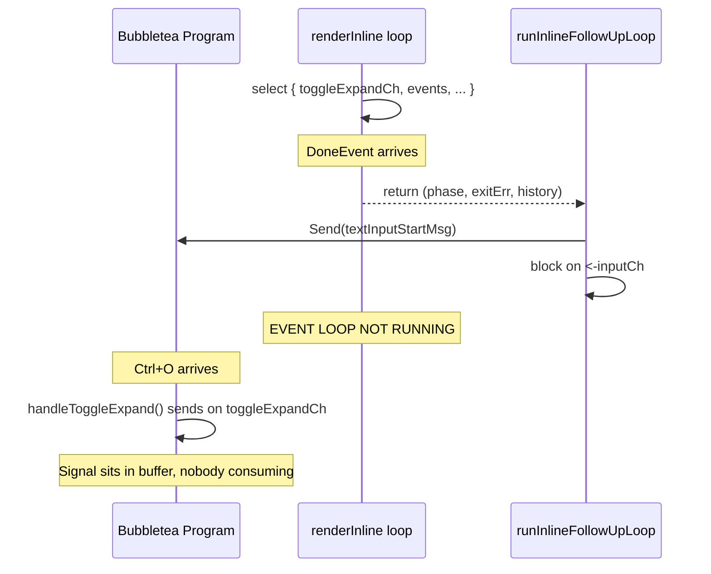

# Phase 4: Unblock Ctrl+O During Follow-up Prompt

## Problem Statement

When the user is at the follow-up prompt (between executions), `renderInline`'s event loop has already returned. The `select` that consumes `toggleExpandCh` is not running. Ctrl+O signals are buffered but not processed until the next execution starts.

Documented in: `_projects/2026-03/20260305.02.expand-collapse-tools/design-decisions/ctrl-o-during-follow-up-prompt.md`

## Root Cause

The lifecycle mismatch between the Bubbletea program (runs continuously) and the renderer's event loop (exits on DoneEvent):




## Chosen Approach: Extend renderInline's Lifecycle

Instead of returning on DoneEvent when follow-up is possible, `renderInline` activates the text input and **continues its event loop**. The `select` keeps consuming `toggleExpandCh`, so Ctrl+O triggers re-commit immediately. The renderer returns only when the user submits/cancels the follow-up.

This is the natural evolution: the renderer IS active during follow-up (the terminal shows content it committed). Making the event loop match that reality is architecturally honest.

### Approaches Considered and Rejected

- **Move re-commit to Bubbletea model**: History, compactOpts, expandMode all live on `inlineRenderer`. Moving them to the model is a major refactor that blurs the model/renderer boundary. Rejected for scope and SRP.
- **Mini select loop in promptFollowUpViaChannel**: Would need the full renderer state (history, expandMode, compactOpts) passed out of `renderInline`. Awkward bridging. Creates parallel event loop patterns. Rejected.

## UX Decision

**Follow-up prompt stays visible in both compact and expanded modes.** Ctrl+O during follow-up re-commits history in the toggled mode, then Bubbletea re-renders `View()` which shows the follow-up prompt with preserved text. The user's typing is never interrupted.

## Architecture After Change

```mermaid
sequenceDiagram
    participant BT as Bubbletea Program
    participant RL as renderInline loop
    participant FL as runInlineFollowUpLoop

    RL->>RL: select { toggleExpandCh, events, ... }
    Note over RL: DoneEvent arrives, follow-up eligible
    RL->>BT: Send(textInputStartMsg)
    RL->>RL: nil out events channel, add followUpInputCh to select
    RL->>RL: select { toggleExpandCh, followUpInputCh, ... }
    Note over BT: Ctrl+O arrives
    BT->>BT: handleToggleExpand() sends on toggleExpandCh
    RL->>RL: expandMode = !expandMode; triggerReCommit()
    Note over BT: User presses Enter
    BT->>RL: input on followUpInputCh
    RL-->>FL: return renderResult{..., followUpInput: "..."}
```


## Files to Change

### Production Code

**[run_stream_inline_types.go](client-apps/cli/cmd/stigmer/root/run_stream_inline_types.go)** -- Add `renderResult` struct, add `followUpEnabled bool` to config, add follow-up state fields to `inlineRenderer`

- New `renderResult` struct replaces the 3-value return:

```go
  type renderResult struct {
      phase         string
      exitErr       string
      history       []committedItem
      followUpInput string
  }
  

```

- Add `followUpEnabled bool` to `inlineRenderConfig`
- Add to `inlineRenderer`:

```go
  followUpInputCh <-chan string
  donePhase       string
  doneExitErr     string
  

```

**[run_stream_inline.go](client-apps/cli/cmd/stigmer/root/run_stream_inline.go)** -- Extend event loop lifecycle for follow-up

- Change return type from `(string, string, []committedItem)` to `renderResult`
- On DoneEvent when `followUpEnabled && isFollowUpEligible(p, e)`:
  - Call `r.activateFollowUp(p, e)` (stops spinner, flushes reads, creates inputCh, sends textInputStartMsg)
  - Nil out `cfg.events` and `cfg.subjectUpdate` (disable those select cases)
  - `continue` (do NOT return)
- Add `case input := <-r.followUpInputCh:` to the select:
  - Process the input (send textInputHideMsg, optionally append to history)
  - Return `renderResult` with `followUpInput`
- New method `activateFollowUp(phase, exitErr string)` on `inlineRenderer`
- Update all existing return sites to use `renderResult{...}`

**[run_stream_inline_followup.go](client-apps/cli/cmd/stigmer/root/run_stream_inline_followup.go)** -- Simplify follow-up loop

- Update `runInlineFollowUpLoop` to use `renderResult`:
  - When `result.followUpInput != ""`: use it directly (channel path handled by renderInline)
  - When `result.followUpInput == ""` and follow-up eligible: fall through to `promptFollowUp` for legacy paths (non-TTY, key reader)
  - When not eligible: return as before
- Remove `promptFollowUpViaChannel` (dead code -- the channel path is now inside renderInline)
- Simplify `promptFollowUp`: remove the `cancelCh` parameter and the `cancelCh != nil` branch

**[run_stream.go](client-apps/cli/cmd/stigmer/root/run_stream.go)** -- Set followUpEnabled in config

- Set `cfg.followUpEnabled = (toggleExpandCh != nil) && (followUpFn != nil)` in `streamAgentInline`

### Test Code

**[run_stream_inline_test.go](client-apps/cli/cmd/stigmer/root/run_stream_inline_test.go)** -- Update return type usage

- All `renderInline(...)` calls change from `phase, exitErr, history := ...` to `result := ...`
- Access via `result.phase`, `result.exitErr`, `result.history`

**[run_stream_inline_followup_test.go](client-apps/cli/cmd/stigmer/root/run_stream_inline_followup_test.go)** -- Update + add tests

- Update `renderInline(...)` calls for new return type
- Add new tests:
  - `TestRenderInline_FollowUpEnabled_ActivatesTextInput` -- DoneEvent with eligible phase enters follow-up mode
  - `TestRenderInline_FollowUpEnabled_ReturnsInput` -- user submits text, returned in result.followUpInput
  - `TestRenderInline_FollowUpEnabled_EmptyInput_ReturnsEmpty` -- Ctrl+C/empty sends empty string
  - `TestRenderInline_FollowUpEnabled_CtrlO_TriggersReCommit` -- Ctrl+O during follow-up flips expandMode and re-commits
  - `TestRenderInline_FollowUpEnabled_NotEligible_ReturnsNormally` -- cancelled phase does not activate follow-up
  - `TestRenderInline_FollowUpEnabled_PreservesInputOnCtrlO` -- text input state survives re-commit

**Other test files** that call `renderInline` directly:

- `run_stream_inline_header_update_test.go`
- `run_stream_inline_history_test.go`
- `run_stream_inline_streaming_test.go`
- `run_stream_inline_approval_test.go`
- `run_stream_inline_spinner_test.go`
- `run_stream_inline_header_test.go`

All need the return type updated from `(phase, exitErr, history)` to `result := renderInline(...)`.

### Design Decision Docs

- Update `_projects/2026-03/20260305.02.expand-collapse-tools/design-decisions/ctrl-o-during-follow-up-prompt.md` to mark **RESOLVED**
- Create checkpoint for Session 5 in `_projects/2026-03/20260305.03.bubbletea-v2-upgrade/checkpoints/`

## Key Implementation Details

### Nil channel trick for conditional select cases

Go's `select` blocks on nil channels, effectively disabling that case. After entering follow-up mode:

- `cfg.events = nil` -- no more execution events expected
- `cfg.subjectUpdate = nil` -- subject updates are done
- `r.followUpInputCh` transitions from nil to a real channel -- activates the new case

### History management moves into renderer

Currently `runInlineFollowUpLoop` appends the human message to history after `promptFollowUp` returns. In the new design, the renderer handles this internally:

- Sends `textInputHideMsg{styledMessage}` for visual commit (tea.Println)
- Appends `committedItem{kind: kindHumanMessage, ...}` to `r.history`
- Returns the updated history in the result

The caller still sets `cfg.initialHistory` and `cfg.suppressHumanEcho` for the next iteration.

### promptFollowUpViaChannel becomes dead code

The channel path (`cancelCh != nil`) is now handled inside `renderInline`. The function is removed. `promptFollowUp` simplifies to handle only the legacy paths (key reader and direct).

## Risks and Mitigations

- **Return type change is wide-reaching**: Every test calling `renderInline` needs updating. Mitigation: mechanical replacement, no behavioral change for existing tests.
- **Events channel closing during follow-up**: After DoneEvent, the gRPC goroutine may close the events channel. Without nil-ing it, the closed-channel case would fire and return prematurely. Mitigation: `cfg.events = nil` disables the case.
- **thinkTimer during follow-up**: The timer might fire from a previous arm. Mitigation: `activateFollowUp` stops the timer and spinner.

## What We Are NOT Doing

- NOT moving history or re-commit to the Bubbletea model
- NOT hiding the follow-up prompt in expanded mode
- NOT changing the non-TTY or key-reader follow-up paths
- NOT changing the Bubbletea model or keypress handlers (they already work correctly)

