# Phase 4: Follow-up History Recording + Resumed Session Bubbletea Support

## Problem Statement

Three gaps prevent correct expand/collapse behavior in multi-execution sessions and resumed sessions:

1. **Streaming tool history gap** -- `completeStreamingTool` in [run_stream_inline_streaming.go](client-apps/cli/cmd/stigmer/root/run_stream_inline_streaming.go) (line 280) renders the tool line and clears state but never appends to `r.history`. Shell tools that stream post-approval output are invisible to re-commit.
2. **History lost across follow-ups** -- Each `renderInline` call creates a fresh `inlineRenderer` with `history = [{kindHeader}]` ([run_stream_inline.go](client-apps/cli/cmd/stigmer/root/run_stream_inline.go) line 30). When a user does follow-up 1, follow-up 2, then Ctrl+O, only the current execution's items toggle. Items from prior executions vanish from screen because clear+re-commit only knows about the current execution's history.
3. **No Bubbletea for resumed sessions** -- `resumeSession` in [run_session.go](client-apps/cli/cmd/stigmer/root/run_session.go) (line 106) builds `inlineRenderConfig` without `program`, `toggleExpandCh`, `cancelCh`. Users resuming a session get no Ctrl+O toggle, no Ctrl+C during idle, and follow-up uses the direct-write fallback instead of channel-based input.

## Architecture

```mermaid
flowchart TD
    subgraph currentFlow [Current: History Resets Each Execution]
        R1["renderInline(exec 1)"] -->|"history = [header, ...]"| F1["promptFollowUp"]
        F1 --> R2["renderInline(exec 2)"]
        R2 -->|"history = [header, ...]"| Toggle["Ctrl+O"]
        Toggle -->|"re-commit"| OnlyExec2["Only exec 2 items visible"]
    end

    subgraph newFlow [Phase 4: History Accumulates]
        NR1["renderInline(exec 1)"] -->|"returns history"| NF1["follow-up loop records human msg"]
        NF1 -->|"passes accumulated history"| NR2["renderInline(exec 2)"]
        NR2 -->|"returns full history"| NToggle["Ctrl+O"]
        NToggle -->|"re-commit"| AllItems["All items from all executions visible"]
    end
```




## Step 4a: Fix Streaming Tool History Gap

**Scope**: Single function, single file, isolated bug fix.

**What**: Add `r.history = append(r.history, committedItem{...})` to `completeStreamingTool` in [run_stream_inline_streaming.go](client-apps/cli/cmd/stigmer/root/run_stream_inline_streaming.go) (line 280). Both the Bubbletea path and the direct-write path need the recording, placed before `clearStreamingState()`.

**Why**: Without this, shell tools that stream post-approval output (the most common streaming case) disappear on Ctrl+O toggle. The tool was displayed via `streamingHideMsg{collapsedResult}` but never recorded in the re-committable history.

**Test**: Unit test that processes a streaming tool sequence (ToolRunning -> ToolStreamDelta -> ToolWaitingApproval -> ApprovalNeeded -> ToolCompleted) and asserts the completed tool appears in the returned history as `kindToolCompact`.

## Step 4b: History Persistence Across Follow-ups

**Scope**: Signature change to `renderInline`, follow-up loop update, new history recording for follow-up messages. Touches 3 files.

### 4b.1 -- Change `renderInline` return signature

In [run_stream_inline.go](client-apps/cli/cmd/stigmer/root/run_stream_inline.go):

- Change `renderInline` from `(phase, exitErr string)` to `(phase string, exitErr string, history []committedItem)`
- All return paths return `r.history` as the third value
- Add `initialHistory []committedItem` field to `inlineRenderConfig` in [run_stream_inline_types.go](client-apps/cli/cmd/stigmer/root/run_stream_inline_types.go)
- In `renderInline`, initialize history from config:
  - If `cfg.initialHistory` is non-empty, use it (continuation from a prior execution)
  - Otherwise, create `[]committedItem{{kind: kindHeader, header: &cfg.headerInfo}}` (first execution)

### 4b.2 -- Carry history across follow-ups

In [run_stream_inline_followup.go](client-apps/cli/cmd/stigmer/root/run_stream_inline_followup.go), update `runInlineFollowUpLoop`:

- Capture the returned history from `renderInline`
- After a successful follow-up prompt, record the human message in the accumulated history:

```go
  history = append(history, committedItem{
      kind: kindHumanMessage,
      text: formatHumanMessage(input),
  })
  

```

- Set `cfg.initialHistory = history` before the next loop iteration
- The `suppressHumanEcho = true` flag already prevents `renderHumanMessage` from adding a duplicate to history (it returns early when suppressed -- confirmed at [run_stream_inline_render.go](client-apps/cli/cmd/stigmer/root/run_stream_inline_render.go) line 66-70)

### Interaction model

The follow-up human message appears in history at the boundary between two executions. On re-commit, the full conversation replays: header, exec 1 events, human follow-up, exec 2 events, etc. This matches what the user sees on screen.

**Tests**:

- Multi-execution history accumulation: two render passes with follow-up, assert combined history contains items from both executions plus the follow-up message
- Re-commit with accumulated history produces correct output for both compact and expanded modes
- `suppressHumanEcho` prevents duplicate human messages in history

## Step 4c: Bubbletea for Resumed Sessions

**Scope**: Wire Bubbletea program + channels into `resumeSession`. Mirrors the pattern in `streamAgentInline`.

In [run_session.go](client-apps/cli/cmd/stigmer/root/run_session.go), update `resumeSession`:

- Add TTY detection + channel creation (same pattern as [run_stream.go](client-apps/cli/cmd/stigmer/root/run_stream.go) lines 83-88):

```go
  var toggleExpandCh chan struct{}
  var cancelCh chan struct{}
  if termctl.IsSupported(os.Stderr) {
      toggleExpandCh = make(chan struct{}, 1)
      cancelCh = make(chan struct{}, 1)
  }
  

```

- Start Bubbletea program via `startInlineProgram(os.Stderr, toggleExpandCh, cancelCh)`
- Add `program`, `toggleExpandCh`, `cancelCh` to the `inlineRenderConfig`
- Call `stopInlineProgram(program)` after `runInlineFollowUpLoop` returns

**Behavioral notes**:

- During initial snapshot replay, events drain quickly (buffered channel, no network). Ctrl+O works but the user has little time to trigger it. After replay, the follow-up prompt appears and Ctrl+O can be pressed before typing.
- `cancelExecFn` is nil during snapshot replay. If the user presses Ctrl+C during replay, the handler prints "Session ended by user" and exits cleanly (same as fresh sessions with no cancel function). This is acceptable -- replay is fast.
- `cancelExecFn` gets set by the follow-up loop when a live execution starts (line 56-59 of [run_stream_inline_followup.go](client-apps/cli/cmd/stigmer/root/run_stream_inline_followup.go)), so Ctrl+C works correctly for live follow-up executions.

**Tests**:

- Resume with Bubbletea: assert `program` is non-nil when status writer supports TTY
- Resume follow-up uses channel-based prompt path (not direct fallback)
- Ctrl+O during replay toggles expand mode correctly

## Step 4d: Document Known Limitation + Checkpoint

**Document the Ctrl+O-during-follow-up-prompt limitation**:

When the user is at the follow-up prompt (text input active), pressing Ctrl+O does not immediately toggle -- the signal is buffered in `toggleExpandCh` (size 1) and processed when the next `renderInline` starts. Root cause: the event loop is not running during `promptFollowUp` (it blocks on `<-inputCh`). Fixing this requires either:

- Making the follow-up prompt non-blocking and integrating it into the event loop, or
- Moving the re-commit mechanism to the Bubbletea model (it currently lives on the `inlineRenderer` which doesn't exist between executions)

Write this to `_projects/2026-03/20260305.02.expand-collapse-tools/design-decisions/` and update the next-task.md with the completed phase and next steps.

## Files Changed


| File                             | Change                                                       |
| -------------------------------- | ------------------------------------------------------------ |
| `run_stream_inline_streaming.go` | Add history recording to `completeStreamingTool`             |
| `run_stream_inline.go`           | Return `r.history` from `renderInline`; use `initialHistory` |
| `run_stream_inline_types.go`     | Add `initialHistory` field to `inlineRenderConfig`           |
| `run_stream_inline_followup.go`  | Capture + accumulate history in follow-up loop               |
| `run_session.go`                 | Wire Bubbletea program + channels into `resumeSession`       |
| `BUILD.bazel`                    | Update if new test files added                               |
| Tests (existing + new)           | Update `renderInline` call sites for new return signature    |


## Risks and Mitigations

- **Return signature change ripple**: `renderInline` is called in `runInlineFollowUpLoop` and possibly tests. All call sites need updating. This is a grep-and-fix -- no architectural risk.
- **History growth**: Accumulated history grows unbounded across follow-ups. `committedItem` is lightweight (references, not rendered strings). For 100 follow-ups with 100 tools each, ~10K items at ~200 bytes each = ~2MB. Negligible vs gRPC buffers.
- **Bubbletea raw mode on resume**: Terminal enters raw mode immediately on resume. Snapshot events render fast. If raw mode causes issues with non-interactive terminals, the existing `termctl.IsSupported` guard prevents it (same as fresh sessions).

