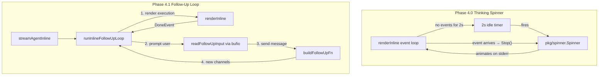

# Phase 4: Thinking Spinner + Follow-Up Input

## Architecture Overview

Two independent features that share no code but both touch the inline renderer:




---

## Phase 4.0: Thinking Spinner

**Problem**: When the agent is reasoning between tool calls, the inline renderer shows nothing. Users cannot distinguish "thinking" from "frozen."

**Solution**: Start the existing `pkg/spinner.Spinner` on stderr after 2 seconds of inactivity during `in_progress` phase. Stop it immediately when any event arrives.

### New file: `run_stream_inline_spinner.go` (~60 lines)

Four methods on `inlineRenderer`:

- `**startThinkingSpinner()`** -- calls `r.spinner.Start("Thinking...")`. Guards: only if `r.thinkingAllowed()` is true and spinner not already active.
- `**stopThinkingSpinner()`** -- calls `r.spinner.Stop()` if active. Called before processing any event.
- `**resetThinkTimer()`** -- if `r.thinkingAllowed()`, resets the timer to 2 seconds. Otherwise stops the timer. Called after processing each event.
- `**thinkingAllowed() bool`** -- predicate: returns true when phase is `"in_progress"`, no AI stream active (`!r.inAIStream`), no tool streaming (`r.activeStreamToolID == ""`), and no approval pending (`r.waitingApproval == nil`).

### Modified: `run_stream_inline.go`

New fields on `inlineRenderer`:

```go
spinner      *spinner.Spinner // stderr thinking indicator
thinkTimer   *time.Timer      // fires after 2s idle
phase        string           // current execution phase
```

Modified `renderInline` event loop -- add third select case and spinner lifecycle:

```go
func renderInline(ctx context.Context, cfg inlineRenderConfig) (string, string) {
    r := &inlineRenderer{
        // ...existing init...
        spinner:    spinner.New(cfg.status),
        thinkTimer: time.NewTimer(0),
    }
    r.thinkTimer.Stop() // don't fire immediately
    // drain the initial channel value
    select {
    case <-r.thinkTimer.C:
    default:
    }

    for {
        select {
        case <-ctx.Done():
            r.stopThinkingSpinner()
            // ...existing...

        case event, ok := <-cfg.events:
            r.stopThinkingSpinner()
            r.thinkTimer.Stop()
            // ...existing event handling...
            if !done {
                r.resetThinkTimer()
            }

        case <-r.thinkTimer.C:
            r.startThinkingSpinner()
        }
    }
}
```

Track `phase` in `renderPhaseChange`:

```go
func (r *inlineRenderer) renderPhaseChange(e executiontui.PhaseChangeEvent) {
    r.phase = e.Phase  // <-- new
    // ...existing switch...
}
```

### New test file: `run_stream_inline_spinner_test.go`

Test the state machine predicate (`thinkingAllowed`) under all combinations:

- Phase not `in_progress` -> false
- AI streaming active -> false
- Tool streaming active -> false
- Approval pending -> false
- All clear in `in_progress` -> true

Test event integration:

- Timer fires after idle gap -> spinner starts
- Event arrives -> spinner stops, timer resets
- DoneEvent -> spinner stops, timer not reset

### Key design notes

- **Reuse `pkg/spinner`**: No new spinner code. The existing spinner handles TTY detection, goroutine management, and `\r\033[K` clearing.
- **No `[Esc to cancel]`**: Per decision, Ctrl+C already works via SIGINT. Esc-to-cancel deferred.
- **2-second threshold**: Matches the TUI's `idleThreshold`. Prevents flicker during rapid tool cycling.
- **Spinner on stderr**: Consistent with all status output. Doesn't affect `stdout | jq` piping.
- **No concurrency risk**: `spinner.Stop()` is synchronous (waits for goroutine, then clears line). Calling it before `statusf` guarantees ordering.

---

## Phase 4.1: Follow-Up Readline Loop

**Problem**: After the agent completes, the inline renderer exits. Users must re-run the command to continue the conversation.

**Solution**: After `DoneEvent`, show a `>`  prompt on stderr. Read input via `bufio.Scanner` (cooked mode -- OS provides line editing natively). Send the message as a follow-up execution and loop back into `renderInline`.

### New file: `run_stream_inline_followup.go` (~90 lines)

- `**runInlineFollowUpLoop(ctx, cfg, followUpFn, executionID, conn) (latestExecID, phase, exitErr)`** -- outer loop that wraps `renderInline`. After each execution completes, prompts for input and creates a follow-up.
- `**readFollowUpInput(status io.Writer) (string, error)`** -- prints `\n>`  to stderr, reads one line from stdin via `bufio.Scanner`. Returns empty string on EOF (Ctrl+D) or empty input (just Enter).
- `**isFollowUpEligible(phase, exitErr string) bool`** -- returns true for `"completed"` and `"failed"` phases with no exit error. Failed executions allow corrective follow-up (matches TUI behavior).

Loop flow:

```
1. renderInline(cfg) -> (phase, exitErr)
2. if !isFollowUpEligible(phase, exitErr) || followUpFn == nil -> return
3. readFollowUpInput(cfg.status) -> input
4. if input == "" -> return (user pressed Enter or Ctrl+D)
5. followUpFn(input) -> result
6. if error -> print error, return
7. executionID = result.ExecutionID
8. cfg.events = result.Events
9. cfg.approvalResponses = result.ApprovalResponses
10. goto 1
```

### Modified: `[run_stream.go](client-apps/cli/cmd/stigmer/root/run_stream.go)`

`**streamAgentInline**` -- add `orgID` parameter, build `followUpFn`, delegate to follow-up loop:

```go
func streamAgentInline(streamCtx context.Context, streamCancel context.CancelFunc,
    sessionID, executionID, orgID string, // <-- orgID added
    events chan executiontui.Event,
    approvalResponses chan executiontui.ApprovalResponse,
    prompter approval.Prompter, defaultAction approval.Action,
    conn *grpc.ClientConn,
) (*agentexecutionv1.AgentExecution, error) {

    var followUpFn executiontui.FollowUpFn
    if sessionID != "" {
        followUpFn = buildFollowUpFn(streamCtx, sessionID, orgID, conn)
    }

    cfg := inlineRenderConfig{
        events: events, approvalResponses: approvalResponses,
        prompter: prompter, defaultAction: defaultAction,
        data: os.Stdout, status: os.Stderr, sessionID: sessionID,
    }

    latestExecID, phase, exitErr := runInlineFollowUpLoop(
        streamCtx, cfg, followUpFn, executionID, conn,
    )
    streamCancel()

    return streamAgentEpilogue(sessionID, latestExecID, phase, exitErr, conn)
}
```

`**streamAgentExecution**` -- pass `orgID` through to the inline call:

```go
case OutputInline:
    return streamAgentInline(streamCtx, streamCancel, sessionID, executionID,
        orgID, events, approvalResponses, prompter, defaultAction, conn) // orgID added
```

### Modified: `[run_session.go](client-apps/cli/cmd/stigmer/root/run_session.go)`

`**resumeSession` inline path** -- replace direct `renderInline` call with the follow-up loop:

```go
case OutputInline:
    prompter := approval.NewInlinePrompter(os.Stdin, os.Stderr)
    followUpFn := buildFollowUpFn(streamCtx, sessionID, orgID, conn)
    cfg := inlineRenderConfig{...}
    latestExecID, phase, exitErr := runInlineFollowUpLoop(
        streamCtx, cfg, followUpFn, latestExecID, conn,
    )
    streamCancel()
    if exitErr != "" {
        return errors.New(exitErr)
    }
    finalExec, err := fetchFinalExecution(context.Background(), conn, latestExecID)
    if err != nil {
        return errors.Wrap(err, "failed to fetch final execution state")
    }
    displaySessionExitLine(sessionID, finalExec)
    return nil
```

### New test file: `run_stream_inline_followup_test.go`

- Test `isFollowUpEligible` for all phase/exitErr combinations
- Test loop exits on empty input
- Test loop exits on non-eligible phase
- Test loop creates follow-up and continues rendering
- Test loop exits on `followUpFn` error
- Test `readFollowUpInput` returns trimmed input

### Key design notes

- `**bufio.Scanner` in cooked mode**: Zero new dependencies. The OS terminal provides backspace, arrow keys, Home/End natively. No raw mode means no conflict with `InlinePrompter`.
- **Prompt on stderr**: `>`  goes to stderr (consistent with all status output). User input is read from stdin. Piped stdout stays clean.
- **Failed phases allow follow-up**: Matches TUI behavior -- user can recover from failures with corrective instructions.
- **Cancelled/error phases exit**: User-initiated cancellation or infrastructure errors should not prompt for follow-up.
- `**streamAgentEpilogue` uses `latestExecID`**: The epilogue fetches the last execution (which may be a follow-up, not the original). This matches the TUI pattern where `result.LatestExecutionID()` tracks the latest.
- **History deferred**: Simple `bufio.Scanner` has no history recall. If users want Up/Down history, a readline library can be swapped in later without architectural changes (only `readFollowUpInput` changes).
- `**resumeSession` gets follow-up**: Resumed sessions (replayed history) also get the follow-up prompt, matching TUI behavior.

---

## Execution Order

Phase 4.0 (spinner) first -- it modifies the event loop internals. Phase 4.1 (follow-up) second -- it wraps the event loop in an outer loop. No dependency between them, but doing inner changes before outer wrapping is cleaner.

## Files Summary


| File                                 | Action   | Lines (est.) |
| ------------------------------------ | -------- | ------------ |
| `run_stream_inline_spinner.go`       | New      | ~60          |
| `run_stream_inline_spinner_test.go`  | New      | ~120         |
| `run_stream_inline.go`               | Modified | +20          |
| `run_stream_inline_followup.go`      | New      | ~90          |
| `run_stream_inline_followup_test.go` | New      | ~150         |
| `run_stream.go`                      | Modified | +15          |
| `run_session.go`                     | Modified | +15          |
| `BUILD.bazel`                        | Modified | +4           |


## Open Questions (to resolve during implementation)

None -- all design decisions finalized. If surprises arise (e.g., `bufio.Scanner` behavior at EOF vs Ctrl+D, or timer edge cases with rapid event bursts), I will pause and discuss before proceeding.