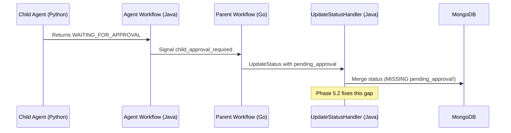

# Phase 5.2: Workflow Status Propagation - pending_approval Handling

## Executive Summary

Phase 5.2 completes the workflow-level approval propagation by implementing the `pending_approval` field handling in the Java `WorkflowExecutionUpdateStatusHandler`. Phase 5.1 already implemented:

- The proto field (`WorkflowExecutionStatus.pending_approval`)
- The Go signal handling and local activities that call `UpdateStatus`
- The Java `NotifyParentActivities` for signaling parent workflows

The missing piece is the Java handler logic to actually **merge** the `pending_approval` field when status updates come from the Go workflow-runner.

---

## Current Architecture Flow




---

## Implementation Plan

### Step 1: Update BuildNewStateWithStatusStep (Java)

**File**: `[backend/services/stigmer-service/src/main/java/ai/stigmer/domain/agentic/workflowexecution/request/handler/WorkflowExecutionUpdateStatusHandler.java](backend/services/stigmer-service/src/main/java/ai/stigmer/domain/agentic/workflowexecution/request/handler/WorkflowExecutionUpdateStatusHandler.java)`

**Changes to `BuildNewStateWithStatusStep.execute()**`:

Add logic to handle `pending_approval` field after the existing timestamp handling (around line 210):

```java
// Handle pending_approval (HITL Phase 5.2)
// This enables workflow-level approval visibility when child agents require approval.
// 
// When set: A child agent is waiting for approval - surface at workflow level
// When not set (hasPendingApproval=false): Clear any existing pending approval
//   - This happens when: (a) approval resolved, (b) task completed, (c) explicit clear
if (requestStatus.hasPendingApproval()) {
    statusBuilder.setPendingApproval(requestStatus.getPendingApproval());
    log.debug("Setting pending_approval on workflow execution: tool_name={}", 
        requestStatus.getPendingApproval().getToolName());
} else {
    // Check if caller explicitly wants to clear (Go sends empty status with only pending_approval intent)
    // Proto3 semantics: hasPendingApproval() returns true even for empty message if field was set
    // We need to detect the "clear" case vs "not provided" case
    // 
    // Strategy: If the request status has NO other meaningful fields but targets this execution,
    // treat empty pending_approval as a clear signal.
    // 
    // Actually, since Go explicitly builds PendingApproval{} vs nil, we check:
    // - If pending_approval has tool_call_id set: it's a real approval request
    // - If pending_approval has empty tool_call_id: it's a clear signal
    if (requestStatus.getPendingApproval().getToolCallId().isEmpty()) {
        statusBuilder.clearPendingApproval();
        log.debug("Clearing pending_approval from workflow execution");
    }
}
```

**Why this design**:

- The Go `UpdateWorkflowTaskApprovalStatus` activity builds a full `PendingApproval` with `tool_call_id`, `tool_name`, etc.
- The Go `ClearWorkflowApprovalStatus` activity sets `pending_approval: nil` which clears it
- Proto3 semantics: `hasPendingApproval()` is true if the field was explicitly set (even to empty)
- We differentiate "set with data" vs "clear" by checking if `tool_call_id` is empty

### Step 2: Unit Tests for pending_approval Handling

**File**: `[backend/services/stigmer-service/src/test/java/ai/stigmer/domain/agentic/workflowexecution/request/handler/WorkflowExecutionUpdateStatusHandlerTest.java](backend/services/stigmer-service/src/test/java/ai/stigmer/domain/agentic/workflowexecution/request/handler/WorkflowExecutionUpdateStatusHandlerTest.java)` (NEW)

**Test cases**:

1. `**testSetPendingApproval_PopulatedCorrectly**`
  - Input: Status with pending_approval containing tool_call_id, tool_name, message
  - Verify: Response has pending_approval populated with all fields
2. `**testClearPendingApproval_WhenEmptyProvided**`
  - Input: Status with empty pending_approval (tool_call_id = "")
  - Existing: Workflow has pending_approval set
  - Verify: Response has pending_approval cleared
3. `**testPendingApproval_PreservedWhenNotProvided**`
  - Input: Status with only tasks[] updated (no pending_approval)
  - Existing: Workflow has pending_approval set
  - Verify: Existing pending_approval preserved (not cleared)
4. `**testPendingApproval_FullIntegrationFlow**`
  - Step 1: Set pending_approval
  - Step 2: Update tasks (pending_approval preserved)
  - Step 3: Clear pending_approval
  - Verify: Each step produces correct state

---

## Files to Modify


| File                                            | Change Type | Lines Est. |
| ----------------------------------------------- | ----------- | ---------- |
| `WorkflowExecutionUpdateStatusHandler.java`     | Modify      | +25 lines  |
| `WorkflowExecutionUpdateStatusHandlerTest.java` | New         | ~300 lines |


---

## Key Design Decisions

### 1. Proto3 Empty vs Unset Semantics

Proto3 doesn't distinguish "not set" from "set to default". For message fields like `PendingApproval`:

- `hasPendingApproval()` returns true if field was explicitly set (even to empty message)
- We use `tool_call_id.isEmpty()` to detect "clear" intent

### 2. Backward Compatibility

- Existing status updates without `pending_approval` will not touch the field
- Only explicit set/clear operations modify `pending_approval`
- No breaking changes to existing workflow execution flows

### 3. Merge Strategy

Following the same pattern as other fields in `BuildNewStateWithStatusStep`:

- `pending_approval` is fully replaced when provided (not merged)
- This matches how Go builds the full `PendingApproval` from `ChildApprovalNotification`

---

## Testing Strategy

### Unit Tests (Phase 5.2)

- Handler step tests with mocked repository
- Verify pending_approval set/clear/preserve behavior

### Integration Tests (Phase 5.5)

- End-to-end workflow → agent → approval → resolution
- Verify pending_approval surfaces in workflow status
- Verify UI can submit approval via workflow API

---

## Success Criteria

1. Go `UpdateWorkflowTaskApprovalStatus` activity successfully populates `pending_approval`
2. Go `ClearWorkflowApprovalStatus` activity successfully clears `pending_approval`
3. Existing workflow status updates (tasks, phase, etc.) don't affect `pending_approval`
4. All new tests pass
5. No regression in existing workflow execution tests

