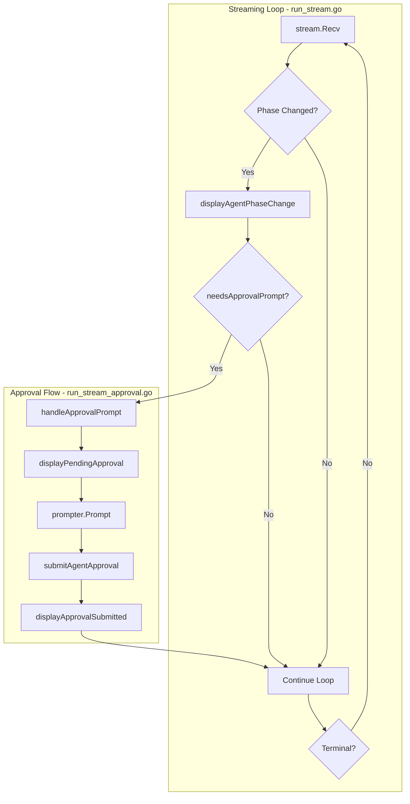

# Phase 6.4: Streaming Integration

## Context

**Completed foundations:**

- Phase 6.1: `displayPendingApproval()` in [run_display_approval.go](client-apps/cli/cmd/stigmer/root/run_display_approval.go) - shows approval details
- Phase 6.2: `pkg/approval/` package with `InteractivePrompter` - collects user decisions
- Phase 6.3: `submitAgentApproval()` / `submitWorkflowApproval()` in [run_approval.go](client-apps/cli/cmd/stigmer/root/run_approval.go) - submits decisions

**Current state of streaming:**

```go
// run_stream.go (line 46-49) - currently only displays phase change
if execution.Status.Phase != lastPhase {
    displayAgentPhaseChange(execution.Status.Phase)  // Shows "Approval required"
    lastPhase = execution.Status.Phase
}
// Missing: display approval details, prompt user, submit decision
```

## Architecture




## Implementation

### 1. Create `run_stream_approval.go` (new file, ~90 lines)

**Location:** [client-apps/cli/cmd/stigmer/root/run_stream_approval.go](client-apps/cli/cmd/stigmer/root/run_stream_approval.go)

**Purpose:** Encapsulates approval detection and handling logic, keeping streaming loop thin.

**Key functions:**

```go
// needsApprovalPrompt checks if we should show an interactive approval prompt.
// Returns true when phase is WAITING_FOR_APPROVAL with a new PendingApproval.
func needsApprovalPrompt(
    phase agentexecutionv1.ExecutionPhase,
    pendingApproval *agentexecutionv1.PendingApproval,
    lastToolCallID string,
) bool
```

- Returns `true` when:
  - Phase is `EXECUTION_WAITING_FOR_APPROVAL`
  - `PendingApproval` is non-nil
  - `ToolCallId` differs from `lastToolCallID` (prevents duplicate prompts)

```go
// handleAgentApprovalPrompt orchestrates the approval flow for agent executions.
// Shows approval details, prompts user, submits decision, displays confirmation.
func handleAgentApprovalPrompt(
    ctx context.Context,
    conn *grpc.ClientConn,
    executionID string,
    pendingApproval *agentexecutionv1.PendingApproval,
    prompter approval.Prompter,
) error
```

- Calls `displayPendingApproval()` to show tool details
- Calls `prompter.Prompt()` to collect user decision
- Calls `submitAgentApproval()` to submit decision
- Calls `displayApprovalSubmitted()` to confirm
- Returns error on failure (caller decides how to handle)

```go
// handleWorkflowApprovalPrompt orchestrates the approval flow for workflow executions.
// Similar to agent approval but uses workflow API.
func handleWorkflowApprovalPrompt(
    ctx context.Context,
    conn *grpc.ClientConn,
    executionID string,
    pendingApproval *workflowexecutionv1.PendingApproval,
    prompter approval.Prompter,
) error
```

**Design decisions:**

- Separate file maintains 250-line limit per CLI guidelines
- Functions under 50 lines each
- Prompter injected for testability
- Returns errors rather than calling `os.Exit()` - caller decides behavior

### 2. Modify `run_stream.go` (~30 lines added)

**Changes to `streamAgentExecutionLogs()`:**

```go
func streamAgentExecutionLogs(executionID string, conn *grpc.ClientConn) {
    // ... existing setup ...
    
    // NEW: Create prompter and track approval state
    prompter := approval.NewInteractivePrompter()
    var lastPendingToolCallID string
    
    for {
        execution, err := stream.Recv()
        // ... existing error handling ...
        
        // Display phase changes
        if execution.Status.Phase != lastPhase {
            displayAgentPhaseChange(execution.Status.Phase)
            lastPhase = execution.Status.Phase
            
            // NEW: Handle approval flow when entering WAITING_FOR_APPROVAL
            if needsApprovalPrompt(
                execution.Status.Phase,
                execution.Status.GetPendingApproval(),
                lastPendingToolCallID,
            ) {
                pendingApproval := execution.Status.GetPendingApproval()
                err := handleAgentApprovalPrompt(
                    ctx, conn, executionID,
                    pendingApproval, prompter,
                )
                if err != nil {
                    cliprint.PrintError("Approval failed: %v", err)
                    return
                }
                lastPendingToolCallID = pendingApproval.ToolCallId
            }
        }
        // ... existing message display and terminal check ...
    }
}
```

**Similar changes to `streamWorkflowExecutionLogs()`:**

- Use workflow-specific approval handling
- Check `execution.Status.GetPendingApproval()` (workflow level)

### 3. Create `run_stream_test.go` (new file, ~200 lines)

**Test coverage:**

`**needsApprovalPrompt` tests:**

- `TestNeedsApprovalPrompt_TrueWhenWaitingWithNewApproval` - happy path
- `TestNeedsApprovalPrompt_FalseWhenNotWaitingPhase` - wrong phase
- `TestNeedsApprovalPrompt_FalseWhenNilApproval` - missing PendingApproval
- `TestNeedsApprovalPrompt_FalseWhenSameToolCallID` - duplicate detection
- `TestNeedsApprovalPrompt_TrueWhenDifferentToolCallID` - new tool call

`**handleAgentApprovalPrompt` tests (mock prompter):**

- `TestHandleAgentApprovalPrompt_ApproveSuccess` - full approve flow
- `TestHandleAgentApprovalPrompt_SkipSuccess` - skip decision flow
- `TestHandleAgentApprovalPrompt_RejectSuccess` - reject decision flow
- `TestHandleAgentApprovalPrompt_PromptCancelled` - user Ctrl+C
- `TestHandleAgentApprovalPrompt_SubmitError` - API error handling

**Mock prompter for tests:**

```go
type mockPrompter struct {
    decision *approval.Decision
    err      error
}

func (m *mockPrompter) Prompt(ctx context.Context, opts approval.Options) (*approval.Decision, error) {
    return m.decision, m.err
}
```

### 4. Update BUILD.bazel

Add new source file and test dependencies:

- Add `run_stream_approval.go` to srcs
- Add `run_stream_test.go` to test srcs
- Ensure `pkg/approval` dependency is present

## Data Flow

```
Stream receives AgentExecution update
    |
    v
Phase changed to EXECUTION_WAITING_FOR_APPROVAL?
    |
    v
execution.Status.PendingApproval populated?
    |                               |
    v                               v
ToolCallId != lastPendingToolCallID?   (duplicate - skip)
    |
    v
displayPendingApproval()     -- Shows: Tool, Message, Args, Waiting time
    |
    v
prompter.Prompt()            -- User selects: Approve / Skip / Reject
    |
    v
submitAgentApproval()        -- Sends decision to backend
    |
    v
displayApprovalSubmitted()   -- Shows: "Tool execution approved"
    |
    v
Update lastPendingToolCallID
    |
    v
Continue streaming (execution will transition phases)
```

## Error Handling Strategy


| Error Type                   | Behavior                                              |
| ---------------------------- | ----------------------------------------------------- |
| `ErrPromptCancelled`         | Print "Approval cancelled", exit streaming loop       |
| `ErrNonInteractiveNoDefault` | Print error with hint about `--approve-default`, exit |
| API submission error         | Print error with context, exit streaming loop         |
| Stream error                 | Print error, exit (existing behavior)                 |


## Edge Cases

1. **Multiple approvals in sequence**: Track `lastPendingToolCallID` to prevent re-prompting for same tool
2. **Approval during message display**: Approval check happens after phase change, before message display
3. **Non-TTY environment**: `InteractivePrompter` auto-detects and uses `DefaultAction` if set
4. **Workflow with nested agent approval**: Workflow's `PendingApproval` is populated by child agent signal

## File Summary


| File                     | Action | Lines |
| ------------------------ | ------ | ----- |
| `run_stream_approval.go` | CREATE | ~90   |
| `run_stream.go`          | MODIFY | +30   |
| `run_stream_test.go`     | CREATE | ~200  |
| BUILD.bazel              | MODIFY | +5    |


**Total:** ~325 lines of production code and tests

## Quality Checklist

- All functions under 50 lines
- All files under 250 lines
- Errors wrapped with specific context (`errors.Wrap`)
- Prompter interface enables testing without TTY
- No business logic in streaming loop - delegated to handler functions
- Duplicate prompt prevention implemented
- Both agent and workflow streams supported
- Non-interactive mode supported via `DefaultAction`

