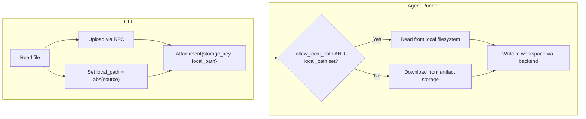

# Phase 6: Local-Mode Input File Optimization

## Domain Analysis

**The concern**: Adding `local_path` to `Attachment` introduces a deployment-mode-specific hint into a domain message. However, `Attachment` already carries infrastructure details (`storage_key`, `mount_path`). The `local_path` field is the CLI's way of saying "the original file lives here" -- it's metadata about provenance, not a deployment-mode branch. The runner decides whether to use it based on its own mode. This is analogous to how `LocalPathSource` exists on `WorkspaceSource` -- a valid domain variant with deployment-scoped validation.

**Decision**: Accept `local_path` as an optional provenance hint on `Attachment`. `storage_key` remains required (`min_len=1`). The CLI always uploads. The runner uses `local_path` as a fast path when in local mode.

## Architecture




## Changes by File

### 1. Proto: Add `local_path` to Attachment

**File**: [apis/ai/stigmer/agentic/agentexecution/v1/spec.proto](apis/ai/stigmer/agentic/agentexecution/v1/spec.proto)

Add field 6 to the `Attachment` message:

```protobuf
  // Absolute filesystem path to the original file on the CLI host (optional).
  //
  // When set and the runner is in local mode, the file is read directly
  // from this path instead of downloading from artifact storage via
  // storage_key.  This eliminates the storage round-trip for local
  // executions.
  //
  // Ignored when the runner is not in local mode (cloud runners use
  // storage_key exclusively).
  //
  // The CLI sets this unconditionally to the resolved absolute path of
  // the attached file.  storage_key remains required -- the upload still
  // happens for execution history and replay support.
  string local_path = 6;
```

No validation changes. `storage_key` keeps its `min_len=1` rule.

### 2. Runner: `inject_attachments` gains local-path fast path

**File**: [backend/services/agent-runner/worker/activities/execute_graphton.py](backend/services/agent-runner/worker/activities/execute_graphton.py)

- Add `allow_local_path: bool = False` parameter to `inject_attachments`.
- Inside the per-attachment loop, before `storage.download()`, check:
  - If `allow_local_path` and `attachment.local_path` is non-empty, read bytes from `Path(attachment.local_path)`.
  - If the file doesn't exist at that path, log a warning and fall through to `storage.download()` (graceful degradation, not a hard failure).
- All downstream code (mount path resolution, zip extraction, `backend.write_files`) stays identical -- only the content source changes.
- At the call site (Step 3.5), pass `allow_local_path=worker_config.is_local_mode()`.

Key code shape inside `inject_attachments`:

```python
content: bytes | None = None

if allow_local_path and attachment.local_path:
    local_file = Path(attachment.local_path)
    if local_file.is_file():
        content = local_file.read_bytes()
        logger.debug(
            "Read %d bytes from local path: %s",
            len(content), attachment.local_path,
        )
    else:
        logger.warning(
            "local_path '%s' not found, falling back to storage download",
            attachment.local_path,
        )

if content is None:
    if not attachment.storage_key:
        raise ValueError(
            f"Attachment missing storage_key: {attachment.filename}"
        )
    content = storage.download(attachment.storage_key)
```

### 3. CLI: Set `local_path` on Attachment

**File**: [client-apps/cli/cmd/stigmer/root/run_attachments.go](client-apps/cli/cmd/stigmer/root/run_attachments.go)

- In `uploadFile()`: after creating the Attachment proto, set `LocalPath` to the resolved absolute path of the source file.
- In `processDirectory()`: set `LocalPath` to the resolved absolute path of the source directory (the zip is what gets uploaded, but `local_path` points to the original dir -- the runner can't use it directly for zips, so this is informational only for now; the runner's `allow_local_path` path only triggers for non-zip cases where `local_path` points to a readable file).

In `uploadFile`:

```go
absPath, _ := filepath.Abs(path)

attachment, err := p.uploadBytes(content, filename, contentType)
if err != nil {
    return nil, err
}
attachment.LocalPath = absPath
return attachment, nil
```

### 4. Tests

**File**: New test cases in existing test infrastructure.

Runner tests (Python, pytest):

- `local_path` set + `allow_local_path=True` + file exists -> reads from local, no storage call
- `local_path` set + `allow_local_path=True` + file missing -> falls back to storage download with warning
- `local_path` set + `allow_local_path=False` -> uses storage download (cloud mode behavior)
- `local_path` not set -> existing behavior (storage download)
- `local_path` with zip extraction (`extract=True`) -> reads zip bytes from local path, extracts correctly
- Backward compatibility: old attachments without `local_path` work unchanged

CLI tests (Go):

- `uploadFile` sets `LocalPath` to absolute path
- `processDirectory` sets `LocalPath` to absolute directory path

## Design Decisions

- **Graceful fallback, not hard failure**: If `local_path` doesn't exist when `allow_local_path=True`, we log a warning and fall back to `storage.download()`. This handles edge cases (file deleted between CLI run and runner pickup, stale session replay) without breaking execution.
- **No symlinks**: Reading bytes and writing through the backend is simpler and sufficient for the 10MB max attachment size. Symlinks would require a new `WorkspaceBackend` method and introduce mutation-through-symlink risks. Premature optimization.
- `**allow_local_path` parameter, not `is_local_mode`**: The parameter name describes what it enables, not why. This keeps `inject_attachments` decoupled from the concept of deployment mode -- it just knows "I'm allowed to use local paths" or "I'm not."
- **CLI always sets `local_path`**: The CLI doesn't need to know the runner's mode. It always provides the provenance hint. The runner decides whether to use it. This follows the same pattern as `LocalPathSource` on the proto -- the sender provides the information, the receiver validates and decides.

