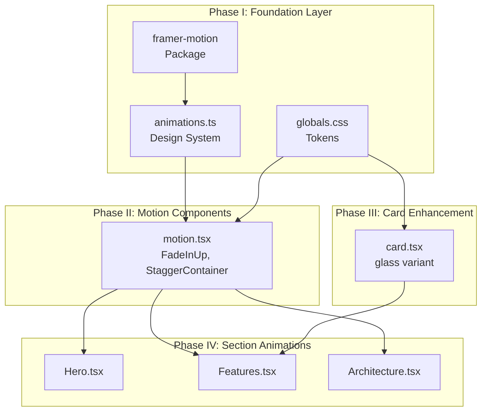

# Phase I: Animation Foundation Layer

## Objective

Establish the animation infrastructure that will power the Stigmer website's visual transformation. This phase creates type-safe, accessible, performance-optimized animation primitives that subsequent phases will consume.

---

## Current State

| Aspect | Current | Target |

|--------|---------|--------|

| Animation library | None (CSS only) | framer-motion |

| Animation tokens | 1 keyframe (`gradient`) | Complete system |

| Glow effects | None | CSS custom properties |

| Glassmorphism | Partial (`backdrop-blur-sm` in cards) | Design tokens |

| Reduced motion | Not supported | Full `prefers-reduced-motion` |

**Key existing patterns to maintain:**

- CVA for component variants ([site/src/components/ui/card.tsx](site/src/components/ui/card.tsx))
- `cn()` utility for class merging ([site/src/lib/utils.ts](site/src/lib/utils.ts))
- HSL color system with composable opacity ([site/src/app/globals.css](site/src/app/globals.css))
- TypeScript-first with proper types
- Yarn 4.5.1 package manager

---

## Deliverables

### 1. Install framer-motion

Add framer-motion as a production dependency:

```bash
cd site && yarn add framer-motion
```

**Why framer-motion:**

- Full TypeScript support with proper generics
- Hardware-accelerated, GPU-optimized transforms
- SSR compatible with Next.js App Router
- Declarative API matches React component model
- Built-in `useReducedMotion` hook for accessibility
- ~30KB gzipped (acceptable for animation capability)

---

### 2. Create Animation Design System

**File:** [site/src/lib/animations.ts](site/src/lib/animations.ts) (NEW)

A centralized, type-safe animation configuration providing:

**2.1 Animation Variants** (`as const` for type safety)

```typescript
// Entrance animations
export const fadeIn = { hidden: { opacity: 0 }, visible: { opacity: 1 } } as const;
export const fadeInUp = { hidden: { opacity: 0, y: 20 }, visible: { opacity: 1, y: 0 } } as const;
export const fadeInDown = { hidden: { opacity: 0, y: -20 }, visible: { opacity: 1, y: 0 } } as const;
export const fadeInLeft = { hidden: { opacity: 0, x: -20 }, visible: { opacity: 1, x: 0 } } as const;
export const fadeInRight = { hidden: { opacity: 0, x: 20 }, visible: { opacity: 1, x: 0 } } as const;
export const scaleIn = { hidden: { opacity: 0, scale: 0.95 }, visible: { opacity: 1, scale: 1 } } as const;
```

**2.2 Stagger Container Variants**

```typescript
export const staggerContainer = {
  hidden: {},
  visible: {
    transition: { staggerChildren: 0.1, delayChildren: 0.2 }
  }
} as const;

export const staggerFast = {
  hidden: {},
  visible: {
    transition: { staggerChildren: 0.05, delayChildren: 0.1 }
  }
} as const;
```

**2.3 Transition Presets**

```typescript
export const transitions = {
  spring: { type: "spring", stiffness: 300, damping: 30 },
  smooth: { duration: 0.4, ease: [0.25, 0.1, 0.25, 1] },
  fast: { duration: 0.2, ease: "easeOut" },
  slow: { duration: 0.6, ease: [0.25, 0.1, 0.25, 1] }
} as const;
```

**2.4 Viewport Configuration**

```typescript
export const viewportOnce = { once: true, margin: "-100px" } as const;
export const viewportAlways = { once: false, margin: "-50px" } as const;
```

**2.5 Hover Animations**

```typescript
export const hoverScale = { scale: 1.02, transition: transitions.fast };
export const hoverGlow = { boxShadow: "0 0 20px hsl(var(--primary) / 0.3)" };
export const tapScale = { scale: 0.98 };
```

**2.6 Reduced Motion Helper**

```typescript
export function getMotionProps(prefersReducedMotion: boolean) {
  if (prefersReducedMotion) {
    return { initial: undefined, animate: undefined, variants: undefined };
  }
  return {};
}
```

---

### 3. Extend CSS Design Tokens

**File:** [site/src/app/globals.css](site/src/app/globals.css) (MODIFY)

Add new design tokens after existing `:root` variables (line ~50):

**3.1 Glow Effect Tokens**

```css
/* Glow effects - composable with existing colors */
--glow-sm: 0 0 10px;
--glow-md: 0 0 20px;
--glow-lg: 0 0 40px;
--glow-primary: var(--glow-md) hsl(var(--primary) / 0.3);
--glow-accent: var(--glow-md) hsl(var(--accent) / 0.3);
--glow-primary-intense: var(--glow-lg) hsl(var(--primary) / 0.4);
```

**3.2 Glassmorphism Tokens**

```css
/* Glassmorphism - extends existing card patterns */
--glass-bg: hsl(var(--card) / 0.8);
--glass-bg-strong: hsl(var(--card) / 0.9);
--glass-border: hsl(var(--primary) / 0.2);
--glass-border-hover: hsl(var(--primary) / 0.4);
--glass-blur: 12px;
--glass-blur-strong: 20px;
```

**3.3 Animation Duration Tokens**

```css
/* Animation durations - for CSS animations and JS reference */
--duration-instant: 100ms;
--duration-fast: 150ms;
--duration-normal: 300ms;
--duration-slow: 500ms;
--duration-slower: 800ms;
```

**3.4 Reduced Motion Support**

```css
@media (prefers-reduced-motion: reduce) {
  *,
  *::before,
  *::after {
    animation-duration: 0.01ms !important;
    animation-iteration-count: 1 !important;
    transition-duration: 0.01ms !important;
  }
}
```

**3.5 Utility Classes**

```css
@layer utilities {
  /* Glass card utility */
  .glass {
    background: var(--glass-bg);
    backdrop-filter: blur(var(--glass-blur));
    -webkit-backdrop-filter: blur(var(--glass-blur));
    border-color: var(--glass-border);
  }
  
  .glass-strong {
    background: var(--glass-bg-strong);
    backdrop-filter: blur(var(--glass-blur-strong));
    -webkit-backdrop-filter: blur(var(--glass-blur-strong));
  }
  
  /* Glow on hover utility */
  .glow-on-hover {
    transition: box-shadow var(--duration-normal) ease;
  }
  .glow-on-hover:hover {
    box-shadow: var(--glow-primary);
  }
}
```

---

## Architecture Diagram



---

## File Changes Summary

| File | Action | Lines | Description |

|------|--------|-------|-------------|

| [site/package.json](site/package.json) | Modify | +1 | Add framer-motion dependency |

| [site/src/lib/animations.ts](site/src/lib/animations.ts) | Create | ~100 | Animation design system |

| [site/src/app/globals.css](site/src/app/globals.css) | Modify | ~60 | Glow, glass, duration tokens |

---

## Quality Gates

Before Phase I is complete:

- [ ] `yarn typecheck` passes (zero TypeScript errors)
- [ ] `yarn lint` passes (zero ESLint errors)
- [ ] `yarn build` succeeds
- [ ] framer-motion appears in production bundle
- [ ] Reduced motion CSS media query present
- [ ] All new tokens use existing HSL color system (composable)
- [ ] No visual regressions on existing components

---

## Implementation Notes

**Type Safety Principles:**

- All animation variants use `as const` for literal types
- Transition objects typed to match framer-motion expectations
- Export types for consuming components

**Performance Principles:**

- Prefer `transform` and `opacity` (compositor-only properties)
- Avoid animating `width`, `height`, `top`, `left`
- Use `will-change` sparingly (only when needed)

**Accessibility Principles:**

- CSS `prefers-reduced-motion` kills all animations
- JavaScript `useReducedMotion` hook available for component logic
- No animation-only content (decorative only)

**Backward Compatibility:**

- All existing CSS tokens preserved
- No changes to existing component behavior
- New tokens extend, never replace