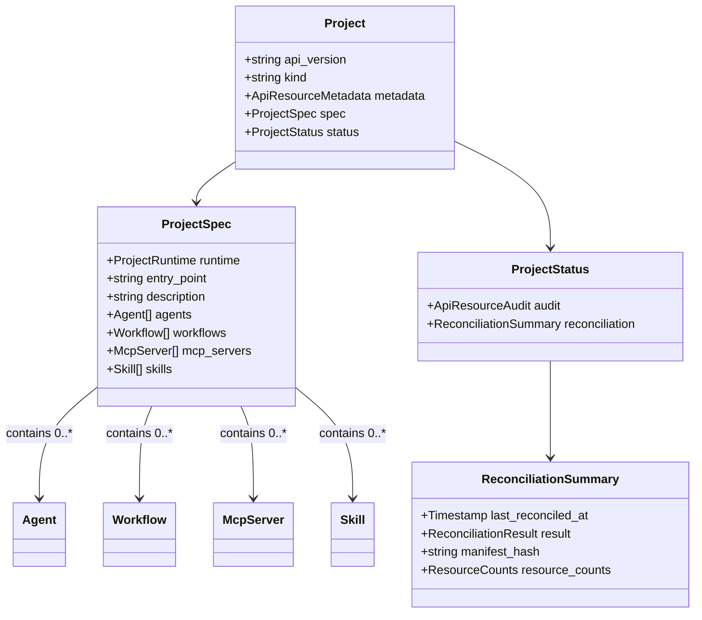

# T04.1b: Update ProjectSpec with Resource Fields

## Objective

Transform `ProjectSpec` from a lightweight SDK configuration holder into a true **aggregate root** that contains all managed resources. This follows the Terraform/Pulumi model where the Project is the state manager for its resources.

## Domain Model After This Change




## File to Modify

[apis/ai/stigmer/agentic/project/v1/spec.proto](apis/ai/stigmer/agentic/project/v1/spec.proto)

## Implementation Details

### Step 1: Add Cross-Package Imports

Add imports for the four resource types at the top of spec.proto:

```protobuf
import "ai/stigmer/agentic/agent/v1/api.proto";
import "ai/stigmer/agentic/workflow/v1/api.proto";
import "ai/stigmer/agentic/mcpserver/v1/api.proto";
import "ai/stigmer/agentic/skill/v1/api.proto";
```

**Why these specific files?** Each `api.proto` defines the top-level resource message (Agent, Workflow, McpServer, Skill) that contains metadata, spec, and status. We embed the complete resource, not just references.

### Step 2: Add Repeated Resource Fields

Add four repeated fields with field numbers 10-13 (reserving 4-9 for future spec fields):

```protobuf
// ============================================================
// Managed Resources
// These are the resources that will be reconciled on apply.
// The backend creates/updates/deletes resources to match this list.
// ============================================================

// Agents managed by this project.
// Each Agent must have unique metadata.name within the project.
// On apply: backend creates/updates agents that exist here, deletes those removed.
repeated ai.stigmer.agentic.agent.v1.Agent agents = 10;

// Workflows managed by this project.
// Each Workflow must have unique metadata.name within the project.
// On apply: backend creates/updates workflows that exist here, deletes those removed.
repeated ai.stigmer.agentic.workflow.v1.Workflow workflows = 11;

// MCP Servers managed by this project.
// Each McpServer must have unique metadata.name within the project.
// On apply: backend creates/updates MCP servers that exist here, deletes those removed.
// Note: MCP servers are processed first (no dependencies on other resources).
repeated ai.stigmer.agentic.mcpserver.v1.McpServer mcp_servers = 12;

// Skills managed by this project.
// Skills require code push before project apply (CLI handles this).
// Each Skill must have unique metadata.name within the project.
// On apply: backend validates skill references exist (code already pushed).
repeated ai.stigmer.agentic.skill.v1.Skill skills = 13;
```

### Step 3: No Additional Validation Rules

The resource fields do NOT need `buf.validate` rules because:

1. Each embedded resource (Agent, Workflow, etc.) has its own comprehensive validation
2. Cross-resource validation (e.g., Agent references valid Skill) is handled by backend reconciliation
3. Uniqueness within project is a backend enforcement concern

**Why no min_items?** Projects can start empty (gradual resource addition) or be intentionally emptied (cleanup).

### Step 4: Regenerate Stubs

Run proto generation from the `apis/` directory:

```bash
cd apis && make protos
```

This runs:

1. `buf lint` - Validates proto syntax and style
2. `buf format -w` - Auto-formats proto files
3. Go stub generation with gazelle BUILD.bazel updates
4. Python stub generation

### Step 5: Verify BUILD.bazel Dependencies

After regeneration, verify that [apis/stubs/go/ai/stigmer/agentic/project/v1/BUILD.bazel](apis/stubs/go/ai/stigmer/agentic/project/v1/BUILD.bazel) includes the new dependencies:

```bazel
deps = [
    # Existing deps...
    "//apis/stubs/go/ai/stigmer/agentic/agent/v1:agent",      # NEW
    "//apis/stubs/go/ai/stigmer/agentic/workflow/v1:workflow", # NEW
    "//apis/stubs/go/ai/stigmer/agentic/mcpserver/v1:mcpserver", # NEW
    "//apis/stubs/go/ai/stigmer/agentic/skill/v1:skill",       # NEW
]
```

Gazelle should add these automatically based on the proto imports.

### Step 6: Build Verification

Verify the changes compile correctly:

```bash
# From repo root
bazel build //apis/stubs/go/ai/stigmer/agentic/project/v1:project
```

## Design Decisions

### Why Embed Full Resources (Not References)?


| Option          | Description                                            | Chosen? |
| --------------- | ------------------------------------------------------ | ------- |
| Full Resources  | Project contains complete Agent/Workflow/etc. messages | Yes     |
| References Only | Project contains `ApiResourceReference` to resources   | No      |


**Rationale**: The SDK synthesizes complete resource definitions. Embedding full resources means:

- Single atomic apply operation
- No separate resource creation needed
- Clear ownership (resources belong to Project)
- Enables drift detection via manifest hash

### Why Field Numbers 10-13?

Reserved field numbers 4-9 for future spec configuration fields (e.g., environment defaults, access policies). Resource fields start at 10 to provide clear separation between configuration and managed resources.

### Why No Validation on Repeated Fields?

1. **protovalidate composability**: Each embedded message validates itself
2. **Backend owns business rules**: Uniqueness, dependency ordering, reference validity
3. **SDK correctness**: SDK generates valid resources; CLI validates before apply

## Impact on Existing Code

### CLI Loader ([client-apps/cli/internal/cli/project/loader.go](client-apps/cli/internal/cli/project/loader.go))

**No changes required.** The loader uses `protojson.Unmarshal` which automatically handles nested messages. The protovalidate call validates the entire message tree including nested resources.

### CLI Validator ([client-apps/cli/internal/cli/project/validator.go](client-apps/cli/internal/cli/project/validator.go))

**No changes required for T04.1b.** Current cross-field validation focuses on runtime/entry_point consistency. Resource-level cross-field validation (e.g., Agent references valid Skill) should be added in a future task when the full apply flow is implemented.

### CLI Display ([client-apps/cli/internal/cli/project/display.go](client-apps/cli/internal/cli/project/display.go))

**May need updates in T04.6/T04.7** to display resource counts in table output. Not part of this task.

## Verification Checklist

1. `buf lint` passes with no errors
2. `buf format` makes no changes (already formatted)
3. Go stubs generate successfully
4. Python stubs generate successfully
5. `bazel build //apis/stubs/go/ai/stigmer/agentic/project/v1:project` succeeds
6. Existing project loader tests pass (no interface changes)
7. Existing project validator tests pass (no interface changes)

## Alignment with ReconciliationSummary

The `ResourceCounts` message in [status.proto](apis/ai/stigmer/agentic/project/v1/status.proto) already tracks these exact resource types:

```protobuf
message ResourceCounts {
  int32 agents = 1;
  int32 workflows = 2;
  int32 skills = 3;
  int32 mcp_servers = 4;
}
```

This confirms the design is consistent - the status tracks counts of exactly the resources that spec contains.