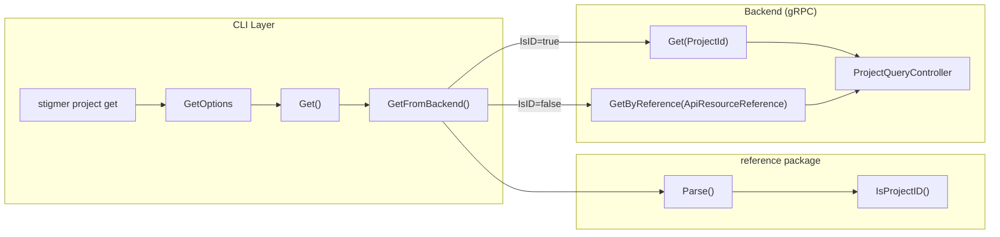

# T05.2: Project Get Foundation

## Goal

Create `get.go` for gRPC get/getByReference orchestration in the project internal package, enabling the CLI to fetch Project resources from the backend.

## Architecture Context

The Project entity is the aggregate root for resource lifecycle management. The get functionality must support:

- **Get by ID**: Direct lookup using `prj_<ulid>` format (e.g., `prj_01h9abc...`)
- **Get by Reference**: Lookup by `org/slug` or `slug` (with context org)




## Pattern Reference

The implementation mirrors [client-apps/cli/internal/cli/agent/get.go](client-apps/cli/internal/cli/agent/get.go) exactly (84 lines):

```go
// Key functions to implement:
func GetFromBackend(conn grpc.ClientConnInterface, orgID, ref string) (*projectv1.Project, error)
func Get(opts *GetOptions) (*projectv1.Project, error)

// Options struct:
type GetOptions struct {
    Reference string                    // slug, org/slug, or prj_xxx
    OrgID     string                    // context org for slug-only refs
    Conn      grpc.ClientConnInterface  // gRPC connection
}
```

## Files to Create/Modify

### 1. New File: `get.go` (~85 lines)

**Location**: [client-apps/cli/internal/cli/project/get.go](client-apps/cli/internal/cli/project/get.go)

**Implementation**:

```go
// Package project provides CLI utilities for managing Project resources.
package project

import (
    "context"
    "fmt"

    "github.com/pkg/errors"
    projectv1 "github.com/stigmer/stigmer/apis/stubs/go/ai/stigmer/agentic/project/v1"
    "github.com/stigmer/stigmer/apis/stubs/go/ai/stigmer/commons/apiresource"
    "github.com/stigmer/stigmer/apis/stubs/go/ai/stigmer/commons/apiresource/apiresourcekind"
    "github.com/stigmer/stigmer/client-apps/cli/pkg/reference"
    "google.golang.org/grpc"
)

// GetFromBackend fetches a project from the backend by reference.
// The reference can be a slug (e.g., "my-project"), org/slug (e.g., "stigmer/my-project"),
// or a resource ID (e.g., "prj_abc123").
func GetFromBackend(conn grpc.ClientConnInterface, orgID, ref string) (*projectv1.Project, error) {
    parsed, err := reference.Parse(ref, orgID)
    if err != nil {
        return nil, errors.Wrap(err, "invalid project reference")
    }

    client := projectv1.NewProjectQueryControllerClient(conn)
    ctx := context.Background()

    var result *projectv1.Project

    if parsed.IsID {
        result, err = client.Get(ctx, &projectv1.ProjectId{Value: parsed.ID})
        if err != nil {
            return nil, errors.Wrapf(err, "failed to get project by ID '%s'", parsed.ID)
        }
    } else {
        result, err = client.GetByReference(ctx, &apiresource.ApiResourceReference{
            Org:  parsed.Org,
            Kind: apiresourcekind.ApiResourceKind_project,
            Slug: parsed.Slug,
        })
        if err != nil {
            return nil, errors.Wrapf(err, "failed to get project '%s/%s'", parsed.Org, parsed.Slug)
        }
    }

    return result, nil
}

// GetOptions contains options for fetching a project.
type GetOptions struct {
    Reference string
    OrgID     string
    Conn      grpc.ClientConnInterface
}

// Get fetches a project from the backend using the provided options.
func Get(opts *GetOptions) (*projectv1.Project, error) {
    if opts == nil {
        return nil, fmt.Errorf("get options cannot be nil")
    }
    if opts.Conn == nil {
        return nil, fmt.Errorf("gRPC connection cannot be nil")
    }
    if opts.Reference == "" {
        return nil, fmt.Errorf("project reference cannot be empty")
    }
    return GetFromBackend(opts.Conn, opts.OrgID, opts.Reference)
}
```

### 2. New File: `get_test.go` (~200 lines)

**Location**: [client-apps/cli/internal/cli/project/get_test.go](client-apps/cli/internal/cli/project/get_test.go)

**Test Coverage**:

- **Options Validation Tests**:
  - `TestGet_NilOptions` - Returns error for nil options
  - `TestGet_NilConnection` - Returns error for nil gRPC connection
  - `TestGet_EmptyReference` - Returns error for empty reference string
- **Reference Type Detection Tests**:
  - `TestGetFromBackend_IDReference` - Correctly routes `prj_xxx` to `Get()` RPC
  - `TestGetFromBackend_OrgSlugReference` - Correctly routes `org/slug` to `GetByReference()` RPC
  - `TestGetFromBackend_SlugOnlyReference` - Uses context org for slug-only refs
- **Error Wrapping Tests**:
  - `TestGetFromBackend_InvalidReference` - Wraps parse errors with context
  - `TestGetFromBackend_GRPCError` - Wraps gRPC errors with context

**Note**: Tests use mock gRPC connection to avoid backend dependency.

### 3. Update: `BUILD.bazel`

**Location**: [client-apps/cli/internal/cli/project/BUILD.bazel](client-apps/cli/internal/cli/project/BUILD.bazel)

**Changes**:

- Add `get.go` to `srcs`
- Add required dependencies:
  - `//client-apps/cli/pkg/reference`
  - `//apis/stubs/go/ai/stigmer/commons/apiresource/apiresourcekind`
  - `@org_golang_google_grpc//:grpc`
- Add `get_test.go` to test srcs

### 4. Optional Enhancement: `reference.go`

**Location**: [client-apps/cli/pkg/reference/reference.go](client-apps/cli/pkg/reference/reference.go)

**Change**: Add `IsProjectID()` helper function for consistency with other resource types:

```go
// IsProjectID returns true if the reference is a project resource ID.
func IsProjectID(ref string) bool {
    return isResourceIDWithKind(ref, apiresourcekind.ApiResourceKind_project)
}
```

This is optional since the generic `isResourceID()` already handles project IDs via the enum iteration, but adding an explicit helper improves code readability and discoverability.

## Key Implementation Details

### Reference Parsing

The `reference.Parse()` function already handles project IDs correctly because:

1. Project is registered in `ApiResourceKind` enum with `id_prefix: "prj"`
2. The `isResourceID()` function iterates all enum values and checks prefixes
3. Both `prj_` and `prj-` separators are supported

### gRPC Client Construction

Uses the generated client:

```go
client := projectv1.NewProjectQueryControllerClient(conn)
```

From [apis/stubs/go/ai/stigmer/agentic/project/v1/query_grpc.pb.go](apis/stubs/go/ai/stigmer/agentic/project/v1/query_grpc.pb.go):

- `Get(ctx, *ProjectId)` - Get by ID
- `GetByReference(ctx, *ApiResourceReference)` - Get by org/slug

### Error Handling

Follows the established error wrapping pattern:

- Parse errors: `"invalid project reference: <underlying error>"`
- ID lookup errors: `"failed to get project by ID '<id>': <grpc error>"`
- Slug lookup errors: `"failed to get project '<org>/<slug>': <grpc error>"`

## Dependencies

**Required Proto Imports**:

- `projectv1` - Project proto types and gRPC client
- `apiresource` - ApiResourceReference type
- `apiresourcekind` - ApiResourceKind enum for project kind

**Required Internal Packages**:

- `reference` - Reference parsing utilities

**External Dependencies**:

- `google.golang.org/grpc` - gRPC client interface
- `github.com/pkg/errors` - Error wrapping

## Success Criteria

1. **Pattern Fidelity**: Implementation is structurally identical to agent/get.go
2. **Build Verification**: `bazel build //client-apps/cli/internal/cli/project:project` succeeds
3. **Test Coverage**: All tests pass with `bazel test //client-apps/cli/internal/cli/project:project_test`
4. **Code Quality**:
  - File size ~85 lines (matching agent pattern)
  - All functions under 50 lines
  - Comprehensive documentation comments
5. **Integration Ready**: Can be used by future `stigmer project get` command

## Estimated Duration

45-60 minutes as specified in Phase 5 plan

## Engineering Standards Checklist

- File size under 250 lines
- All functions under 50 lines
- Comprehensive documentation comments
- Error messages include actionable guidance
- Pattern matches agent/get.go exactly
- No code duplication (reuses reference package)
- Tests cover validation, routing, and error wrapping

