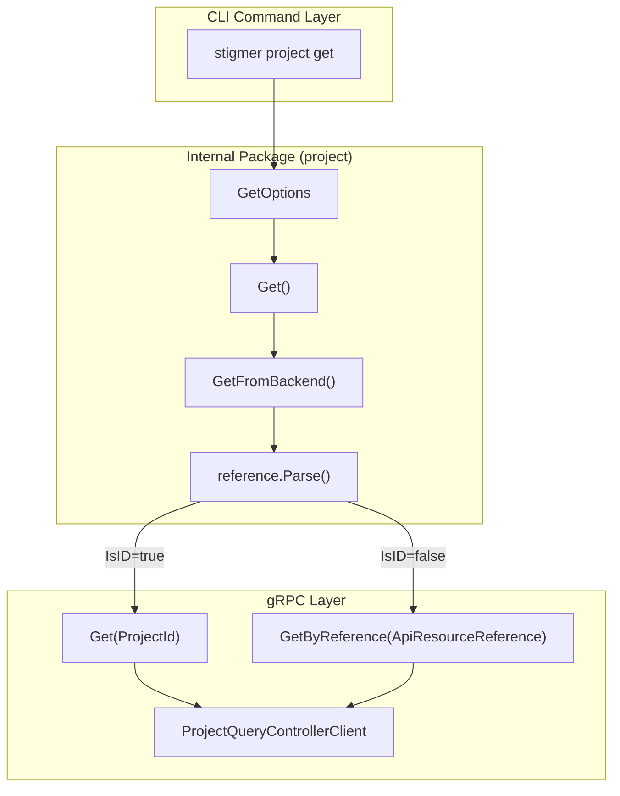

# T05.2: Project Get Foundation

## Context

This is Phase 5, Subtask 3 (T05.2) of the CLI-Agent-YAML-First project. We're implementing the foundational `get.go` file for the Project internal package, which enables retrieving Project resources from the backend via gRPC.

## Architecture




## Reference Patterns

The implementation must exactly mirror these established patterns:

- **[agent/get.go](client-apps/cli/internal/cli/agent/get.go)** (85 lines)
- **[workflow/get.go](client-apps/cli/internal/cli/workflow/get.go)** (85 lines)

Both follow the same structure:

1. `GetFromBackend(conn, orgID, ref)` - Low-level gRPC call
2. `Get(opts *GetOptions)` - High-level options wrapper
3. Reference parsing via `reference.Parse()` - Handles ID vs slug detection
4. Dual API routing: `Get()` for IDs, `GetByReference()` for slugs

## Implementation Details

### File: `client-apps/cli/internal/cli/project/get.go`

**Target: ~85 lines** (matching agent/workflow patterns)

**Imports Required:**

```go
import (
    "context"
    "fmt"
    
    "github.com/pkg/errors"
    projectv1 "github.com/stigmer/stigmer/apis/stubs/go/ai/stigmer/agentic/project/v1"
    "github.com/stigmer/stigmer/apis/stubs/go/ai/stigmer/commons/apiresource"
    "github.com/stigmer/stigmer/apis/stubs/go/ai/stigmer/commons/apiresource/apiresourcekind"
    "github.com/stigmer/stigmer/client-apps/cli/pkg/reference"
    "google.golang.org/grpc"
)
```

**Types:**

```go
// GetOptions contains options for fetching a project.
type GetOptions struct {
    Reference string                  // Required: slug, org/slug, or prj_xxx ID
    OrgID     string                  // Required for slug-only references
    Conn      grpc.ClientConnInterface // Required: gRPC connection
}
```

**Functions:**


| Function         | Parameters                | Returns                     | Purpose                                    |
| ---------------- | ------------------------- | --------------------------- | ------------------------------------------ |
| `GetFromBackend` | `conn, orgID, ref string` | `*projectv1.Project, error` | Low-level gRPC call with reference routing |
| `Get`            | `opts *GetOptions`        | `*projectv1.Project, error` | High-level wrapper with validation         |


**Reference Parsing Flow:**

1. Parse reference via `reference.Parse(ref, orgID)`
2. If `parsed.IsID == true`: Call `client.Get()` with `ProjectId{Value: parsed.ID}`
3. If `parsed.IsID == false`: Call `client.GetByReference()` with `ApiResourceReference{Org, Kind, Slug}`

**API Resource Kind:** `apiresourcekind.ApiResourceKind_project` (enum value 60, prefix `prj`)

**Error Handling:**

- Use `errors.Wrap()` for reference parsing errors
- Use `errors.Wrapf()` for gRPC errors with context
- Include reference in error messages for debugging

### BUILD.bazel Updates

Add these dependencies to `client-apps/cli/internal/cli/project/BUILD.bazel`:

```bazel
srcs = [
    "detect.go",
    "display.go",
    "get.go",        # NEW
    "loader.go",
    "validator.go",
],
deps = [
    # Existing deps...
    "//apis/stubs/go/ai/stigmer/commons/apiresource",              # NEW
    "//apis/stubs/go/ai/stigmer/commons/apiresource/apiresourcekind", # NEW
    "//client-apps/cli/pkg/reference",                             # NEW
    "@org_golang_google_grpc//:grpc",                               # NEW
]
```

### Test File: `client-apps/cli/internal/cli/project/get_test.go`

**Target: ~150-200 lines** (comprehensive coverage)

**Test Cases:**


| Test Function                   | Scenario                    | Expected Behavior             |
| ------------------------------- | --------------------------- | ----------------------------- |
| `TestGetOptions_NilOptions`     | Pass nil options            | Returns error                 |
| `TestGetOptions_NilConn`        | Options with nil connection | Returns error                 |
| `TestGetOptions_EmptyReference` | Empty reference string      | Returns error                 |
| `TestGetOptions_ValidSlug`      | Valid slug reference        | Calls GetByReference          |
| `TestGetOptions_ValidOrgSlug`   | Valid org/slug format       | Parses org and slug correctly |
| `TestGetOptions_ValidID`        | Valid `prj_xxx` ID          | Calls Get with ProjectId      |


**Note:** Unit tests will use mock interfaces. Integration tests come in Phase 5 Group F.

## Quality Standards (Per User Requirements)

- **Pattern Fidelity**: 100% alignment with agent/get.go and workflow/get.go
- **File Size**: ~85 lines (matching established pattern)
- **Function Size**: All functions under 50 lines
- **Documentation**: Comprehensive GoDoc comments on all exports
- **Error Messages**: Actionable with context (include reference in errors)
- **No Hardcoding**: Use enum-based ID detection via `reference.Parse()`

## Validation Checklist

Before marking complete:

- `get.go` created with exact pattern match
- `get_test.go` with comprehensive test coverage
- BUILD.bazel updated with 4 new dependencies
- `go fmt` passes
- `go vet` passes
- All tests pass (existing + new)
- Bazel build succeeds

## Files to Create/Modify


| File                                               | Action | Lines (est.)     |
| -------------------------------------------------- | ------ | ---------------- |
| `client-apps/cli/internal/cli/project/get.go`      | CREATE | ~85              |
| `client-apps/cli/internal/cli/project/get_test.go` | CREATE | ~150-200         |
| `client-apps/cli/internal/cli/project/BUILD.bazel` | MODIFY | +4 deps, +2 srcs |


**Total New Code:** ~250-300 lines

## Proto API Reference

The implementation uses these proto definitions:

**Query Service** ([query.proto](apis/ai/stigmer/agentic/project/v1/query.proto)):

- `Get(ProjectId) returns (Project)` - Get by resource ID
- `GetByReference(ApiResourceReference) returns (Project)` - Get by org/slug

**Input Types** ([io.proto](apis/ai/stigmer/agentic/project/v1/io.proto)):

- `ProjectId { string value }` - Project ID wrapper

**Common Types** (from commons/apiresource):

- `ApiResourceReference { org, kind, slug }` - Reference for slug-based lookup
- `ApiResourceKind.project = 60` - Enum value for project resources

## Success Criteria

1. **Functional**: Both ID and slug-based lookups work correctly
2. **Pattern Compliant**: Indistinguishable structure from agent/get.go
3. **Tested**: All validation scenarios covered
4. **Build Verified**: Bazel build and test pass
5. **Clean Code**: No linter warnings, proper documentation

