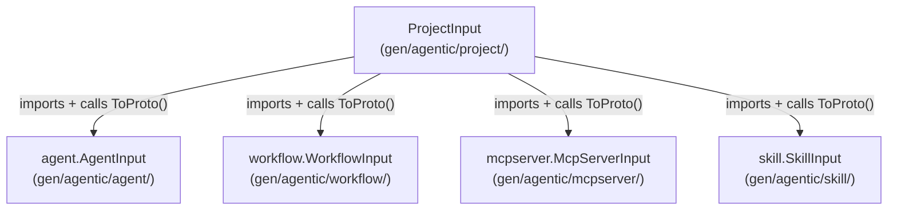

# Enable MCP Codegen for Project (Composite Resource)

## Problem

`ProjectSpec` embeds full resource wrappers:

```proto
repeated ai.stigmer.agentic.agent.v1.Agent agents = 10;
repeated ai.stigmer.agentic.workflow.v1.Workflow workflows = 11;
repeated ai.stigmer.agentic.mcpserver.v1.McpServer mcp_servers = 12;
repeated ai.stigmer.agentic.skill.v1.Skill skills = 13;
```

Each wrapper (e.g., `Agent`) has fields: `api_version`, `kind`, `metadata`, `spec`, `status`. The codegen's `messageInputTypeName` maps both `Agent` and `AgentSpec` to `AgentInput`, causing a naming collision. This is why `project` is in `skipResources` today.

## Design: Cross-Package Import

Instead of generating duplicate input types for the wrapper messages, the codegen will detect resource wrappers and import the already-generated input types from sibling packages:




This works because the existing `AgentInput.ToProto()` returns `*agentv1.Agent`, which is exactly the type expected by `ProjectSpec.Agents`. No duplication, no collision.

## Expected Generated Output

The generated `project_gen.go` would look like:

```go
package project

import (
    "github.com/stigmer/stigmer/mcp-server/gen/agentic/agent"
    "github.com/stigmer/stigmer/mcp-server/gen/agentic/mcpserver"
    "github.com/stigmer/stigmer/mcp-server/gen/agentic/skill"
    "github.com/stigmer/stigmer/mcp-server/gen/agentic/workflow"
    projectv1 "github.com/stigmer/stigmer/apis/stubs/go/ai/stigmer/agentic/project/v1"
    // ...
)

type ProjectInput struct {
    Name       string `json:"name" jsonschema:"required,..."`
    // ... other metadata fields ...
    Runtime     string                     `json:"runtime" jsonschema:"required,enum=go|python|node,..."`
    EntryPoint  string                     `json:"entry_point,omitempty" ...`
    Description string                     `json:"description,omitempty" ...`
    Agents      []agent.AgentInput         `json:"agents,omitempty" ...`
    Workflows   []workflow.WorkflowInput   `json:"workflows,omitempty" ...`
    McpServers  []mcpserver.McpServerInput `json:"mcp_servers,omitempty" ...`
    Skills      []skill.SkillInput         `json:"skills,omitempty" ...`
}

func (input *ProjectInput) specToProto() (*projectv1.ProjectSpec, error) {
    spec := &projectv1.ProjectSpec{}
    spec.Runtime = projectv1.ProjectRuntime(projectv1.ProjectRuntime_value[input.Runtime])
    spec.EntryPoint = input.EntryPoint
    spec.Description = input.Description
    for _, item := range input.Agents {
        v, err := item.ToProto()  // exported, cross-package
        if err != nil { return nil, err }
        spec.Agents = append(spec.Agents, v)
    }
    // ... same pattern for Workflows, McpServers, Skills ...
    return spec, nil
}
```

## Implementation

### Phase 1: Add resource wrapper detection to `mcpGen` ([mcp.go](tools/codegen/generator/mcp.go))

Add `isResourceWrapper(messageName string) bool` that checks if a message type in the loaded types has the standard resource envelope (fields: `api_version`, `kind`, `metadata` with `ApiResourceMetadata`, `spec`).

Add `resourceWrapperGenImport(messageName string) (importPath, pkgName, inputTypeName string)` that derives the cross-package MCP gen import from the wrapper's proto type namespace:

- `ai.stigmer.agentic.agent.v1.Agent` -> import `github.com/stigmer/stigmer/mcp-server/gen/agentic/agent`, type `agent.AgentInput`
- Convention: `mcp-server/gen/{domain}/{resource}/` with package name = resource subdomain

### Phase 2: Add cross-package reference support to `mcpInputField` ([mcp.go](tools/codegen/generator/mcp.go))

Add a boolean `useExportedToProto` to `mcpInputField`. When true, `genFieldAssignment` calls the exported `ToProto()` instead of the package-private `toProto()`.

### Phase 3: Modify `resolveField` to intercept wrapper types ([mcp.go](tools/codegen/generator/mcp.go))

Add two new cases in the `resolveField` switch, BEFORE the existing general message/array-of-message cases:

- **Array of resource wrappers**: when `f.Type.Kind == "array"` and the element message type is a resource wrapper, skip `ensureMessageInputType()`, record the cross-package import, use qualified type `[]agent.AgentInput`
- **Singular resource wrapper**: same pattern for pointer fields

This prevents the generator from recursively descending into wrapper internals and creating duplicate types.

### Phase 4: Modify `genFieldAssignment` for exported ToProto ([mcp.go](tools/codegen/generator/mcp.go))

In the slice-of-nested-inputs and pointer-to-nested-input cases, check `f.useExportedToProto` and use `ToProto()` instead of `toProto()` when true.

### Phase 5: Remove project from skip list ([main.go](tools/codegen/generator/main.go))

Remove `"project": true` from `skipResources` map.

### Phase 6: Generate, build, test

- `cd mcp-server && make codegen` - regenerate all resources including project
- `go build ./...` - verify compilation
- `go test -race ./...` - verify tests pass

## Design Considerations

- **No code duplication**: The agent, workflow, mcpserver, and skill input types are reused, not regenerated. Each resource's `ToProto()` contract is the single source of truth.
- **Hardcoded module path**: The cross-package import path `github.com/stigmer/stigmer/mcp-server/gen/...` follows the same convention as existing hardcoded paths in the codegen (e.g., `github.com/stigmer/stigmer/apis/stubs/go/...`).
- **Comprehensive mode only**: The project resource requires comprehensive mode because it depends on sibling packages being generated. This is already the standard generation path via `make codegen`.
- **Type safety**: The Go compiler verifies at build time that `agent.AgentInput.ToProto()` returns a type compatible with `projectv1.ProjectSpec.Agents`.

