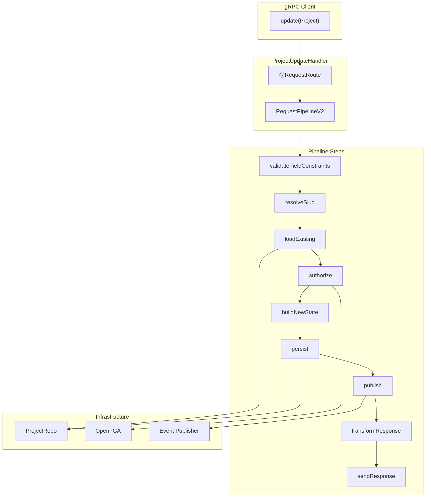

# Project Update Handler Implementation (T05.7)

## Dependency Check

**Prerequisites**: T05.6 (ProjectCreateHandler) is NOT yet implemented. While T05.7 can technically be implemented independently (handlers are routed by `@RequestRoute` annotation), the typical flow requires create before update. I recommend either:

- Implementing T05.6 first, OR
- Confirming T05.6 will be implemented separately before merging

**Current State**: Only `ProjectRepo.java` exists in `/backend/services/stigmer-service/src/main/java/ai/stigmer/domain/agentic/project/`

## Architecture




## Implementation Details

### Handler Location

`backend/services/stigmer-service/src/main/java/ai/stigmer/domain/agentic/project/request/handler/ProjectUpdateHandler.java`

### Design Decisions

1. **No Custom Validation Step**: Unlike `McpServerUpdateHandler` which validates server type configuration, Project has no special validation requirements. Proto field constraints and protovalidate handle all validation.
2. **Simple 10-Step Pipeline**: Standard update flow using framework-provided steps:
  - validateFieldConstraints -> resolveSlug -> loadExisting -> authorize -> buildNewState -> persist -> publish -> transformResponse -> sendResponse
3. **Immutable Fields Preserved Automatically**: The framework's `UpdateOperationBuildNewStateStepV2` preserves:
  - `metadata.id` (system-assigned resource ID)
  - `metadata.slug` (derived from name)
  - `metadata.org` (organization scope)
  - `metadata.audit.created_at` (creation timestamp)
4. **Authorization via Proto Definition**: The `command.proto` already defines:
  ```protobuf
   option (ai.stigmer.iam.iampolicy.v1.rpcauthorization.config).resource_kind = project;
   option (ai.stigmer.iam.iampolicy.v1.rpcauthorization.config).permission = can_edit;
   option (ai.stigmer.iam.iampolicy.v1.rpcauthorization.config).field_path = "metadata.id";
  ```

### Pattern Reference

Following [McpServerUpdateHandler.java](backend/services/stigmer-service/src/main/java/ai/stigmer/domain/agentic/mcpserver/request/handler/McpServerUpdateHandler.java) - a clean 78-line handler that demonstrates the exact pattern.

## Files to Create

### 1. ProjectUpdateHandler.java (~75 lines)

Location: `backend/services/stigmer-service/src/main/java/ai/stigmer/domain/agentic/project/request/handler/ProjectUpdateHandler.java`

Key structure:

- Extends `UpdateOperationHandlerV2<Project>`
- `@RequestRoute(controller = ProjectCommandControllerGrpc.class, method = ProjectCommandController.Method.update)`
- Dependencies: `RequestOperationCommonSteps<Project, Project>`, `UpdateOperationSteps<Project>`, `Tracer`
- 10-step pipeline (no custom steps needed)

### 2. ProjectUpdateHandlerTest.java (~250-300 lines)

Location: `backend/services/stigmer-service/src/test/java/ai/stigmer/domain/agentic/project/request/handler/ProjectUpdateHandlerTest.java`

Test coverage:

- Pipeline construction verification
- Step ordering validation
- Integration with ProjectRepo (mocked)
- Authorization flow (mocked FGA)
- Field preservation verification
- Error scenarios (not found, unauthorized)

## Directory Structure

```
backend/services/stigmer-service/src/main/java/ai/stigmer/domain/agentic/project/
├── repo/
│   └── ProjectRepo.java              (EXISTS - T05.5)
└── request/
    └── handler/
        └── ProjectUpdateHandler.java  (NEW - T05.7)

backend/services/stigmer-service/src/test/java/ai/stigmer/domain/agentic/project/
├── repo/
│   └── ProjectRepoTest.java          (EXISTS - T05.5)
└── request/
    └── handler/
        └── ProjectUpdateHandlerTest.java  (NEW - T05.7)
```

## Success Criteria

1. Handler compiles with zero warnings
2. Pipeline matches McpServerUpdateHandler pattern exactly
3. `@RequestRoute` annotation correctly routes to `update` method
4. All tests pass (target: 10+ test cases)
5. Handler auto-discovered by Spring component scan
6. Authorization enforced via framework (can_edit permission)
7. Immutable fields preserved (id, slug, org)
8. updated_at timestamp automatically refreshed by framework

## Engineering Standards

- File size: Target ~75 lines (handler), ~250-300 lines (test)
- No hardcoded strings for field paths (use framework constants)
- Comprehensive JavaDoc with pipeline documentation
- Clear separation: handler is thin orchestrator, framework does heavy lifting
- Lombok annotations: `@Slf4j`, `@Component`, `@RequiredArgsConstructor`

## Estimated Duration

45-60 minutes (as planned in Phase 5)