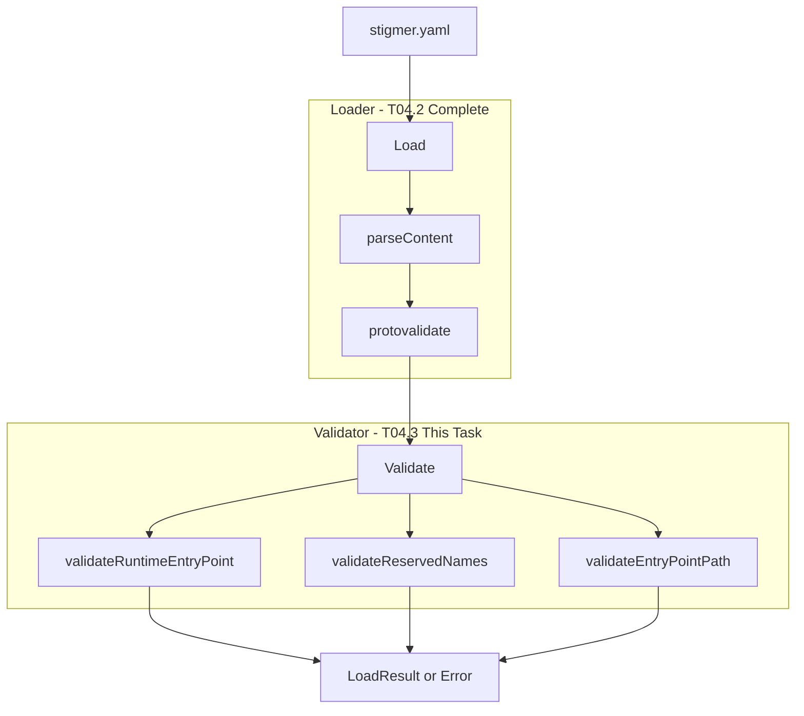

# Phase 4 Sub-task T04.3: Project Validator (Cross-Field)

## Context

The Project loader (T04.2) is complete and handles YAML/JSON parsing with protovalidate for schema validation. This task implements **cross-field business logic validation** - relationships between fields that cannot be expressed in proto validation rules.

**Prerequisite Complete**:

- [loader.go](client-apps/cli/internal/cli/project/loader.go) (157 lines) - handles parsing and schema validation
- [loader_test.go](client-apps/cli/internal/cli/project/loader_test.go) (415 lines) - 15+ test cases

---

## Proto Structure Reference

From [spec.proto](apis/ai/stigmer/agentic/project/v1/spec.proto):

```proto
message ProjectSpec {
  ProjectRuntime runtime = 1;    // Required: go, python, node
  string entry_point = 2;        // Optional: defaults by runtime
  string description = 3;        // Optional
}
```

From [enum.proto](apis/ai/stigmer/agentic/project/v1/enum.proto):

```proto
enum ProjectRuntime {
  project_runtime_unspecified = 0;
  go = 1;      // Default entry: main.go
  python = 2;  // Default entry: main.py
  node = 3;    // Default entry: index.ts
}
```

---

## Validation Rules

### 1. Runtime-EntryPoint Consistency

When `entry_point` is provided (non-empty), its file extension must match the runtime:


| Runtime  | Valid Extensions             |
| -------- | ---------------------------- |
| `go`     | `.go`                        |
| `python` | `.py`                        |
| `node`   | `.js`, `.ts`, `.mjs`, `.mts` |


**Empty entry_point is valid** - defaults are applied at apply-time, not validation-time.

### 2. Reserved Project Names

Certain project names are reserved for platform use:

- `default` - default namespace
- `system` - system components
- `admin` - administrative namespace
- `root` - root namespace
- `stigmer` - platform namespace
- `test` - reserved for testing

### 3. Entry Point Path Security

When `entry_point` is provided:

- Must be a relative path (no leading `/`)
- No directory traversal (no `..` components)
- Valid file path characters only

---

## Implementation

### File 1: validator.go (~120 lines)

Location: `client-apps/cli/internal/cli/project/validator.go`

**Pattern**: Follow [workflow/validator.go](client-apps/cli/internal/cli/workflow/validator.go) exactly

```go
// Validate performs cross-field validation on a Project.
// Schema validation is handled by protovalidate in Load().
func Validate(project *projectv1.Project) error {
    if project == nil || project.Spec == nil {
        return nil // Schema validation handles required fields
    }
    
    if err := validateRuntimeEntryPoint(project); err != nil {
        return err
    }
    
    if err := validateReservedNames(project); err != nil {
        return err
    }
    
    if err := validateEntryPointPath(project); err != nil {
        return err
    }
    
    return nil
}
```

**Helper Functions**:

- `validateRuntimeEntryPoint(project) error` - checks extension matches runtime
- `validateReservedNames(project) error` - checks against reserved name list
- `validateEntryPointPath(project) error` - checks for path security issues
- `getValidExtensions(runtime) []string` - returns valid extensions for runtime
- `isReservedName(name) bool` - checks if name is reserved

### File 2: validator_test.go (~350 lines)

Location: `client-apps/cli/internal/cli/project/validator_test.go`

**Test Categories** (14+ test cases):

**Edge Cases**:

- `TestValidate_NilProject` - nil passes
- `TestValidate_NilSpec` - nil spec passes
- `TestValidate_EmptyEntryPoint` - empty is valid for all runtimes

**Runtime-EntryPoint Consistency**:

- `TestValidate_GoWithGoExtension` - valid
- `TestValidate_GoWithPyExtension` - invalid
- `TestValidate_PythonWithPyExtension` - valid
- `TestValidate_PythonWithGoExtension` - invalid
- `TestValidate_NodeWithJsExtension` - valid
- `TestValidate_NodeWithTsExtension` - valid
- `TestValidate_NodeWithGoExtension` - invalid

**Reserved Names**:

- `TestValidate_ReservedName_Default` - invalid
- `TestValidate_ReservedName_System` - invalid
- `TestValidate_ValidProjectName` - valid

**Path Security**:

- `TestValidate_AbsolutePathRejected` - invalid
- `TestValidate_DirectoryTraversalRejected` - invalid
- `TestValidate_ValidRelativePath` - valid

**Error Message Quality**:

- `TestValidate_ErrorMessagesIncludeGuidance` - actionable messages

### File 3: BUILD.bazel Update

Add validator files to existing [BUILD.bazel](client-apps/cli/internal/cli/project/BUILD.bazel):

```starlark
go_library(
    name = "project",
    srcs = [
        "loader.go",
        "validator.go",  # ADD
    ],
    ...
)

go_test(
    name = "project_test",
    srcs = [
        "loader_test.go",
        "validator_test.go",  # ADD
    ],
    ...
)
```

---

## Error Message Standards

Each error message must be **actionable** with guidance on how to fix:

```go
// Runtime-EntryPoint mismatch
fmt.Errorf(
    "entry point %q has invalid extension for %s runtime\n\n"+
        "Expected extensions: %s\n"+
        "Either change the entry_point or the runtime setting.",
    entryPoint, runtime, strings.Join(validExts, ", "),
)

// Reserved name
fmt.Errorf(
    "project name %q is reserved for platform use\n\n"+
        "Choose a different name. Reserved names: %s",
    name, strings.Join(reservedNames, ", "),
)

// Path security
fmt.Errorf(
    "entry point %q contains invalid path: %s\n\n"+
        "Use a relative path without directory traversal (..)",
    entryPoint, reason,
)
```

---

## Engineering Standards Compliance

Per [coding-guidelines.mdc](client-apps/cli/.cursor/rules/coding-guidelines.mdc):

- **File sizes**: validator.go ~120 lines (under 250)
- **Function sizes**: All functions under 50 lines
- **Error handling**: All errors have specific, actionable context
- **Single responsibility**: One file for validation, one for tests
- **Package organization**: Business logic in `internal/cli/project/`

---

## Verification Steps

After implementation:

1. **Build**: `bazel build //client-apps/cli/internal/cli/project:project`
2. **Test**: `bazel test //client-apps/cli/internal/cli/project:project_test`
3. **Lint**: Verify no linter errors via ReadLints
4. **Integration**: Manually test with example stigmer.yaml files

---

## Architecture Diagram




---

## Success Criteria

- validator.go under 150 lines
- validator_test.go with 14+ test cases, all passing
- BUILD.bazel updated correctly
- Bazel build and test successful
- Error messages are actionable with fix guidance
- Pattern consistency with workflow/validator.go and agent/validator.go

