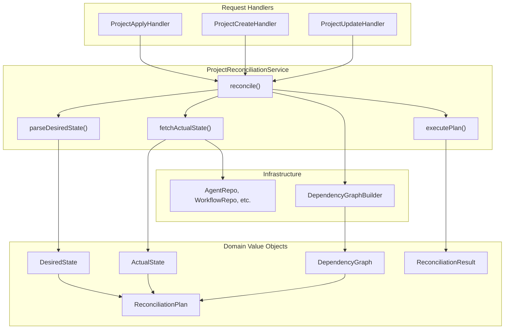

# ProjectReconciliationService Foundation (T05.15)

## Context and Dependencies

This task builds upon the following completed components:

- **T05.12**: Domain Value Objects (DesiredState, ActualState, DependencyGraph, ReconciliationPlan, ReconciliationResult)
- **T05.13**: DependencyDiscoverer (reflection-based scanner)
- **T05.14**: DependencyGraphBuilder (builds graph from DesiredState)

## Architecture Overview




## Files to Create

### 1. ProjectReconciliationService.java (~250 lines)

**Location**: `[backend/services/stigmer-service/src/main/java/ai/stigmer/domain/agentic/project/reconcile/ProjectReconciliationService.java](backend/services/stigmer-service/src/main/java/ai/stigmer/domain/agentic/project/reconcile/ProjectReconciliationService.java)`

**Key Design Points**:

- **Spring `@Service**` annotation for dependency injection
- `**@RequiredArgsConstructor**` + `**@Slf4j**` following established patterns
- **Constructor injection** of all 5 repositories + DependencyGraphBuilder
- **Stateless, thread-safe** design

**Method Signatures**:

```java
// Main entry point - orchestrates full reconciliation
public ReconciliationResult reconcile(Project project, ReconciliationOptions options)

// Parse desired state from Project.spec (T05.16 implementation)
DesiredState parseDesiredState(Project project)

// Fetch actual state from repositories (T05.17 implementation - stubbed for now)
ActualState fetchActualState(String projectId)

// Execute plan in dependency order (T05.19 implementation - stubbed for now)
ReconciliationResult executePlan(ReconciliationPlan plan, ReconciliationOptions options)
```

**Orchestration Flow in reconcile()**:

1. Validate input (null checks, project ID presence)
2. Parse desired state from `project.getSpec()`
3. Fetch actual state from repositories (stubbed - returns empty for now)
4. Derive dependency graph using `graphBuilder.buildFromDesiredState()`
5. Compute reconciliation plan using `ReconciliationPlan.fromDiff()`
6. Handle dry-run mode (return plan as result without execution)
7. Execute plan and return result

### 2. ReconciliationOptions.java (~50 lines)

**Location**: `[backend/services/stigmer-service/src/main/java/ai/stigmer/domain/agentic/project/reconcile/ReconciliationOptions.java](backend/services/stigmer-service/src/main/java/ai/stigmer/domain/agentic/project/reconcile/ReconciliationOptions.java)`

**Design**: Immutable Java record with factory methods

```java
public record ReconciliationOptions(
    boolean pruneEnabled,  // Default: true (delete orphans)
    boolean dryRun         // Default: false (actually execute)
) {
    public static ReconciliationOptions defaults() { ... }
    public static ReconciliationOptions dryRun() { ... }
    public static ReconciliationOptions noPrune() { ... }
}
```

### 3. ProjectReconciliationServiceTest.java (~500 lines)

**Location**: `[backend/services/stigmer-service/src/test/java/ai/stigmer/domain/agentic/project/reconcile/ProjectReconciliationServiceTest.java](backend/services/stigmer-service/src/test/java/ai/stigmer/domain/agentic/project/reconcile/ProjectReconciliationServiceTest.java)`

**Test Categories** (~20-25 test methods):

- **Service Instantiation** (5 tests)
  - Component annotation verification
  - Constructor injection of all dependencies
  - Null dependency handling
- **Input Validation** (4 tests)
  - Null project handling
  - Missing project ID handling
  - Empty spec handling
- **Reconcile Orchestration** (6 tests)
  - Full flow with all steps
  - Dry-run mode returns plan as result
  - Empty desired state (no resources)
  - Dependency graph derivation
- **Desired State Parsing** (5 tests)
  - Parses agents, workflows, mcpServers, skills
  - Empty spec returns empty DesiredState
  - Duplicate slug handling
- **Stubbed Behaviors** (4 tests)
  - fetchActualState returns empty (stub for T05.17)
  - executePlan returns dry-run result (stub for T05.19)

## Implementation Notes

### Stub Strategy for Later Tasks

The service skeleton includes stub implementations for methods that will be fully implemented in later tasks:

- `**fetchActualState()**`: Returns `ActualState.empty()` for now (T05.17 will add actual repo queries and `findByProjectId` methods)
- `**executePlan()**`: Returns `ReconciliationResult.dryRun(plan)` for now (T05.19 will implement actual execution)

This allows the skeleton to compile, test, and integrate without blocking on later tasks.

### parseDesiredState() Implementation (T05.16)

Can be implemented now since it only uses existing value objects:

```java
DesiredState parseDesiredState(Project project) {
    ProjectSpec spec = project.getSpec();
    
    Map<String, Agent> agents = spec.getAgentsList().stream()
        .collect(toMap(a -> a.getMetadata().getName(), identity()));
    
    // Similar for workflows, mcpServers, skills...
    
    return DesiredState.of(agents, workflows, mcpServers, skills);
}
```

### Pattern References

- Service pattern: `[EnvironmentMergeService.java](backend/services/stigmer-service/src/main/java/ai/stigmer/domain/agentic/executioncontext/service/EnvironmentMergeService.java)` (244 lines)
- Value objects: `[DependencyGraph.java](backend/services/stigmer-service/src/main/java/ai/stigmer/domain/agentic/project/reconcile/DependencyGraph.java)`, `[ReconciliationPlan.java](backend/services/stigmer-service/src/main/java/ai/stigmer/domain/agentic/project/reconcile/ReconciliationPlan.java)`
- Test patterns: `[DependencyGraphBuilderTest.java](backend/services/stigmer-service/src/test/java/ai/stigmer/domain/agentic/project/reconcile/DependencyGraphBuilderTest.java)`

## Success Criteria

1. Service compiles and Spring can inject all dependencies
2. `reconcile()` method orchestrates full flow (with stubs for fetchActual and executePlan)
3. `parseDesiredState()` fully implemented (extracts resources from Project.spec)
4. Comprehensive test suite (~20-25 tests, all passing)
5. Zero linter errors
6. JavaDoc on all public methods with design decisions documented
7. Logging with structured context (project ID, org, resource counts)

## Estimated Duration

60-75 minutes:

- ReconciliationOptions.java: ~10 minutes
- ProjectReconciliationService.java: ~30 minutes
- Tests: ~30 minutes
- Documentation and verification: ~5 minutes

## Unblocks

- **T05.16**: Desired State Parsing (may already be complete in this task)
- **T05.17**: Actual State Fetching (needs findByProjectId in repos)
- **T05.18**: Diff Algorithm (already implemented in ReconciliationPlan.fromDiff)
- **T05.19**: Dependency-Ordered Apply (executePlan implementation)

