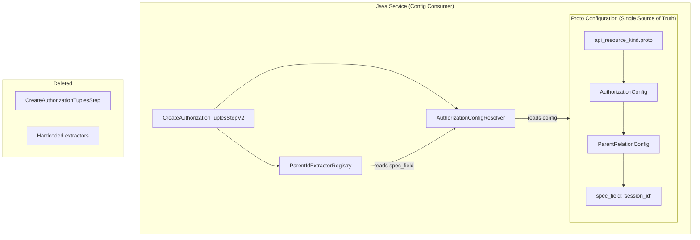

# Proto-Driven Authorization Configuration

## Problem Statement

The current `ParentIdExtractorRegistry` has hardcoded logic for extracting parent IDs:

```java
// Hardcoded in Java - should be in proto config
register(ApiResourceKind.agent_execution, "session", 
        msg -> extractSpecField(msg, "session_id"));
register(ApiResourceKind.agent_instance, "agent",
        msg -> extractSpecField(msg, "agent_id"));
register(ApiResourceKind.workflow_instance, "workflow",
        msg -> extractSpecField(msg, "workflow_id"));
```

Additionally, `CreateAuthorizationTuplesStep` is marked deprecated but still exists with full implementation. All handlers have migrated to V2.

## Solution: Proto as Single Source of Truth

### Phase 1: Enhance Proto Schema

Add `spec_field` to `ParentRelationConfig` in [authorization_config.proto](stigmer/apis/ai/stigmer/commons/apiresource/apiresourcekind/authorization_config.proto):

```protobuf
message ParentRelationConfig {
  string kind = 1;
  string relation = 2;
  
  // NEW: Spec field containing the parent ID (e.g., "session_id", "agent_id")
  // The service extracts this field from resource.spec to get the parent ID
  string spec_field = 3;
}
```

### Phase 2: Update Resource Kind Configurations

Update [api_resource_kind.proto](stigmer/apis/ai/stigmer/commons/apiresource/apiresourcekind/api_resource_kind.proto) to include `spec_field`:

- `agent_execution`: parent.spec_field = "session_id"
- `agent_instance`: additional_parents[0].spec_field = "agent_id"  
- `workflow_instance`: additional_parents[0].spec_field = "workflow_id"

Example for `agent_execution`:

```protobuf
agent_execution = 41 [(kind_meta) = {
  // ... existing config ...
  authorization: {
    scope_type: AUTHORIZATION_SCOPE_TYPE_PARENT
    owner_type: OWNER_ATTRIBUTION_TYPE_INHERITED
    parent: {
      kind: "session"
      relation: "session"
      spec_field: "session_id"  // NEW
    }
  }
}];
```

### Phase 3: Refactor ParentIdExtractorRegistry

Transform [ParentIdExtractorRegistry.java](stigmer-cloud/backend/libs/java/grpc/grpc-request/src/main/java/ai/stigmer/grpcrequest/pipeline/operation/create/step/ParentIdExtractorRegistry.java) from hardcoded mappings to configuration-driven:

**Current (hardcoded):**

```java
private void registerParentScopeExtractors() {
    register(ApiResourceKind.agent_execution, "session", 
            msg -> extractSpecField(msg, "session_id"));
}
```

**New (config-driven):**

```java
public String extractParentId(ApiResourceKind kind, String relation, Message message) {
    AuthorizationConfig config = AuthorizationConfigResolver.resolve(kind);
    String specField = findSpecFieldForRelation(config, relation);
    return extractSpecField(message, specField);
}

private String findSpecFieldForRelation(AuthorizationConfig config, String relation) {
    if (config.hasParent() && config.getParent().getRelation().equals(relation)) {
        return config.getParent().getSpecField();
    }
    for (ParentRelationConfig parent : config.getAdditionalParentsList()) {
        if (parent.getRelation().equals(relation)) {
            return parent.getSpecField();
        }
    }
    throw new IllegalStateException("No spec_field configured for relation: " + relation);
}
```

### Phase 4: Delete Deprecated Code

Remove [CreateAuthorizationTuplesStep.java](stigmer-cloud/backend/libs/java/grpc/grpc-request/src/main/java/ai/stigmer/grpcrequest/pipeline/step/common/CreateAuthorizationTuplesStep.java) entirely:

- All 11 handlers migrated to `createSteps.createAuthorizationTuples`
- `SkillPushHandler` uses `IamPolicyCreationService` directly (conditional logic)
- No references to factory methods (`forOrgScopedResource`, etc.)

### Phase 5: Update Tests

Update [ParentIdExtractorRegistryTest.java](stigmer-cloud/backend/libs/java/grpc/grpc-request/src/test/java/ai/stigmer/grpcrequest/pipeline/operation/create/step/ParentIdExtractorRegistryTest.java) to verify:

- Reads spec_field from proto config
- Handles missing spec_field with clear error
- No hardcoded mappings remain

## Architecture After Changes




## Files to Modify


| Repository    | File                                   | Action                                     |
| ------------- | -------------------------------------- | ------------------------------------------ |
| stigmer       | apis/.../authorization_config.proto    | Add `spec_field` to `ParentRelationConfig` |
| stigmer       | apis/.../api_resource_kind.proto       | Add `spec_field` values for parent configs |
| stigmer-cloud | .../ParentIdExtractorRegistry.java     | Refactor to read from proto config         |
| stigmer-cloud | .../CreateAuthorizationTuplesStep.java | **DELETE**                                 |
| stigmer-cloud | .../ParentIdExtractorRegistryTest.java | Update tests for config-driven behavior    |


## Benefits

- **Single source of truth**: All authorization config in proto, zero hardcoded Java logic
- **Self-documenting**: Adding new parent relations requires only proto changes
- **Reduced maintenance**: No code changes needed for new parent-scoped resources
- **Cleaner codebase**: Removes 375 lines of deprecated code

