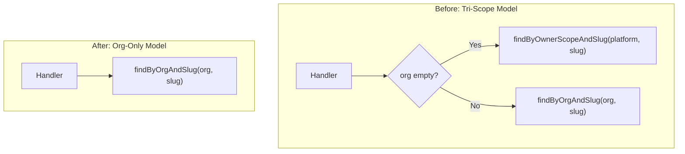

# Repository Methods Cleanup Plan

## Context

Under the new ownership model:

- **No more platform scope** - all resources belong to an organization
- **What was "platform-scoped"** is now `stigmer/<slug>` (the official Stigmer org)
- **The `org` field is now required** for all resource references

## Architecture Summary




## Methods to Remove (14 methods across 9 repositories)

### Tier 1: Simple Removals (8 repositories - 1 method each)

These repositories have a single `findByOwnerScopeAndSlug` method with identical patterns:


| Repository                                                                                                                                            | Method                    | Lines | Existing Replacement |
| ----------------------------------------------------------------------------------------------------------------------------------------------------- | ------------------------- | ----- | -------------------- |
| [AgentRepo.java](backend/services/stigmer-service/src/main/java/ai/stigmer/domain/agentic/agent/repo/AgentRepo.java)                                  | `findByOwnerScopeAndSlug` | 69-77 | `findByOrgAndSlug`   |
| [AgentInstanceRepo.java](backend/services/stigmer-service/src/main/java/ai/stigmer/domain/agentic/agentinstance/repo/AgentInstanceRepo.java)          | `findByOwnerScopeAndSlug` | 69-77 | `findByOrgAndSlug`   |
| [EnvironmentRepo.java](backend/services/stigmer-service/src/main/java/ai/stigmer/domain/agentic/environment/repo/EnvironmentRepo.java)                | `findByOwnerScopeAndSlug` | 69-77 | `findByOrgAndSlug`   |
| [WorkflowRepo.java](backend/services/stigmer-service/src/main/java/ai/stigmer/domain/agentic/workflow/repo/WorkflowRepo.java)                         | `findByOwnerScopeAndSlug` | 64-72 | `findByOrgAndSlug`   |
| [WorkflowInstanceRepo.java](backend/services/stigmer-service/src/main/java/ai/stigmer/domain/agentic/workflowinstance/repo/WorkflowInstanceRepo.java) | `findByOwnerScopeAndSlug` | 69-77 | `findByOrgAndSlug`   |
| [ApiKeyRepo.java](backend/services/stigmer-service/src/main/java/ai/stigmer/domain/iam/apikey/repo/ApiKeyRepo.java)                                   | `findByOwnerScopeAndSlug` | 72-80 | `findByOrgAndSlug`   |


### Tier 2: Complex Removals (3 repositories - multiple methods)

#### [SkillRepo.java](backend/services/stigmer-service/src/main/java/ai/stigmer/domain/agentic/skill/repo/SkillRepo.java) - 3 methods


| Method                                                       | Lines   | Existing Replacement                                     |
| ------------------------------------------------------------ | ------- | -------------------------------------------------------- |
| `findByOwnerScopeAndSlug(int, String)`                       | 69-77   | `findByOrgAndSlug(String, String)`                       |
| `findByOwnerScopeAndSlugAndTag(int, String, String)`         | 193-202 | `findByOrgAndSlugAndTag(String, String, String)`         |
| `findByOwnerScopeAndSlugAndVersionHash(int, String, String)` | 232-241 | `findByOrgAndSlugAndVersionHash(String, String, String)` |


#### [SkillAuditRepo.java](backend/services/stigmer-service/src/main/java/ai/stigmer/domain/agentic/skill/repo/SkillAuditRepo.java) - 2 methods


| Method                                                         | Lines   | Existing Replacement                                       |
| -------------------------------------------------------------- | ------- | ---------------------------------------------------------- |
| `findByOwnerScopeAndSlugAndVersionHash(int, String, String)`   | 182-193 | `findByOrgAndSlugAndVersionHash(String, String, String)`   |
| `findMostRecentByOwnerScopeAndSlugAndTag(int, String, String)` | 203-215 | `findMostRecentByOrgAndSlugAndTag(String, String, String)` |


#### [McpServerRepo.java](backend/services/stigmer-service/src/main/java/ai/stigmer/domain/agentic/mcpserver/repo/McpServerRepo.java) - 5 methods


| Method                                     | Lines   | Action                                           |
| ------------------------------------------ | ------- | ------------------------------------------------ |
| `findByOwnerScopeAndSlug(int, String)`     | 76-84   | Remove (use `findByOrgAndSlug`)                  |
| `findByIdentityAccountAndSlug(String)`     | 121-129 | Remove (identity-account scope eliminated)       |
| `findPlatformScoped()`                     | 139-150 | Remove (platform scope eliminated)               |
| `findByIdentityAccount()`                  | 179-190 | Remove (identity-account scope eliminated)       |
| `existsBySlugInScope(int, String, String)` | 283-292 | Simplify to `existsByOrgAndSlug(String, String)` |


## Callers to Update (6 files)

### Handler Files


| File                                                                                                                                                                                               | Changes                                                       |
| -------------------------------------------------------------------------------------------------------------------------------------------------------------------------------------------------- | ------------------------------------------------------------- |
| [SkillGetByReferenceHandler.java](backend/services/stigmer-service/src/main/java/ai/stigmer/domain/agentic/skill/request/handler/SkillGetByReferenceHandler.java)                                  | Remove `isPlatformScoped` logic, always use org-based methods |
| [SkillPushHandler.java](backend/services/stigmer-service/src/main/java/ai/stigmer/domain/agentic/skill/request/handler/SkillPushHandler.java)                                                      | Line 218: Remove platform scope check                         |
| [McpServerGetByReferenceHandler.java](backend/services/stigmer-service/src/main/java/ai/stigmer/domain/agentic/mcpserver/request/handler/McpServerGetByReferenceHandler.java)                      | Line 140: Remove platform scope check                         |
| [WorkflowInstanceGetByReferenceHandler.java](backend/services/stigmer-service/src/main/java/ai/stigmer/domain/agentic/workflowinstance/request/handler/WorkflowInstanceGetByReferenceHandler.java) | Line 103: Remove platform scope check                         |


### Service Files


| File                                                                                                                                                           | Changes                               |
| -------------------------------------------------------------------------------------------------------------------------------------------------------------- | ------------------------------------- |
| [McpEnvironmentValidator.java](backend/services/stigmer-service/src/main/java/ai/stigmer/domain/agentic/executioncontext/service/McpEnvironmentValidator.java) | Line 252: Remove platform scope check |


## Test Files to Update (2 files)


| File                                                                                                                                                                                    | Changes                                                             |
| --------------------------------------------------------------------------------------------------------------------------------------------------------------------------------------- | ------------------------------------------------------------------- |
| [SkillVersionResolutionIntegrationTest.java](backend/services/stigmer-service/src/test/java/ai/stigmer/domain/agentic/skill/request/handler/SkillVersionResolutionIntegrationTest.java) | Update mocks from `findByOwnerScopeAndSlug*` to `findByOrgAndSlug*` |
| [McpEnvironmentValidatorTest.java](backend/services/stigmer-service/src/test/java/ai/stigmer/domain/agentic/executioncontext/service/McpEnvironmentValidatorTest.java)                  | Update mocks from `findByOwnerScopeAndSlug*` to `findByOrgAndSlug*` |


## Implementation Steps

### Step 1: Update Handlers (eliminate scope branching logic)

Transform the pattern in each handler from:

```java
// OLD PATTERN
boolean isPlatformScoped = org == null || org.isEmpty();
if (isPlatformScoped) {
    return repo.findByOwnerScopeAndSlug(ApiResourceOwnerScope.platform_VALUE, slug);
} else {
    return repo.findByOrgAndSlug(org, slug);
}
```

To:

```java
// NEW PATTERN  
// Org is now required - validated at API level
return repo.findByOrgAndSlug(org, slug);
```

### Step 2: Remove deprecated repository methods

For each repository:

1. Delete the `findByOwnerScope*` methods
2. Remove `ApiResourceOwnerScope` import if no longer used
3. Update Javadoc to remove scope-related documentation

### Step 3: Update tests

1. Replace `findByOwnerScopeAndSlug` mocks with `findByOrgAndSlug` mocks
2. Update test data to include org values (e.g., `"stigmer"` for platform-equivalent tests)
3. Remove any assertions about platform scope behavior

### Step 4: Simplify McpServerRepo

The `existsBySlugInScope` method needs special handling:

```java
// OLD
public boolean existsBySlugInScope(int ownerScope, String orgId, String slug) {
    if (ownerScope == platform_VALUE) { ... }
    else if (ownerScope == organization_VALUE && orgId != null) { ... }
    else if (ownerScope == identity_account_VALUE) { ... }
}

// NEW
public boolean existsByOrgAndSlug(String orgId, String slug) {
    return findByOrgAndSlug(orgId, slug).isPresent();
}
```

## Key Design Principles

1. **Org is always required**: The proto changes in Phase 1 made `org` a required field
2. **No more branching on scope**: Handlers should have single code path
3. **Platform resources migrate to "stigmer" org**: Any existing platform-scoped resources in DB will need data migration (separate task)
4. **Clean method signatures**: Remove int parameters representing enums
5. **Remove dead code**: Don't leave deprecated methods "for compatibility"

## Files Summary


| Category                      | Count  | Files                                                                                                                                   |
| ----------------------------- | ------ | --------------------------------------------------------------------------------------------------------------------------------------- |
| Repositories (remove methods) | 9      | SkillRepo, SkillAuditRepo, McpServerRepo, AgentRepo, AgentInstanceRepo, EnvironmentRepo, WorkflowRepo, WorkflowInstanceRepo, ApiKeyRepo |
| Handlers (update logic)       | 4      | SkillGetByReferenceHandler, SkillPushHandler, McpServerGetByReferenceHandler, WorkflowInstanceGetByReferenceHandler                     |
| Services (update logic)       | 1      | McpEnvironmentValidator                                                                                                                 |
| Tests (update mocks)          | 2      | SkillVersionResolutionIntegrationTest, McpEnvironmentValidatorTest                                                                      |
| **Total**                     | **16** |                                                                                                                                         |


## Verification Plan

1. Run `./gradlew build` - compile check
2. Run `./gradlew test` - all tests pass
3. Search for `findByOwnerScope` - zero results
4. Search for `ApiResourceOwnerScope` in repos - zero results
5. Verify each handler has no `isPlatformScoped` variable

