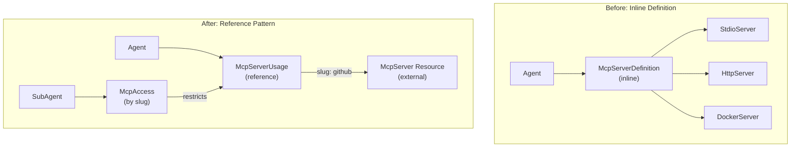

# SDK AgentSpec Migration Plan

## Context

The AgentSpec proto has fundamentally changed:

- **Before**: Agents defined MCP servers inline (`McpServerDefinition` with `StdioServer`, `HttpServer`, `DockerServer`)
- **After**: Agents reference external McpServer resources via `McpServerUsage` (slug-based)

The SDK is currently broken - it tries to use types that no longer exist in the proto stubs.

## Architecture Change



## Files Requiring Changes

**Core SDK Files:**

- [agent/agent.go](sdk/go/agent/agent.go) - Agent struct and builder methods
- [agent/proto.go](sdk/go/agent/proto.go) - Proto conversion (broken, uses non-existent types)
- [subagent/subagent.go](sdk/go/subagent/subagent.go) - SubAgent struct and conversion

**New Files to Create:**

- `sdk/go/mcpserverref/mcpserverref.go` - Reference helpers (like skillref)
- `sdk/go/mcpserverref/doc.go` - Package documentation

**Generated Files (regenerate):**

- [gen/types/agentic_types.go](sdk/go/gen/types/agentic_types.go) - Contains old McpServerDefinition
- [gen/agent/agentspec_args.go](sdk/go/gen/agent/agentspec_args.go) - Has old McpServers field
- [gen/agent/inlinesubagentspec_args.go](sdk/go/gen/agent/inlinesubagentspec_args.go) - Old SubAgent structure

**Legacy Package (deprecate/remove):**

- [mcpserver/](sdk/go/mcpserver/) - Entire package (StdioServer, HTTPServer, DockerServer)

**Examples (rewrite):**

- [examples/03_agent_with_mcp_servers.go](sdk/go/examples/03_agent_with_mcp_servers.go) - Complete rewrite
- [examples/04_agent_with_subagents.go](sdk/go/examples/04_agent_with_subagents.go) - Update McpAccess pattern

---

## Phase 1: Create mcpserverref Package

Create a new package following the `skillref` pattern for referencing McpServer resources.

**New File:** `sdk/go/mcpserverref/mcpserverref.go`

```go
// Platform creates a reference to a platform-scoped McpServer.
func Platform(slug string, version ...string) *apiresource.ApiResourceReference

// Organization creates a reference to an organization-scoped McpServer.
func Organization(org, slug string, version ...string) *apiresource.ApiResourceReference

// Personal creates a reference to a personal McpServer (identity_account scope).
func Personal(slug string, version ...string) *apiresource.ApiResourceReference
```

**Design Decisions:**

- Returns `*apiresource.ApiResourceReference` directly (no wrapper types)
- Uses `apiresourcekind.ApiResourceKind_mcp_server` (44)
- Supports all three scopes (platform, organization, identity_account)

---

## Phase 2: Update Agent Package

### 2.1 Update Agent Struct ([agent/agent.go](sdk/go/agent/agent.go))

**Change:**

```go
// Before
MCPServers []mcpserver.MCPServer

// After
McpServerUsages []*agentv1.McpServerUsage
```

**New Builder Methods:**

```go
// AddMcpServerUsage adds an MCP server usage to the agent.
// Use with mcpserverref.Platform() or mcpserverref.Organization().
func (a *Agent) AddMcpServerUsage(ref *apiresource.ApiResourceReference, enabledTools ...string) *Agent

// AddMcpServerUsages adds multiple MCP server usages.
func (a *Agent) AddMcpServerUsages(usages ...*agentv1.McpServerUsage) *Agent

// UseMCPServer is a convenience method that creates a usage from slug directly.
// Uses platform scope by default.
func (a *Agent) UseMCPServer(slug string, enabledTools ...string) *Agent
```

**Remove:**

- `AddMCPServer(server mcpserver.MCPServer)` - deprecated
- `AddMCPServers(servers ...mcpserver.MCPServer)` - deprecated
- Import of `mcpserver` package

### 2.2 Update Proto Conversion ([agent/proto.go](sdk/go/agent/proto.go))

**Remove:**

- `convertMCPServers()` function (no longer needed - direct assignment)

**Update `ToProto()`:**

```go
// Before
McpServers: mcpServers,  // []*agentv1.McpServerDefinition (doesn't exist)

// After
McpServerUsages: a.McpServerUsages,  // []*agentv1.McpServerUsage (direct)
```

**Update `convertSubAgents()`:**

```go
// Before: Uses mcpServers []string + mcpToolSelections map
// After: Uses mcpAccess []*agentv1.McpAccess
```

---

## Phase 3: Update SubAgent Package

### 3.1 Update SubAgent Struct ([subagent/subagent.go](sdk/go/subagent/subagent.go))

**Change:**

```go
// Before
mcpServers        []string
mcpToolSelections map[string]*types.McpToolSelection

// After
mcpAccess []*agentv1.McpAccess
```

**New Methods:**

```go
// GrantMcpAccess grants access to a parent's MCP server by slug.
func (s *SubAgent) GrantMcpAccess(mcpServerSlug string, enabledTools ...string) *SubAgent

// McpAccess returns the MCP access grants.
func (s *SubAgent) McpAccess() []*agentv1.McpAccess
```

**Remove:**

- `MCPServerNames() []string`
- `ToolSelections() map[string]*types.McpToolSelection`

### 3.2 Update Args Type

The `Args` type alias needs to use a new generated type that matches the new proto structure.

---

## Phase 4: Regenerate Types

Run the stigmer-codegen tool to regenerate:

1. `gen/types/agentic_types.go` - Should generate:

   - `McpServerUsage` struct
   - `McpAccess` struct
   - Remove old `McpServerDefinition`, `StdioServer`, etc.

2. `gen/agent/agentspec_args.go` - Should have:

   - `McpServerUsages []*types.McpServerUsage` (instead of `McpServers`)

3. `gen/agent/subagentspec_args.go` (new or renamed) - Should have:

   - `McpAccess []*types.McpAccess` (instead of `McpServers` + `McpToolSelections`)

---

## Phase 5: Deprecate mcpserver Package

**Option: Remove with Migration Path**

1. Delete `sdk/go/mcpserver/` directory
2. Document migration in CHANGELOG
3. Provide clear error if old imports are attempted

**Rationale:** The inline MCP server types no longer exist in the proto. The McpServer resource is now created separately (via CLI or API), and agents just reference them.

---

## Phase 6: Update Examples

### 6.1 Rewrite [03_agent_with_mcp_servers.go](sdk/go/examples/03_agent_with_mcp_servers.go)

**Before (166 lines):** Creates inline StdioServer, HTTPServer, DockerServer objects

**After (~60 lines):** References external McpServer resources by slug

```go
// Example: Referencing platform MCP servers
a.AddMcpServerUsage(
    mcpserverref.Platform("github"),
    "create_issue", "list_repos", "create_pr",
)

// Example: Referencing org MCP server
a.AddMcpServerUsage(
    mcpserverref.Organization("acme-corp", "internal-tools"),
)

// Example: Convenience method
a.UseMCPServer("aws", "list_buckets", "describe_instances")
```

### 6.2 Update [04_agent_with_subagents.go](sdk/go/examples/04_agent_with_subagents.go)

Update SubAgent creation to use new McpAccess pattern:

```go
sub, _ := subagent.New("code-reviewer", &subagent.Args{
    Instructions: "Review code changes...",
})
sub.GrantMcpAccess("github", "search_code", "get_file")
```

---

## Phase 7: Update Tests

- Update `agent/agent_test.go` for new builder methods
- Update `subagent/subagent_test.go` for McpAccess pattern
- Add `mcpserverref/mcpserverref_test.go`
- Update integration tests in `examples/examples_test.go`

---

## Key Design Principles

1. **Single Slug Pattern**: The McpServer's slug flows through the entire system - no extra naming
2. **Direct Proto Types**: Use `*agentv1.McpServerUsage` directly in SDK (no wrapper types)
3. **Reference Not Creation**: SDK references McpServers, doesn't create them (like Skills)
4. **Permission Hierarchy**: SubAgent can only restrict parent's tools, not expand
5. **Clean Deprecation**: Remove old mcpserver package entirely (no gradual deprecation)

---

## Risk Assessment

| Risk | Mitigation |

|------|------------|

| Breaking change for SDK users | Clear migration guide, version bump |

| Codegen may not produce correct types | Verify codegen templates first |

| Tests may be extensive | Run incrementally, fix as we go |

---

## Success Criteria

- `agent.ToProto()` produces valid `*agentv1.Agent` proto
- Buf validation passes for generated agents
- All examples compile and run
- Unit tests pass
- No references to deleted types (`McpServerDefinition`, etc.)