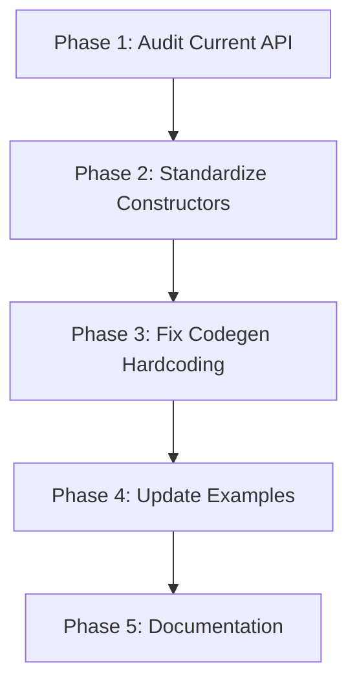

# SDK API Ergonomics - Pulumi Alignment Plan

## Current State Assessment

### What's Working Well

The codebase has solid foundations with clear Pulumi influence:

- Two-stage codegen pipeline (proto2schema -> generator) mirrors Pulumi's schema-based approach
- Args struct pattern (`AgentArgs`, `SkillArgs`) follows Pulumi conventions
- Context-based resource management
- Implicit dependency tracking via `TaskFieldRef`

### Critical Gaps Requiring Attention

**1. Inconsistent Resource Creation Patterns**

| Package | Pattern | Context Required |

|---------|---------|-----------------|

| `agent` | Struct Args | Yes |

| `skill` | Struct Args | No |

| `workflow` | Functional Options | Yes |

| `environment` | Functional Options | No |

| `mcpserver` | Functional Options | No |

| `subagent` | Functional Options | No |

Pulumi uses **struct args consistently** for all resources. This is the pattern we should standardize on.

**2. Context Requirement Inconsistency**

- `agent.New(ctx, name, args)` - requires context
- `skill.New(name, args)` - no context
- `workflow.New(ctx, opts...)` - requires context
- `environment.New(opts...)` - no context

In Pulumi, all resource constructors require context. Resources that don't need context aren't "resources" - they're helper types.

**3. Hardcoded Codegen Logic (Proto Change Risk)**

Key locations in [tools/codegen/generator/main.go](tools/codegen/generator/main.go):

- Line ~1118: Hardcoded `HttpEndpoint` type check for expression handling
- Line ~200: Package name derived from proto file paths (fragile)
- Line ~643: Validation extraction via string matching

---

## Recommended Changes

### Phase 1: Standardize Resource Creation Pattern

**Decision: Use Struct Args Pattern (Pulumi-style)**

Rationale:

- Pulumi uses this consistently
- DevOps engineers expect this pattern
- Type-safe, IDE-discoverable
- Generated Args structs already exist

**Convert functional options to struct args:**

```go
// BEFORE: workflow uses functional options
workflow.New(ctx,
    workflow.WithNamespace("data"),
    workflow.WithName("pipeline"),
    workflow.WithVersion("1.0.0"),
)

// AFTER: workflow uses struct args (Pulumi-style)
workflow.New(ctx, "data/pipeline", &workflow.WorkflowArgs{
    Version:     "1.0.0",
    Description: "Data pipeline",
})
```

**Files to modify:**

- [sdk/go/workflow/workflow.go](sdk/go/workflow/workflow.go) - Change constructor
- [sdk/go/environment/environment.go](sdk/go/environment/environment.go) - Change constructor
- [sdk/go/mcpserver/mcpserver.go](sdk/go/mcpserver/mcpserver.go) - Change constructor
- [sdk/go/subagent/subagent.go](sdk/go/subagent/subagent.go) - Change constructor

### Phase 2: Standardize Context Requirements

**Decision: All resources require context**

This matches Pulumi where every resource constructor takes `*pulumi.Context`.

```go
// All resources follow this signature:
func New(ctx *stigmer.Context, name string, args *<Type>Args) (*<Type>, error)
```

**Resources to update:**

- `skill.New()` - add context parameter
- `environment.New()` - add context parameter  
- `mcpserver.Stdio/SSE()` - add context parameter
- `subagent.Inline/Reference()` - add context parameter

### Phase 3: Codegen Improvements (Proto Change Safety)

**Remove hardcoded type handling:**

Current problem in [tools/codegen/generator/main.go](tools/codegen/generator/main.go):

```go
// Hardcoded check - BAD
if field.Type.MessageType == "HttpEndpoint" {
    fmt.Fprintf(w, "\t\tif uri, ok := %s[\"uri\"]; ok {\n", mapVarName)
```

Fix: Add `isExpression` flag to schema and handle generically:

```go
// Data-driven check - GOOD
if field.IsExpression {
    fmt.Fprintf(w, "\t\t%s[%q] = coerceToString(%s[%q])\n", 
        mapVarName, field.Name, mapVarName, field.Name)
}
```

**Files to modify:**

- [tools/codegen/proto2schema/main.go](tools/codegen/proto2schema/main.go) - Add expression field detection
- [tools/codegen/generator/main.go](tools/codegen/generator/main.go) - Use schema metadata

### Phase 4: Builder Pattern Alignment

Keep the builder pattern for adding child resources (this is good):

```go
agent.AddSkill(skill)
agent.AddMCPServer(server)
```

This matches Pulumi's component resources where you compose resources.

---

## Files Requiring Changes

### High-Impact SDK Files

| File | Change Type | Effort |

|------|-------------|--------|

| `sdk/go/workflow/workflow.go` | Constructor signature change | Medium |

| `sdk/go/skill/skill.go` | Add context parameter | Low |

| `sdk/go/environment/environment.go` | Constructor signature change | Medium |

| `sdk/go/mcpserver/mcpserver.go` | Add context parameter | Medium |

| `sdk/go/subagent/subagent.go` | Add context parameter | Low |

### Codegen Files

| File | Change Type | Effort |

|------|-------------|--------|

| `tools/codegen/generator/main.go` | Remove hardcoded logic | Medium |

| `tools/codegen/proto2schema/main.go` | Add expression field metadata | Low |

### Examples (Update After SDK Changes)

All examples in `sdk/go/examples/` will need updates to match new API.

---

## What NOT To Do

1. **Do NOT implement Pulumi's Input/Output type system** - This is complex machinery for async infrastructure provisioning. Stigmer's synthesis model doesn't need it.

2. **Do NOT over-abstract the codegen** - The two-stage pipeline is good. Don't add template engines or complex abstractions that make it harder to understand.

3. **Do NOT change working patterns unnecessarily** - The builder methods (`AddSkill`, `AddTask`) are fine. The `TaskFieldRef` for dependencies is good.

---

## Execution Order



**Phase 1**: Deep audit to catalog every public API method

**Phase 2**: Change constructors to struct args + context requirement

**Phase 3**: Remove hardcoded codegen logic

**Phase 4**: Update all 19 examples

**Phase 5**: Update documentation

---

## Success Criteria

1. All resource constructors follow: `New(ctx, name, *Args) (*Type, error)`
2. DevOps engineers familiar with Pulumi will recognize the patterns
3. Proto changes propagate to SDK without manual codegen modifications
4. All existing tests pass
5. All examples compile and work correctly