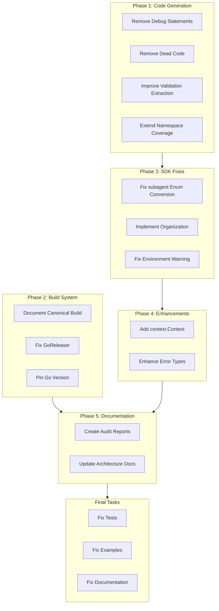

# SDK Deep Audit and Foundation Excellence Plan

## Executive Summary

The audit exploration revealed **critical issues** that must be addressed before proceeding to testing and documentation. This plan ensures the foundations of this world-class platform are solid.

---

## Critical Findings Summary

### Code Generation Pipeline (T01.1)

| Severity | Issue | Location |
|----------|-------|----------|
| **HIGH** | DEBUG print statements in production | `tools/codegen/generator/main.go:1032,1046` |
| **HIGH** | Dead code: `generateHelpersFile` | `tools/codegen/proto2schema/main.go:515-569` |
| **MEDIUM** | Brittle string matching for validation | `proto2schema/main.go:655-659` |
| **MEDIUM** | Incomplete buf.validate parsing | Enums, patterns, oneof not extracted |
| **MEDIUM** | Missing namespace generation | IAM, tenancy namespaces not included |
| **LOW** | No cycle detection for nested types | `proto2schema/main.go:437-478` |

### Build System (T01.3)

| Severity | Issue | Location |
|----------|-------|----------|
| **HIGH** | Bazel/Go build inconsistency | CI uses `go build`, local can use Bazel |
| **HIGH** | GoReleaser references deprecated `stigmer-server` | `.goreleaser.yml:32-48` |
| **MEDIUM** | Go version mismatch | CI: 1.22, MODULE.bazel: 1.24.6 |
| **MEDIUM** | CLI has two build paths | Root Makefile vs CLI Makefile |

### SDK Packages

| Severity | Issue | Location |
|----------|-------|----------|
| **HIGH** | DEBUG statements in generated code | `sdk/go/gen/workflow/*.go` |
| **HIGH** | Incomplete enum conversion | `sdk/go/subagent/subagent.go:89-90` |
| **MEDIUM** | Unimplemented Organization() | `sdk/go/subagent/subagent.go:157-159` |
| **LOW** | Missing tests | `skillref/`, `internal/validation/` |

---

## Phase 1: Code Generation Pipeline Fixes

### Task 1.1: Remove Debug Statements

**Files:**
- `tools/codegen/generator/main.go` (lines 1032, 1046)
- `sdk/go/gen/workflow/trytaskconfig.go`
- `sdk/go/gen/workflow/switchtaskconfig.go`
- `sdk/go/gen/workflow/fortaskconfig.go`
- `sdk/go/gen/workflow/forktaskconfig.go`

**Action:** Remove all `fmt.Printf("DEBUG ...")` statements or gate behind a `-debug` flag.

### Task 1.2: Remove Dead Code

**File:** `tools/codegen/proto2schema/main.go`

**Action:** Remove `generateHelpersFile` (lines 515-569) - duplicates `generateHelpers`.

### Task 1.3: Improve Validation Extraction

**File:** `tools/codegen/proto2schema/main.go`

**Current (brittle):**
```go
// Lines 655-659: String matching on proto text
if strings.Contains(protoText, "required:") { ... }
```

**Improved:** Use protoreflect APIs for robust validation extraction:
- Extract enum values programmatically
- Extract pattern validation
- Handle float/double validation

### Task 1.4: Extend Namespace Coverage

**File:** `tools/codegen/proto2schema/main.go`

**Action:** Extend comprehensive mode (lines 247-310) to include:
- `apis/ai/stigmer/iam/` namespace
- `apis/ai/stigmer/tenancy/` namespace

---

## Phase 2: Build System Unification

### Task 2.1: Document Canonical Build System

**Decision Required:** Choose one of:

**Option A: Standardize on Go Build**
- Remove Bazel configuration (if not actively used)
- Update CLI Makefile to use `go build`
- Simpler, fewer moving parts

**Option B: Standardize on Bazel**
- Update root Makefile to use `bazel build`
- Update CI workflows to use Bazel
- Better reproducibility, hermetic builds

**Recommendation:** Option A (Go Build) unless Bazel is required for specific features. Bazel adds complexity without clear benefit if CI doesn't use it.

### Task 2.2: Fix GoReleaser Configuration

**File:** `.goreleaser.yml`

**Issues:**
- References deprecated `stigmer-server` binary (lines 32-48)
- Dockerfile.server reference may not exist

**Actions:**
1. Remove `stigmer-server` build target
2. Update to match BusyBox CLI architecture
3. Or remove entirely if CI handles releases

### Task 2.3: Pin Go Version

**Action:** Create `.tool-versions` or update `go.mod` files with `go 1.24` toolchain directive to ensure consistency between CI and local development.

---

## Phase 3: SDK Package Fixes

### Task 3.1: Fix subagent Enum Conversion

**File:** `sdk/go/subagent/subagent.go`

**Current (incomplete):**
```go
// Lines 89-90
// Note: types.ApiResourceReference uses string for Scope/Kind,
// proto uses enums. These would need proper conversion if used.
```

**Action:** Implement proper Scope/Kind enum conversion in `convertSkillRefs()`.

### Task 3.2: Implement Organization() for References

**File:** `sdk/go/subagent/subagent.go`

**Current:**
```go
// Lines 157-159
// For references, we need to parse from agentInstanceRef
// For now, return empty - this will be handled by CLI
```

**Action:** Implement parsing from `agentInstanceRef` or document as intentional limitation with clear error message.

### Task 3.3: Implement Warning System for Environment

**File:** `sdk/go/environment/environment.go`

**Current (unused):**
```go
// Lines 186-188
_ = fmt.Sprintf("warning: secret variable %s has no description", v.Name)
```

**Action:** Either implement proper warning system (logging) or remove dead code.

---

## Phase 4: Pulumi Pattern Adoption (Optional Enhancements)

Based on the comparative analysis, these patterns could elevate the SDK:

### Task 4.1: Add context.Context Support

**File:** `sdk/go/stigmer/context.go`

**Current:** No standard `context.Context` integration.

**Proposed:**
```go
type Context struct {
    ctx context.Context  // Add this
    // ... existing fields
}

func (c *Context) WithContext(ctx context.Context) *Context { ... }
func (c *Context) SynthesizeWithContext(ctx context.Context) error { ... }
```

### Task 4.2: Enhance Error Types (Consider)

**File:** `sdk/go/internal/validation/errors.go`

**Proposed:** More structured errors with field path, resource type, etc.

```go
type ValidationError struct {
    Resource string
    Field    string
    Reason   string
    Code     string  // Machine-readable error code
}
```

---

## Phase 5: Documentation and Audit Reports

### Task 5.1: Create Audit Report Documents

Create checkpoint files documenting findings:
- `_projects/2026-01/.../tasks/T01_1_codegen_audit.md`
- `_projects/2026-01/.../tasks/T01_3_build_audit.md`
- `_projects/2026-01/.../tasks/T02_1_pulumi_comparison.md`

### Task 5.2: Update Architecture Documentation

- Update `tools/codegen/README.md` with any changes
- Document build system decision (Go vs Bazel)
- Add ADR for protovalidate migration decision

---

## Final Tasks (Existing - After Audit Complete)

| ID | Task | Description |
|----|------|-------------|
| **5a** | Fix tests | Update all test files to new APIs |
| **5b** | Fix examples | Update all 19 examples |
| **5c** | Fix documentation | Update doc.go, README, api-reference |

---

## Task Dependency Flow



---

## Estimated Effort

| Phase | Tasks | Effort |
|-------|-------|--------|
| Phase 1 | Code Generation Fixes | 3-4 hours |
| Phase 2 | Build System Unification | 2-3 hours |
| Phase 3 | SDK Package Fixes | 2-3 hours |
| Phase 4 | Pulumi Pattern Adoption | 3-4 hours (optional) |
| Phase 5 | Documentation | 1-2 hours |
| Final | Tests, Examples, Docs | 6-8 hours |

---

## Success Criteria

1. **Zero DEBUG statements** in production code
2. **Zero dead code** in code generation tools
3. **Single, documented build system** (Go or Bazel, not both)
4. **Complete enum conversion** in subagent package
5. **All audit findings documented** in checkpoint files
6. **Build passes** after each phase
7. **No new technical debt** introduced
