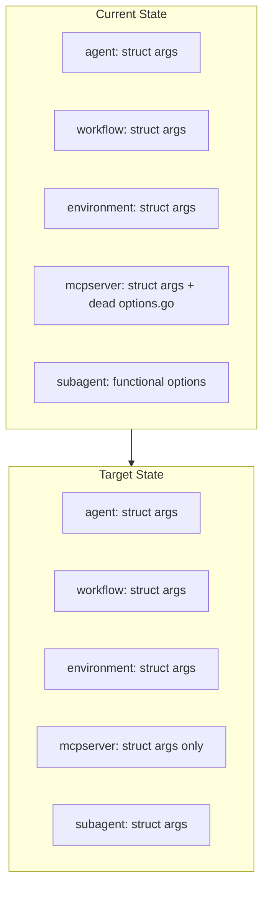
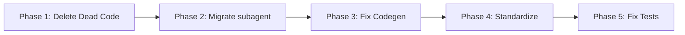

# SDK Foundation Refactoring Plan

## Problem Statement

The SDK has accumulated technical debt from an incomplete migration from functional options to struct args pattern. Several packages have dead code, inconsistent APIs, and broken tests. This plan addresses the foundations before fixing tests.

---

## Architecture Overview



---

## Phase 1: Delete Dead Code

### 1.1 Remove `mcpserver/options.go`

**File**: [sdk/go/mcpserver/options.go](sdk/go/mcpserver/options.go)

- 337 lines of completely unused code
- All functional options (`WithName`, `WithCommand`, `WithArgs`, etc.)
- No longer compatible with current constructors `Stdio(ctx, name, *StdioArgs)`
- **Action**: Delete entire file

### 1.2 Clean Up Type Definitions

**File**: [sdk/go/mcpserver/mcpserver.go](sdk/go/mcpserver/mcpserver.go)

Evaluate removing internal types in favor of generated types:

- `VolumeMount` (lines 58-62) - may duplicate `types.VolumeMount`
- `PortMapping` (lines 64-69) - may duplicate `types.PortMapping`
- **Action**: Assess if conversion in `docker.go:91-111` can be eliminated

---

## Phase 2: Migrate subagent to Struct Args

### 2.1 Current API (Functional Options)

```go
// Current pattern - INCONSISTENT with rest of SDK
sub, err := subagent.Inline(
    subagent.WithName("analyzer"),
    subagent.WithInstructions("..."),
    subagent.WithMCPServer("github"),
)
```

### 2.2 Target API (Struct Args)

```go
// New pattern - CONSISTENT with agent, workflow, mcpserver
sub := subagent.Inline("analyzer", &subagent.InlineArgs{
    Instructions: "...",
    MCPServers:   []string{"github"},
})
```

### 2.3 Files to Modify

| File | Changes |

|------|---------|

| [sdk/go/subagent/subagent.go](sdk/go/subagent/subagent.go) | Replace `InlineOption` functions with `InlineArgs` struct |

| [sdk/go/subagent/doc.go](sdk/go/subagent/doc.go) | Update documentation examples |

### 2.4 New Struct Design

```go
// InlineArgs configures an inline sub-agent (Pulumi-aligned pattern)
type InlineArgs struct {
    Description       string
    Instructions      string
    InstructionsFile  string  // Alternative to Instructions
    MCPServers        []string
    MCPToolSelections map[string][]string
    SkillRefs         []*apiresource.ApiResourceReference
}
```

### 2.5 Migration Strategy

1. Create `InlineArgs` struct
2. Create new `Inline(name string, args *InlineArgs) (SubAgent, error)` 
3. Remove all `With*` option functions (~100 lines)
4. Update `agent` package calls to subagent

---

## Phase 3: Fix Code Generation Gaps

### 3.1 Problem: Incomplete `FromProto()` Methods

18 instances in generated code where array/map/float conversions are marked TODO:

**Location**: [sdk/go/gen/types/agentic_types.go](sdk/go/gen/types/agentic_types.go)

```go
// Current (incomplete)
// TODO: Implement FromProto for array field EnabledTools
// TODO: Implement FromProto for map field McpToolSelections
// TODO: Implement FromProto for array field SkillRefs
```

### 3.2 Root Cause

Code generator at [tools/codegen/generator/main.go](tools/codegen/generator/main.go) doesn't handle:

- Array fields (`repeated` in proto)
- Map fields
- Float fields

### 3.3 Fix Options

**Option A**: Fix the code generator to emit proper `FromProto()` for all types

- Proper solution, prevents future drift
- Requires modifying `generator/main.go`

**Option B**: Manually complete `FromProto()` implementations

- Quick fix but creates maintenance burden
- Generated code shouldn't be manually edited

**Recommendation**: Option A - fix the generator

---

## Phase 4: Standardize Validation and Errors

### 4.1 Current State: Duplicated Validation

| Package | Validation | Error Type |

|---------|-----------|------------|

| agent | `validation.go` | `ValidationError` struct |

| subagent | inline in `subagent.go` | `fmt.Errorf()` |

| workflow | `validation.go` | `ValidationError` struct |

| environment | inline | `ValidationError` struct |

### 4.2 Duplication Examples

**Instruction length check** (duplicated):

- `agent/validation.go:103-133`
- `subagent/subagent.go:256-258`

**Name validation regex** (similar but inconsistent):

- Agent: `^[a-z0-9]([a-z0-9-]*[a-z0-9])?$`
- Task: `^[a-zA-Z0-9_-]+$`

### 4.3 Recommended Approach

Create shared validation package:

```
sdk/go/internal/validation/
├── validation.go  # Common validators
├── errors.go      # Shared error types
└── doc.go
```

Common validators:

- `ValidateName(name string, rules NameRules) error`
- `ValidateInstructions(instructions string, minLen int) error`
- `ValidateRequired(field, value string) error`

---

## Phase 5: Fix Tests and Examples (LAST)

Only after Phases 1-4 are complete:

### 5.1 Test Files to Update

| File | Issue |

|------|-------|

| `mcpserver/mcpserver_test.go` | Uses deleted functional options |

| `environment/environment_test.go` | Uses functional options that don't exist |

| `subagent/subagent_test.go` | Uses old API after Phase 2 migration |

| `agent/agent_builder_test.go` | References `AddSkill()` instead of `AddSkillRef()` |

| `integration_scenarios_test.go` | Multiple old API usages |

### 5.2 Example Files to Update (19 examples)

- `examples/03_agent_with_mcp_servers.go`
- `examples/04_agent_with_subagents.go`
- `examples/05_agent_with_environment_variables.go`
- `examples/12_agent_with_typed_context.go`
- ... and others

### 5.3 Documentation to Update

- `mcpserver/doc.go` - Examples show old API
- `mcpserver/README.md`
- `docs/api-reference.md`
- `docs/USAGE.md`

---

## Summary: Work Order



| Phase | Scope | Impact |

|-------|-------|--------|

| Phase 1 | Delete ~337 lines | Removes confusion, cleans API |

| Phase 2 | Rewrite ~150 lines | API consistency across SDK |

| Phase 3 | Fix generator | Proper `FromProto()` for all types |

| Phase 4 | Extract ~100 lines | Reduces duplication, improves consistency |

| Phase 5 | Update ~500 lines | Tests pass, docs accurate |

---

## Key Design Decisions Required

1. **subagent API**: Should `Reference()` also take args struct, or keep positional params?
2. **Validation package**: Extract to `internal/validation/` or `stigmer/validation/`?
3. **Phase 3 scope**: Fix generator now, or defer to separate task?