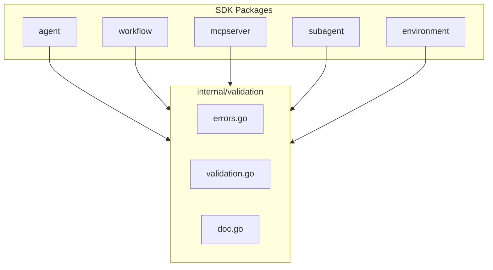

# SDK Validation Standardization

## Problem Analysis

The SDK currently has **significant validation duplication** across packages:

**Identical Code (100% duplicate)**

- `ValidationError` struct: 61 lines duplicated in `agent/errors.go` and `workflow/errors.go`
- `ConversionError` struct: 39 lines duplicated in both packages  
- Constructor functions: `NewValidationError()`, `NewValidationErrorWithCause()`, `NewConversionError()`, `NewConversionErrorWithCause()`

**Similar Patterns (repeated 15+ times)**

- Required field checks: `if field == ""`
- String length validation: min/max bounds
- Regex pattern matching: name formats, semver
- URL validation: scheme, host checks
- Numeric range validation: timeout, ports
- Slice validation: nil checks, element iteration

**Inconsistent Error Handling**

- `agent` and `workflow`: Use structured `ValidationError` with field context
- `mcpserver`, `subagent`, `environment`: Use plain `fmt.Errorf()`
- Error message formats vary across packages

---

## Architecture



### Package: `sdk/go/internal/validation`

Single internal package with three files:

**[errors.go](sdk/go/internal/validation/errors.go)** - Shared error types

- `ValidationError` - Structured validation error with field, value, rule, message
- `ConversionError` - Proto conversion error with type and field context  
- `MultiError` - Accumulates multiple validation errors (optional enhancement)
- Implements `error`, `Unwrap()`, `Is()` for error chaining
- Constructor functions with consistent signatures

**[validation.go](sdk/go/internal/validation/validation.go)** - Core validation functions

- `Required(field, value string) error`
- `MinLength(field, value string, min int) error`
- `MaxLength(field, value string, max int) error`
- `LengthRange(field, value string, min, max int) error`
- `MatchesPattern(field, value string, pattern *regexp.Regexp, description string) error`
- `ValidHTTPURL(field, value string) error`
- `OneOf(field, value string, allowed []string) error`
- `MinInt(field string, value, min int) error`
- `MaxInt(field string, value, max int) error`
- `RangeInt(field string, value, min, max int) error`
- `FieldPath(parts ...interface{}) string` - Builds paths like `"volumes[2].host_path"`

**[doc.go](sdk/go/internal/validation/doc.go)** - Package documentation with examples

---

## Implementation Details

### Error Type Design

```go
// ValidationError provides structured validation context.
type ValidationError struct {
    Field   string // e.g., "volumes[2].host_path"
    Value   string // The invalid value (truncated if long)
    Rule    string // e.g., "required", "min_length", "format"
    Message string // Human-readable: "host_path is required"
    Err     error  // Underlying sentinel error for errors.Is()
}

func (e *ValidationError) Error() string {
    if e.Field != "" {
        return fmt.Sprintf("validation failed for field %q: %s", e.Field, e.Message)
    }
    return fmt.Sprintf("validation failed: %s", e.Message)
}
```

### Validation Function Design

Functions return `nil` on success, `*ValidationError` on failure:

```go
// Required validates that a string field is non-empty.
func Required(field, value string) error {
    if value == "" {
        return &ValidationError{
            Field:   field,
            Value:   value,
            Rule:    "required",
            Message: field + " is required",
        }
    }
    return nil
}

// FieldPath builds hierarchical field paths for nested validation.
// Examples:
//   FieldPath("volumes", 2, "host_path") -> "volumes[2].host_path"
//   FieldPath("config", "timeout")       -> "config.timeout"
func FieldPath(parts ...interface{}) string
```

### Sentinel Errors

Move sentinel errors to validation package for consistency:

```go
var (
    ErrRequired      = errors.New("field is required")
    ErrMinLength     = errors.New("value below minimum length")
    ErrMaxLength     = errors.New("value exceeds maximum length")
    ErrInvalidFormat = errors.New("invalid format")
    ErrInvalidURL    = errors.New("invalid URL")
    ErrOutOfRange    = errors.New("value out of range")
)
```

---

## Migration Strategy

### Phase 1: Create validation package

Create `sdk/go/internal/validation/` with errors.go, validation.go, doc.go

### Phase 2: Migrate error types

- Delete `ValidationError` and `ConversionError` from `agent/errors.go`
- Delete `ValidationError` and `ConversionError` from `workflow/errors.go`
- Add type aliases for backward compatibility:
  ```go
  // agent/errors.go
  type ValidationError = validation.ValidationError
  ```


### Phase 3: Migrate validation functions

- Update `agent/validation.go` to use `validation.Required()`, etc.
- Update `workflow/validation.go` to use shared validators
- Update `mcpserver/*.go` to use structured errors
- Update `subagent/subagent.go` to use structured errors
- Update `environment/environment.go` to use structured errors

---

## Files to Create

| File | Purpose | ~Lines |

|------|---------|--------|

| `sdk/go/internal/validation/errors.go` | Shared error types | ~90 |

| `sdk/go/internal/validation/validation.go` | Core validation functions | ~150 |

| `sdk/go/internal/validation/doc.go` | Package documentation | ~30 |

## Files to Modify

| File | Change |

|------|--------|

| `sdk/go/agent/errors.go` | Remove ValidationError, ConversionError; add type aliases |

| `sdk/go/agent/validation.go` | Use validation package functions |

| `sdk/go/workflow/errors.go` | Remove ValidationError, ConversionError; add type aliases |

| `sdk/go/workflow/validation.go` | Use validation package functions |

| `sdk/go/mcpserver/docker.go` | Use validation package for structured errors |

| `sdk/go/mcpserver/http.go` | Use validation package for structured errors |

| `sdk/go/mcpserver/stdio.go` | Use validation package for structured errors |

| `sdk/go/subagent/subagent.go` | Use validation package for structured errors |

| `sdk/go/environment/environment.go` | Use validation package for structured errors |

---

## Design Principles

1. **Zero-allocation on success**: Validation functions return `nil` when valid, no allocations
2. **Fail-fast**: Return on first error (no multi-error accumulation for simplicity)
3. **Field context preservation**: All errors include the full field path
4. **Consistent formatting**: Every package produces identical error message formats
5. **Type-safe composition**: Validators are composable for complex rules
6. **Backward compatible**: Type aliases maintain API compatibility
7. **Internal only**: Package is internal - no public API commitment

---

## Success Criteria

- [ ] Build passes: `go build ./...`
- [ ] All duplicated `ValidationError` and `ConversionError` code removed
- [ ] All packages use consistent validation error format
- [ ] Error messages include field paths (e.g., `"volumes[2].host_path"`)
- [ ] `errors.Is()` works correctly for sentinel error matching
- [ ] Package has comprehensive documentation with examples