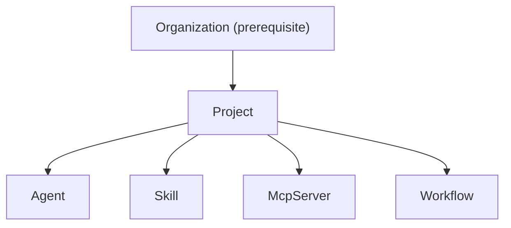

# Seedpack Bootstrap and Organization Hierarchy Fix

## Root Cause

After the org-tenancy migration (T01.1-T01.9), system resources (agents, skills, MCP servers) exist under org `local` (from pre-migration bootstrap) but the CLI context resolves to `default` (from the new Organization resource). This mismatch causes `stigmer draft skill` and `stigmer list agents` to find nothing.

Three factors contribute:

- **No ordering guarantee**: Organizations are applied AFTER agents (alphabetical: `agents/` before `organizations/`)
- **Organization is treated as a project resource**: But it is the *parent* of the project hierarchy, not a member
- **No re-bootstrap happened**: The old resources under `local` persist, and the new resources under `default` were never created

## Architectural Principle

The resource hierarchy is **Organization -> Project -> Members**. A project should never create its parent. Organization is a prerequisite, not a deliverable.




## Changes

### 1. Remove Organization from declarative project apply

**File**: `[client-apps/cli/cmd/stigmer/root/apply_declarative.go](client-apps/cli/cmd/stigmer/root/apply_declarative.go)`

In `detectResourceItems`, skip Organization kind with a clear log message:

```go
if result.Kind == "Organization" {
    climsg.Warning("Skipping %s: Organization resources are not part of project apply. Use 'stigmer apply -f' instead.", filePath)
    continue
}
```

This applies to both seedpack and user projects. Organization YAMLs found inside a project directory are silently skipped with guidance.

### 2. Allow Organization apply without org context

**File**: `[client-apps/cli/cmd/stigmer/root/apply_file.go](client-apps/cli/cmd/stigmer/root/apply_file.go)`

In `executeFileApply`, make org resolution conditional. If the detected items are ALL Organization kind, skip `resolveOrganization` (since Organization resources are self-identifying by slug -- the server uses slug-based lookup, not `metadata.org`).

Key insight from the codebase: `organization.Apply` fills `metadata.org` from `OrgID` only when `metadata.org` is empty, and the OSS server does not use `metadata.org` for Organization identity/lookup. So passing an empty `orgID` is safe.

```go
needsOrg := false
for _, item := range applyItems {
    if item.typeInfo.ProtoKind != apiresourcekind.ApiResourceKind_organization {
        needsOrg = true
        break
    }
}

if needsOrg {
    fctx.orgID, err = resolveOrganization(cfg, opts.OrgOverride)
    // ...
}
```

### 3. Two-phase seedpack bootstrap

**File**: `[client-apps/cli/internal/cli/daemon/daemon.go](client-apps/cli/internal/cli/daemon/daemon.go)`

Replace the single `stigmer apply --config <tmpDir>` with two sequential commands:

- **Phase 1**: `stigmer apply -f <tmpDir>/organizations/` -- creates the `default` Organization. No org context needed (from change 2 above).
- **Phase 2**: `stigmer apply --config <tmpDir>` -- applies the project (agents, skills, MCP servers). Org comes from `stigmer.yaml` `metadata.org: default`. Organization YAMLs are skipped (from change 1 above).

The `organizations/` directory is detected by checking `os.Stat` on the path; if it doesn't exist (e.g., a seedpack without organizations), Phase 1 is skipped. This keeps the mechanism forward-compatible.

### 4. Improve draft diagnostics

**File**: `[client-apps/cli/cmd/stigmer/root/draft_handler.go](client-apps/cli/cmd/stigmer/root/draft_handler.go)`

When the system agent is not found, enhance the error message to include:

- The org that was searched (so the user understands the mismatch)
- Suggestion to check `stigmer list agents` to verify resources
- Suggestion to run `stigmer server reset` and restart if bootstrap may be stale

### 5. Manual cleanup for existing installations

Users with resources stranded under org `local` run:

```
stigmer server reset
stigmer server
```

This clears `~/.stigmer/data/` (including the SQLite DB and `.seedpack-bootstrapped` hash file), and the next server start re-bootstraps fresh, creating everything under org `default`.

No automatic migration logic. The reset command already handles this.

## Files Modified


| File                   | Change                                                     |
| ---------------------- | ---------------------------------------------------------- |
| `apply_declarative.go` | Skip Organization kind in `detectResourceItems`            |
| `apply_file.go`        | Conditional org resolution (skip for org-only applies)     |
| `daemon.go`            | Two-phase bootstrap: orgs first, then project              |
| `draft_handler.go`     | Better error message with org context and reset suggestion |


## What We Are NOT Doing

- **No automatic cleanup of old "local" resources**: User runs `stigmer server reset` explicitly
- **No Organization kind ordering in file-mode apply**: `apply -f` applies in file order; for mixed dirs, OSS does not validate org existence so ordering is not a problem today
- **No changes to the server-side controllers**: The OSS server already handles Organization correctly (slug-based identity, no parent org validation)
- **No changes to `IsProjectMemberKind`**: Organization already returns false; the function remains correct

