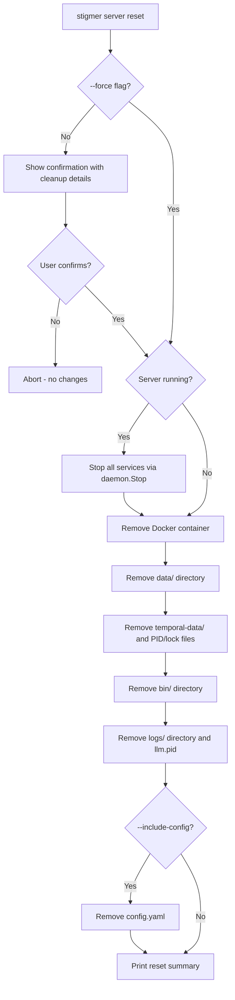

# `stigmer server reset` Command

## Architect's Domain Analysis

### The Problem

The server lifecycle has a gap. Users can start, stop, and check status, but there is no first-class way to return to a clean slate. The README (lines 336-341) documents a manual workaround:

```bash
stigmer server stop
rm -rf ~/.stigmer
stigmer server
```

This is problematic because:

- It is undiscoverable (buried in troubleshooting)
- It is a blunt instrument (destroys config along with data -- user loses API keys)
- It is error-prone (user might forget to stop first, leaving orphan processes)
- It does not clean Docker containers

### Naming Decision: `reset` not `destroy`

`**stigmer server reset**` -- not `destroy`, `clean`, or `purge`.

- "Reset" maps to user intent: "return to initial state so I can start fresh"
- "Destroy" implies the system is gone (wrong -- `stigmer server` recreates everything)
- Fits the existing subcommand pattern: `server stop`, `server status`, `server logs`, `server setup`, `**server reset**`

### State Taxonomy

Two categories of on-disk state in `~/.stigmer/`:

**User Configuration (preserved by default):**

- `config.yaml` -- LLM provider, API keys, backend choice, execution mode

**Runtime State (always removed):**

- `data/` -- databases, PID files, startup-config, workspace, artifacts, logs
- `temporal-data/` -- Temporal SQLite database
- `temporal.pid`, `temporal.lock` -- Temporal process state
- `llm.pid` -- LLM server PID
- `bin/` -- downloaded Temporal and Ollama binaries
- `logs/` -- root-level logs (llm.log, temporal.log)
- Docker container `stigmer-agent-runner`

### Command Design

```
stigmer server reset [flags]

Flags:
  --force             Skip confirmation prompt
  --include-config    Also remove configuration (config.yaml)
```

**Default behavior (no flags):**

1. Show what will be removed and ask for confirmation
2. Stop all running services (reuse existing `daemon.Stop()`)
3. Remove Docker container `stigmer-agent-runner`
4. Remove all runtime state directories and files
5. Preserve `config.yaml`
6. Print summary of what was removed

**With `--include-config`:**

- Also removes `config.yaml` (user will need to re-run setup wizard on next `stigmer server`)

**With `--force`:**

- Skips the interactive confirmation (for CI/scripts)

### Behavior When Server Is Not Running

The command works regardless of whether the server is running. If the server is stopped but stale data exists, reset still cleans it up. If the server is running, it stops it first. This handles the common case where a user's environment is in a broken state and they can't even `stop` cleanly.

---

## Implementation

### File 1: Command Layer -- [server_reset.go](client-apps/cli/cmd/stigmer/root/server_reset.go) (NEW)

Thin Cobra command following existing patterns in [server.go](client-apps/cli/cmd/stigmer/root/server.go):

- `newServerResetCommand()` returns `*cobra.Command`
- `handleServerReset()` handler: parse flags, resolve data dir, show confirmation, delegate to `daemon.Reset()`, render result
- Confirmation prompt shows a bullet list of what will be removed (directories and their sizes if feasible)
- Follows the coding guidelines: thin handler, max 50-80 lines

### File 2: Domain Layer -- [reset.go](client-apps/cli/internal/cli/daemon/reset.go) (NEW)

Core reset logic:

- `ResetOptions` struct: `IncludeConfig bool`, `Force bool`
- `Reset(configDir string, dataDir string, opts ResetOptions) error`
  - Calls `Stop(dataDir)` if server is running (swallows "not running" errors)
  - Removes Docker container by name (`stigmer-agent-runner`) via `docker rm -f`
  - Removes directories: `data/`, `temporal-data/`, `bin/`, `logs/`
  - Removes files: `temporal.pid`, `temporal.lock`, `llm.pid`
  - If `IncludeConfig`: removes `config.yaml`
  - Returns a `ResetResult` with what was removed

Each cleanup concern is a separate function:

- `removeDataDir(configDir string) error`
- `removeTemporalState(configDir string) error`
- `removeDownloadedBinaries(configDir string) error`
- `removeRootLogs(configDir string) error`
- `removeDockerContainer() error`
- `removeConfig(configDir string) error`

### File 3: Register Subcommand

In [server.go](client-apps/cli/cmd/stigmer/root/server.go) line 49-53, add:

```go
cmd.AddCommand(newServerResetCommand())
```

### README Updates -- [README.md](README.md)

**Section: "Managing the Server" (lines 53-59)** -- Add `reset`:

```bash
stigmer server reset    # stop and remove all data (keeps config)
stigmer server reset --include-config  # full reset including config
```

**Section: "CLI Reference" (line 197)** -- Add row:

```
| `stigmer server reset` | Reset local environment to fresh state |
```

**Section: "Troubleshooting" (lines 335-341)** -- Replace manual recipe:

```bash
# Before (manual, loses config):
stigmer server stop
rm -rf ~/.stigmer

# After (proper command, preserves config):
stigmer server reset
stigmer server       # recreates everything on first run
```

---

## What This Does NOT Do (Intentional Omissions)

- **Does not remove Docker images** -- images are expensive to download and will be re-pulled automatically on next start. Removing containers is sufficient.
- **Does not add selective cleanup** (e.g., "just logs" or "just databases") -- YAGNI. If a future need arises, we can add `--only` flags later without breaking the current interface.
- **Does not add a `--dry-run` flag** -- the confirmation prompt already shows what will be removed. Dry-run adds complexity for marginal value at this stage.

---

## Mermaid: Reset Flow




