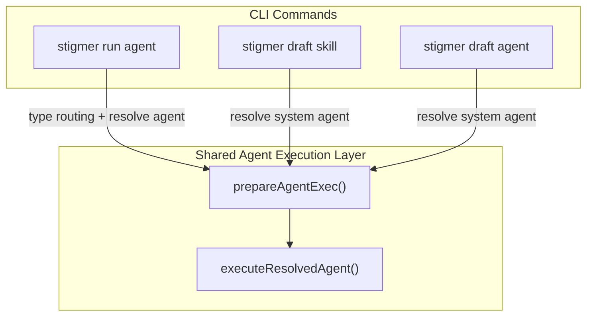

# Shared Agent Execution Layer

## Problem

The previous refactor unified `draft skill` and `draft agent` into a single parameterized handler, but the orchestration logic inside `executeDraft()` is still a near-copy of `executeRun()` + `runAgent()`. Specifically:

- **Preparation phase** (approve-default parsing, workspace parsing, env loading, auto-env resolution, backend connection, attachment processing) is duplicated between `executeDraft()` lines 114-178 and `executeRun()` lines 283-338.
- **Agent execution phase** (workspace session creation, execution creation, detach/stream, artifact download) is duplicated between `executeDraft()` lines 180-260 and `runAgent()` lines 37-117.
- **Flag fields** are duplicated: 13 of 16 fields in `draftOptions` are identical to fields in `runOptions`.
- **Flag registration** is duplicated: the same 13 flags are registered with the same descriptions in both `registerDraftFlags()` and `NewRunCommand()`.

## Design

Three layers, each with a single source of truth:




### Layer 1: Shared Flag Struct + Registration

A new file `[run_agent_exec.go](client-apps/cli/cmd/stigmer/root/run_agent_exec.go)` defines the shared types and functions.

**Shared flag struct** -- embedded by both `runOptions` and `draftOptions`:

```go
type agentExecFlags struct {
    Message         string
    AttachFlags     []string
    ApproveDefault  string
    Verbose         bool
    Detach          bool
    OrgOverride     string
    WorkspaceFlag   string
    BranchFlag      string
    CommitFlag      string
    EnvFlags        []string
    EnvFileFlags    []string
    SecretFlags     []string
    SecretFileFlags []string
}
```

**Shared flag registration**:

```go
func registerAgentExecFlags(cmd *cobra.Command, f *agentExecFlags) {
    // registers all 13 common flags once
}
```

Then `runOptions` and `draftOptions` become:

```go
type runOptions struct {
    agentExecFlags
    TypeArg     string
    Reference   string
    DownloadDir string
}

type draftOptions struct {
    agentExecFlags
    OutputDir   string
    Model       string
    AutoApprove bool
}
```

And `NewRunCommand()` calls `registerAgentExecFlags(cmd, &opts.agentExecFlags)` plus its own 1 flag (`--download`). `registerDraftFlags()` calls `registerAgentExecFlags(cmd, &opts.agentExecFlags)` plus its own 3 flags (`--output`, `--model`, `--auto-approve`).

### Layer 2: Shared Preparation

The validation + connection + env resolution steps that are currently duplicated between `executeRun()` and `executeDraft()` are extracted into a single function:

```go
type preparedAgentExec struct {
    DefaultAction   approval.Action
    WorkspaceSource *sessionv1.WorkspaceSource
    RuntimeEnv      envfile.EnvMap
    Conn            *grpc.ClientConn
    OrgID           string
    AttachResult    AttachmentResult
}

func prepareAgentExec(flags agentExecFlags) (*preparedAgentExec, error) {
    // 1. parse approve-default
    // 2. parse workspace source
    // 3. load & merge env vars
    // 4. auto-resolve credentials
    // 5. connect to backend
    // 6. process workspace-aware attachments
    // return prepared struct (caller is responsible for defer Conn.Close())
}
```

### Layer 3: Shared Agent Execution

The "given a resolved agent, run it" logic that is currently duplicated between `runAgent()` and `executeDraft()` is extracted into a single function:

```go
type resolvedAgentExecInput struct {
    Agent           *agentv1.Agent
    Message         string
    RuntimeEnv      envfile.EnvMap
    AttachResult    *AttachmentResult
    WorkspaceSource *sessionv1.WorkspaceSource
    Model           string
    AutoApproveAll  bool
    Detach          bool
    DownloadDir     string   // empty = skip download
    OrgID           string
    DefaultAction   approval.Action
    Verbose         bool
    Conn            *grpc.ClientConn
}

func executeResolvedAgent(input resolvedAgentExecInput) error {
    // 1. build CreateAgentExecutionInput
    // 2. if workspace: create session explicitly
    // 3. create execution
    // 4. if detach: return
    // 5. stream execution
    // 6. if downloadDir != "": download artifacts
}
```

### How the Commands Compose These Layers

`**executeRun()` becomes:**

1. Resolve type from alias, check verb support (run-specific)
2. `prep := prepareAgentExec(opts.agentExecFlags)`
3. `defer prep.Conn.Close()`
4. Route: agent -> resolve agent + `executeResolvedAgent(...)`, workflow -> `runWorkflow(...)` (unchanged)

`**executeDraft()` becomes:**

1. `prep := prepareAgentExec(opts.agentExecFlags)`
2. `defer prep.Conn.Close()`
3. Resolve system agent by name (draft-specific)
4. `executeResolvedAgent(...)` with `DownloadDir = opts.OutputDir` (always set)

`**runAgent()` is deleted** -- its body moves into `executeResolvedAgent()`.

## Files Changed

- **NEW**: `[client-apps/cli/cmd/stigmer/root/run_agent_exec.go](client-apps/cli/cmd/stigmer/root/run_agent_exec.go)` -- `agentExecFlags`, `registerAgentExecFlags()`, `preparedAgentExec`, `prepareAgentExec()`, `resolvedAgentExecInput`, `executeResolvedAgent()`
- **MODIFY**: `[client-apps/cli/cmd/stigmer/root/run.go](client-apps/cli/cmd/stigmer/root/run.go)` -- `runOptions` embeds `agentExecFlags`; `NewRunCommand` calls `registerAgentExecFlags`; `executeRun` calls `prepareAgentExec`
- **MODIFY**: `[client-apps/cli/cmd/stigmer/root/run_handlers.go](client-apps/cli/cmd/stigmer/root/run_handlers.go)` -- Delete `runAgent()` body (replaced by `executeResolvedAgent` call); `routeRun` signature simplified
- **MODIFY**: `[client-apps/cli/cmd/stigmer/root/draft_handler.go](client-apps/cli/cmd/stigmer/root/draft_handler.go)` -- `draftOptions` embeds `agentExecFlags`; `registerDraftFlags` calls `registerAgentExecFlags`; `executeDraft` calls `prepareAgentExec` + `executeResolvedAgent`

## What Does NOT Change

- `draft_skill.go`, `draft_agent.go` -- thin wrappers, untouched
- `draft.go` -- command group, untouched
- `run_workspace.go`, `run_create.go`, `run_stream.go`, `run_attachments.go` -- building-block functions, untouched
- `run_session.go` -- session resume path, untouched
- Workflow execution path (`runWorkflow`, `streamWorkflowExecution`) -- untouched
- All external behavior is preserved; this is a pure internal refactor

## Behavioral Notes

- `run` currently lacks `--model` and `--auto-approve`; `draft` has them. These remain draft-only for now (separate gap to close later, if desired).
- `routeRun` currently takes 12 positional parameters. After this refactor, it receives a `*preparedAgentExec` struct + the few run-specific values, which is cleaner.
- The detach-mode message for draft ("artifacts will not be auto-downloaded") is handled inside `executeDraft` after `executeResolvedAgent` returns, not inside the shared function. This keeps the shared function behavior-neutral.

