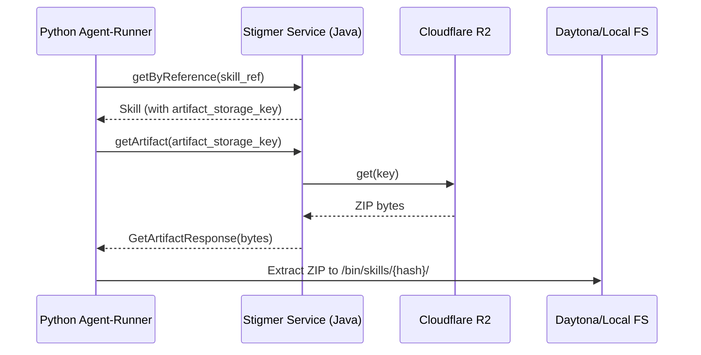

# Skill Artifact Download & Extraction

## Architecture Overview



## Design Decision: gRPC vs Direct R2 Access

**Chosen: gRPC endpoint** (Option 1)

Rationale:

- Reuses existing Java R2 infrastructure (`SkillArtifactR2Store.java`)
- No additional credential management in Python
- Centralized access control
- Skill ZIPs are typically small (<10MB) - acceptable for gRPC

---

## Implementation Steps

### 1. Proto Changes (stigmer OSS)

Add new messages and RPC to `apis/ai/stigmer/agentic/skill/v1/`:

**io.proto** - Add request/response messages:

```protobuf
// Request to download skill artifact by storage key.
message GetArtifactRequest {
  // The artifact storage key from skill.status.artifact_storage_key
  string artifact_storage_key = 1;
}

// Response containing skill artifact bytes.
message GetArtifactResponse {
  // The artifact ZIP file content.
  bytes artifact = 1;
}
```

**query.proto** - Add RPC:

```protobuf
// Download skill artifact from storage.
// Returns the ZIP file containing SKILL.md and implementation files.
rpc getArtifact(GetArtifactRequest) returns (GetArtifactResponse) {
  option (ai.stigmer.iam.iampolicy.v1.rpcauthorization.is_skip_authorization) = true;
}
```

### 2. Java Handler (stigmer-cloud)

Create `SkillGetArtifactHandler.java` in:

`backend/services/stigmer-service/src/main/java/ai/stigmer/domain/agentic/skill/request/handler/`

Key implementation:

- Inject `SkillArtifactR2Store`
- Call `r2Store.get(request.getArtifactStorageKey())`
- Return bytes in response (or throw NOT_FOUND if missing)

### 3. Python gRPC Client (stigmer OSS)

Update `backend/services/agent-runner/grpc_client/skill_client.py`:

```python
async def get_artifact(self, artifact_storage_key: str) -> bytes:
    """Download skill artifact from storage."""
    request = GetArtifactRequest(artifact_storage_key=artifact_storage_key)
    response = await self.query_stub.getArtifact(request)
    return response.artifact
```

### 4. Python Skill Writer (stigmer OSS)

Update `backend/services/agent-runner/worker/activities/graphton/skill_writer.py`:

Add artifact extraction to `SkillWriter`:

```python
def _extract_artifact(self, skill: Skill, artifact_bytes: bytes, target_dir: str) -> None:
    """Extract skill artifact ZIP to target directory."""
    with zipfile.ZipFile(io.BytesIO(artifact_bytes)) as zf:
        zf.extractall(target_dir)
```

Update `write_skills()` to accept optional artifacts dict and extract when present.

### 5. Update Execute Graphton (stigmer OSS)

Update `backend/services/agent-runner/worker/activities/execute_graphton.py`:

After fetching skills, download artifacts:

```python
# Fetch artifacts for skills that have storage keys
artifacts = {}
for skill in skills:
    if skill.status.artifact_storage_key:
        artifact = await skill_client.get_artifact(skill.status.artifact_storage_key)
        artifacts[skill.metadata.id] = artifact

# Pass artifacts to skill writer
skill_writer.write_skills(skills, artifacts=artifacts)
```

---

## Files to Modify

| Repo | File | Change |

|------|------|--------|

| stigmer | `apis/ai/stigmer/agentic/skill/v1/io.proto` | Add GetArtifactRequest/Response |

| stigmer | `apis/ai/stigmer/agentic/skill/v1/query.proto` | Add getArtifact RPC |

| stigmer-cloud | `backend/.../skill/request/handler/SkillGetArtifactHandler.java` | New handler |

| stigmer | `backend/.../agent-runner/grpc_client/skill_client.py` | Add get_artifact() |

| stigmer | `backend/.../agent-runner/worker/activities/graphton/skill_writer.py` | Add extraction |

| stigmer | `backend/.../agent-runner/worker/activities/execute_graphton.py` | Download artifacts |

---

## Implementation Order

1. **Proto definitions** (stigmer) - Foundation for both Java and Python
2. **Regenerate stubs** - Run `make build-protos` in both repos
3. **Java handler** (stigmer-cloud) - Server-side artifact retrieval
4. **Python client** (stigmer) - gRPC client method
5. **Python skill_writer** (stigmer) - Extraction logic
6. **Python execute_graphton** (stigmer) - Wire it all together

---

## Testing Notes

- R2 bucket must be configured (pending user action from previous session)
- Test with a skill that has actual executable files (not just SKILL.md)
- Verify extracted files have correct permissions (+x for scripts)