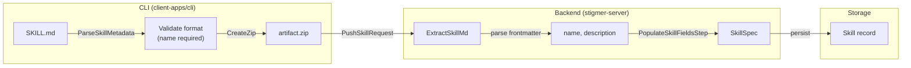

# Skill Frontmatter Backend Parsing

## Summary

Refactor skill metadata extraction to use backend as the single source of truth. The backend already extracts SKILL.md content from artifacts - it should also parse YAML frontmatter to extract `name` and `description`. This removes redundant parsing in CLI and simplifies the API.

## Design Decision (Based on Feedback)

**Principle**: Backend is the authoritative parser of SKILL.md content.

**Rationale**:
- Backend already extracts SKILL.md content from the artifact ZIP
- Parsing YAML frontmatter should happen in the same place (backend)
- CLI should only **validate** format (for fast user feedback), not extract fields for API
- Avoids duplication of parsing logic across CLI, SDKs, and other clients

## Revised Data Flow Architecture



## Task Breakdown

### Phase 1: Proto Cleanup (io.proto)

**Remove redundant fields from PushSkillRequest:**

Current `io.proto` has:
- `name` (field 1) - **REMOVE** - backend will extract from SKILL.md
- `description` (field 7) - **REMOVE** - backend will extract from SKILL.md

Keep in `spec.proto`:
- `description` (field 5) - **KEEP** - needed for storage

### Phase 2: Go Backend (stigmer OSS)

**Update `ExtractSkillMdResult` struct:**

```go
type ExtractSkillMdResult struct {
    Content     string  // Raw SKILL.md content
    Hash        string  // SHA256 of ZIP
    Name        string  // Extracted from YAML frontmatter
    Description string  // Extracted from YAML frontmatter
}
```

**Add frontmatter parsing in `zip_extractor.go`:**

```go
func parseFrontmatter(content string) (name, description string, err error) {
    // Parse YAML between --- markers
    // Return name (required) and description (optional)
}
```

**Update `PopulateSkillFieldsStep` in `push.go`:**

```go
// Before (uses request):
skill.Spec.Name = req.Name
skill.Spec.Description = req.Description

// After (uses extracted):
skill.Spec.Name = extractResult.Name
skill.Spec.Description = extractResult.Description
```

### Phase 3: Java Backend (stigmer-cloud)

Equivalent changes in Java skill push handler.

### Phase 4: CLI Cleanup

Remove name/description from `PushSkillRequest` construction:

```go
// Before:
response, err := client.Push(ctx, &skillv1.PushSkillRequest{
    Name:        metadata.Name,
    Description: metadata.Description,
    Artifact:    zipData,
    // ...
})

// After:
response, err := client.Push(ctx, &skillv1.PushSkillRequest{
    Artifact: zipData,
    // ... (no name/description)
})
```

Keep `ParseSkillMetadata` for local validation (good error messages).

## Files to Modify

| File | Change | Repo |
|------|--------|------|
| `apis/.../io.proto` | Remove name, description fields | stigmer |
| `apis/.../spec.proto` | Keep description field | stigmer |
| `backend/.../storage/zip_extractor.go` | Add frontmatter parsing | stigmer |
| `backend/.../controller/push.go` | Use extracted values | stigmer |
| `client-apps/cli/.../skill.go` | Remove fields from request | stigmer |
| Java skill handler | Add frontmatter parsing | stigmer-cloud |

## Migration Notes

- The `name` field in `PushSkillRequest` was added in a previous project
- Removing it is a breaking change - coordinate with CLI release
- Both Go and Java backends need frontmatter parsing

## Quality Checklist

- [ ] Proto linting passes after field removal
- [ ] Go backend parses frontmatter correctly
- [ ] Java backend parses frontmatter correctly
- [ ] CLI validation still provides good error messages
- [ ] All builds pass (Go, Java, Bazel)
- [ ] Tests for frontmatter parsing