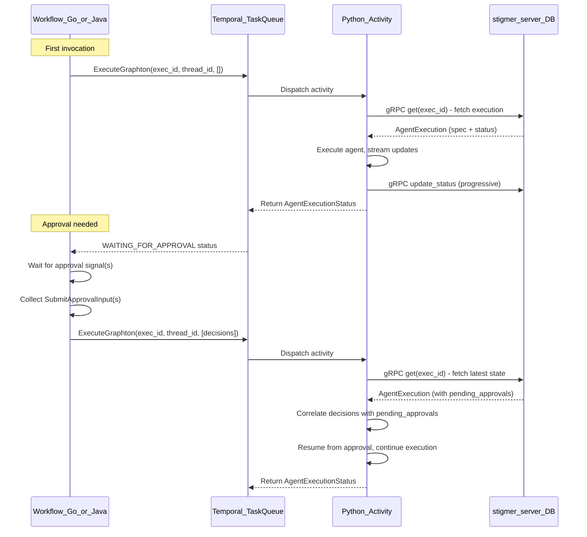

# Slim ExecuteGraphton Temporal Activity Payloads

## Problem

The `ExecuteGraphton` activity takes the full `AgentExecution` proto as input. The `status` sub-object grows unboundedly as `tool_calls` and `messages` accumulate during execution. On the HITL approval re-invocation path, the workflow reconstructs the full execution with accumulated status and passes it back through Temporal, risking Temporal's payload size limit (~2MB).

## Root Cause

The workflow's `buildExecutionWithApprovalDecision` method copies the entire accumulated status (messages, tool_calls, pending_approvals, audit, etc.) into a new `AgentExecution` object and passes it back to the Python activity. This means every re-invocation after approval carries the full history through Temporal.

## Solution

Change the activity signature from `(AgentExecution, thread_id)` to `(execution_id, thread_id, approval_decisions)`:

```
Before: ExecuteGraphton(execution: AgentExecution, thread_id: str)
After:  ExecuteGraphton(execution_id: str, thread_id: str, approval_decisions: [SubmitApprovalInput])
```

- **execution_id** (string): ~36 bytes. Activity fetches full execution via gRPC `get(execution_id)`.
- **thread_id** (string): ~36 bytes. Unchanged.
- **approval_decisions** (list of `SubmitApprovalInput`): Small, bounded. Each entry has `tool_call_id`, `action`, `comment`. Empty list on first invocation.

This eliminates the multi-MB status from Temporal payloads entirely. The extra gRPC `get` call (~10-50ms) is negligible compared to the agent execution time.

## Data Flow




## Key Design Decisions

- **Reuse `SubmitApprovalInput**` proto for approval_decisions: Already defined, available in all language stubs (Go, Java, Python), and carries exactly what the activity needs (`tool_call_id`, `action`, `comment`). No new proto definitions needed.
- **Fetch from DB, not from Temporal**: The activity already sends progressive gRPC status updates during execution. The DB has the latest persisted state. Approval decisions (which are NOT yet in the DB) are passed explicitly via the `approval_decisions` parameter.
- `**buildExecutionWithApprovalDecision` is removed**: The workflow no longer needs to reconstruct the full execution for re-invocation. It simply forwards the collected `SubmitApprovalInput` signals.

## Files to Change

### Repo: `stigmer` (Python + Go)

**1. Python gRPC client** -- [agent_execution_client.py](backend/services/agent-runner/grpc_client/agent_execution_client.py)

- Add `get(execution_id: str) -> AgentExecution` method using `AgentExecutionQueryControllerStub`
- Import `query_pb2_grpc` and `AgentExecutionId` from `io_pb2`
- Create a second stub (`query_stub`) on the existing channel

**2. Python activity** -- [execute_graphton.py](backend/services/agent-runner/worker/activities/execute_graphton.py)

- Change signature: `execute_graphton(execution_id: str, thread_id: str, approval_decisions: list | None = None)`
- At activity start: fetch `execution = await execution_client.get(execution_id)`
- Refactor approval resume logic (lines ~1309-1360): correlate `approval_decisions` parameter with `pending_approvals` from the fetched execution, instead of reading `execution.status.tool_calls` for embedded decisions
- Update all downstream references that used to read from the input `execution` parameter (they now read from the fetched execution -- this is semantically the same)

**3. Go activity stub** -- [execute_graphton.go](backend/services/stigmer-server/pkg/domain/agentexecution/temporal/activities/execute_graphton.go)

- Change interface: `ExecuteGraphton(executionID string, threadID string, approvalDecisions []*agentexecutionv1.SubmitApprovalInput) (*agentexecutionv1.AgentExecutionStatus, error)`
- Update stub implementation to pass three arguments to `workflow.ExecuteActivity`

**4. Go workflow** -- [invoke_workflow_impl.go](backend/services/stigmer-server/pkg/domain/agentexecution/temporal/workflows/invoke_workflow_impl.go)

- **Initial invocation** (~line 159): `ExecuteGraphton(executionID, threadID, nil)` instead of `ExecuteGraphton(currentExecution, threadID)`
- **Approval loop** (~lines 182-254): collect `[]*SubmitApprovalInput` from signals, pass directly to `ExecuteGraphton(executionID, threadID, approvalDecisions)` instead of building modified execution
- **Remove** `buildExecutionWithApprovalDecision` method entirely (lines ~310-377)
- Remove `currentExecution` variable tracking in approval loop (no longer needed)

### Repo: `stigmer-cloud` (Java)

**5. Java activity interface** -- `ExecuteGraphtonActivity.java`

- Change signature: `AgentExecutionStatus executeGraphton(String executionId, String threadId, List<SubmitApprovalInput> approvalDecisions) throws Exception`

**6. Java workflow** -- `InvokeAgentExecutionWorkflowImpl.java`

- **Initial invocation** (~line 525): `executeGraphton(executionId, threadId, Collections.emptyList())`
- **Approval loop** (~lines 549-648): collect `List<SubmitApprovalInput>` from signals, pass directly to `executeGraphton(executionId, threadId, approvalDecisions)`
- **Remove** `buildExecutionWithApprovalDecision` method (lines ~722-763)
- Remove `currentExecution` mutation tracking in approval loop

## Risks and Mitigations

- **Race condition on fetch**: The new activity invocation fetches from DB. The previous invocation's final status update (WAITING_FOR_APPROVAL) must be persisted before the fetch. The activity already sends this via gRPC progressively, and the workflow awaits approval signals before re-invoking, so there is ample time for persistence. We should add a defensive check in the Python activity to validate the fetched status has the expected phase.
- **Breaking change**: This is a non-backward-compatible activity signature change. In-flight workflows will fail if the Python worker is updated first (or vice versa). Since this is on the `test/agent-execution-flow-2` branch, coordinate deployment of Go/Java workflow + Python activity together. For production, consider registering as a new activity name (`ExecuteGraphtonV2`) with a migration period.

## Out of Scope

- Workflow input payload (the initial `AgentExecution` passed to the workflow itself) -- this is set once at creation and is small.
- Progressive gRPC status update mechanism -- already working correctly.
- Proto schema changes -- no new protos needed; we reuse `SubmitApprovalInput`.

