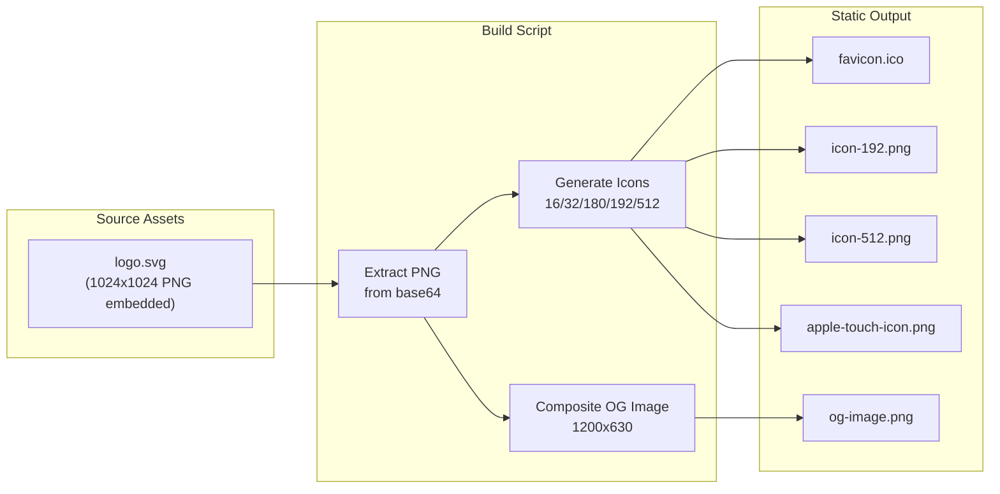

# Phase 4.2.1: Static Image Generation for GitHub Pages

## Problem Statement

The current implementation uses Next.js dynamic image routes (`icon.tsx`, `apple-icon.tsx`, `opengraph-image.tsx`, `twitter-image.tsx`) with Edge runtime. These require a server and will 404 on GitHub Pages static export, breaking:

- Favicons (broken browser tab icon)
- Apple touch icons (broken iOS home screen)
- OG images (broken social media previews on Twitter, LinkedIn, Slack)
- PWA manifest icons (broken installable web app)

## Solution Architecture

Build-time static image generation using **sharp** - the same library Next.js uses internally for image optimization. This approach is:

- **Automated**: Regenerates when logo changes
- **Reproducible**: Deterministic builds
- **Zero external dependencies**: No Puppeteer, Canvas, or browser needed
- **Industry standard**: Sharp is the de facto Node.js image library




## Implementation Details

### 1. Build Script: `scripts/generate-images.ts`

TypeScript script (not JavaScript) for type safety. Key responsibilities:

**Icon Generation:**

- Extract embedded 1024x1024 PNG from `public/logo.svg` (base64 decode)
- Generate favicon sizes: 16x16, 32x32 (combined into `favicon.ico`)
- Generate PWA icons: 192x192, 512x512
- Generate Apple touch icon: 180x180

**OG Image Generation:**

- Create 1200x630 canvas with dark gradient background
- Composite the logo at appropriate size
- Add text layers: "Stigmer", "Agents as Microservices", tagline
- Add badge elements matching the current design

The script will use sharp's compositing API for the OG image, ensuring pixel-perfect output that matches the current dynamic design.

### 2. Static Assets to Generate


| File                          | Dimensions   | Purpose              |
| ----------------------------- | ------------ | -------------------- |
| `public/favicon.ico`          | 16x16, 32x32 | Browser tab icon     |
| `public/favicon-16x16.png`    | 16x16        | Modern browsers      |
| `public/favicon-32x32.png`    | 32x32        | Modern browsers      |
| `public/apple-touch-icon.png` | 180x180      | iOS home screen      |
| `public/icon-192.png`         | 192x192      | PWA small icon       |
| `public/icon-512.png`         | 512x512      | PWA large icon       |
| `public/og-image.png`         | 1200x630     | Social media preview |


### 3. Files to Modify

**[site/package.json](site/package.json)**

- Add `sharp` as devDependency
- Add `tsx` for TypeScript execution
- Add `generate-images` script
- Update `build` to run image generation first

**[site/src/app/layout.tsx](site/src/app/layout.tsx)**

- Add explicit `icons` metadata configuration pointing to static files
- Update `openGraph.images` to reference `/og-image.png`
- Update `twitter.images` to reference `/og-image.png`
- Update structured data `logo.url` to `/og-image.png`

**[site/public/site.webmanifest](site/public/site.webmanifest)**

- Update icon references from `/icon?size=192` to `/icon-192.png`
- Update icon references from `/icon?size=512` to `/icon-512.png`

### 4. Files to Delete

Remove dynamic routes that are now replaced by static assets:

- `src/app/icon.tsx`
- `src/app/apple-icon.tsx`
- `src/app/opengraph-image.tsx`
- `src/app/twitter-image.tsx`

### 5. Build Pipeline Integration

The build command becomes:

```bash
"build": "tsx scripts/generate-images.ts && next build"
```

This ensures:

1. Images are always regenerated before build
2. Any logo updates are automatically reflected
3. CI/CD pipeline doesn't need special handling

## OG Image Design Specification

Matching the current `opengraph-image.tsx` design exactly:

**Background:**

- Gradient: `#0a0f1a` to `#1a1f2e` (135 degrees)
- Accent blur: Blue-purple gradient at 15% opacity, top-right

**Content (centered vertically):**

- Logo: 140x140 with rounded corners (20% radius), gradient background, drop shadow
- Brand name: "Stigmer" - 72px white, -0.02em letter-spacing
- Tagline: "Agents as Microservices" - 42px slate-400, -0.01em letter-spacing
- Value prop: "Build agents in YAML or Go. Deploy once. Call from everywhere via gRPC." - 28px slate-300

**Badges (horizontal, bottom):**

- "Open Source" - blue border/text
- "gRPC APIs" - purple border/text
- "YAML + SDK" - blue border/text

## Quality Validation

Before considering this complete:

1. Run `yarn build` - must succeed with no errors
2. Verify all static images exist in `out/` directory
3. Test favicon in Chrome, Safari, Firefox
4. Test OG image with Twitter Card Validator
5. Test Apple touch icon on iOS simulator
6. Run Lighthouse audit - no missing favicon warnings
7. Verify `site.webmanifest` loads correctly

## Dependencies

**New devDependencies:**

- `sharp@^0.33.x` - Image processing (MIT license)
- `tsx@^4.x` - TypeScript execution (MIT license)
- `png-to-ico@^2.x` - ICO generation (MIT license)

All dependencies are MIT licensed, well-maintained, and widely used in production.