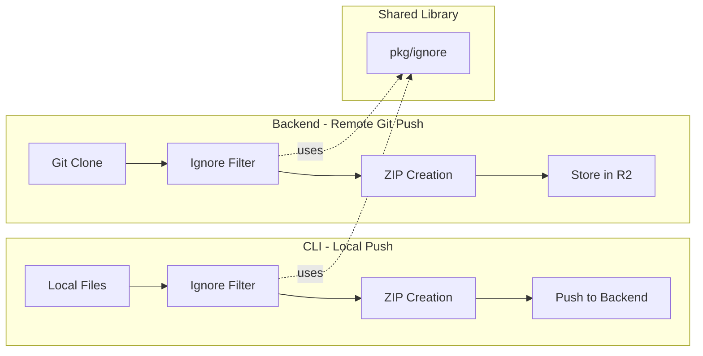

# Stigmerignore Architecture Design

## Executive Summary

After researching Git, Docker, and Buf implementations, all three use **client-side filtering** exclusively. This is the industry standard for good reasons: reduced network transfer, local context awareness, and user customization. However, Stigmer has a unique consideration: remote git push mode where the backend fetches files directly.

**Recommendation**: Implement a shared ignore library in `pkg/ignore` that can be used by both CLI (local push) and backend (remote git push).

---

## Research Findings Summary

### Git (.gitignore)

- Client-side only, never enforced on server
- Uses custom `wildmatch` algorithm (not fnmatch)
- Hierarchical: supports `.gitignore` in subdirectories with precedence rules
- Precedence: Command-line > `.gitignore` > `.git/info/exclude` > `core.excludesFile`
- Negation (`!pattern`) re-includes files, but cannot re-include if parent is excluded
- Lazy evaluation: stops recursing into ignored directories

### Docker (.dockerignore)

- Client-side only, filters before sending build context to daemon
- Uses Go's `filepath.Match` + `**` extension
- Non-recursive by default (`*.pyc` matches root only; use `**/*.pyc`)
- Single file at context root, no hierarchical support
- Patterns evaluated sequentially, last match wins

### Buf (buf.yaml excludes)

- Client-side only, configured in `buf.yaml` not separate file
- No glob/wildcard support, exact paths only
- Multiple ignore contexts (lint, breaking, policies)
- Design prioritizes explicitness over flexibility

---

## Architectural Decision: Client-Side vs Server-Side



**Decision**: Implement filtering where files are collected:

- **CLI** handles local push filtering (files are on user's machine)
- **Backend** handles remote git push filtering (files are fetched by backend)
- **Shared library** (`pkg/ignore`) provides the pattern matching logic

---

## File Precedence Model

Inspired by Git's hierarchical model but simplified for Stigmer's use case:

```
Priority (highest to lowest):
1. .stigmerignore (Stigmer-specific overrides, can use ! to re-include)
2. .gitignore (respects existing patterns developers already maintain)
3. Built-in defaults (node_modules, .git, etc.)
```

**Key Design Decision**: `.stigmerignore` has HIGHER precedence than `.gitignore`. This allows:

- Developers to exclude files from Git but include them in skill push
- Using `!pattern` in `.stigmerignore` to re-include files excluded by `.gitignore`

---

## Pattern Matching Specification

Using Git-compatible pattern syntax (not Docker's):

| Pattern | Meaning |

|---------|---------|

| `*.log` | Matches `*.log` anywhere in tree |

| `/config.yaml` | Anchored to root only |

| `build/` | Matches `build` directory only |

| `**/test/**` | Matches `test` dir at any level |

| `!important.log` | Re-includes previously excluded |

| `#` | Comment line |

**Library Choice**: Use [`go-git/go-git/v5/plumbing/format/gitignore`](https://pkg.go.dev/github.com/go-git/go-git/v5/plumbing/format/gitignore) - actively maintained (v5.16.4, Nov 2025), 176 known importers, full gitignore compatibility.

---

## Package Structure

```
client-apps/cli/
├── pkg/
│   └── ignore/                    # New package
│       ├── BUILD.bazel
│       ├── ignore.go              # Main API: NewMatcher, Match
│       ├── ignore_test.go         # Comprehensive tests
│       ├── defaults.go            # Built-in default patterns
│       ├── parser.go              # File parsing logic
│       └── doc.go                 # Package documentation
└── internal/cli/artifact/
    └── skill.go                   # Modified to use pkg/ignore
```

---

## Core API Design

```go
// pkg/ignore/ignore.go

// Matcher determines if paths should be ignored
type Matcher struct {
    patterns []Pattern
}

// Options configures matcher behavior
type Options struct {
    // RespectGitignore enables reading .gitignore files
    RespectGitignore bool
    
    // StigmerignoreFile is the path to .stigmerignore (optional)
    StigmerignoreFile string
    
    // IncludeDefaults adds built-in patterns (node_modules, .git, etc.)
    IncludeDefaults bool
}

// NewMatcher creates a matcher for the given directory
func NewMatcher(rootDir string, opts Options) (*Matcher, error)

// Match returns true if the path should be ignored
// path must be relative to rootDir, using forward slashes
func (m *Matcher) Match(path string, isDir bool) bool

// ShouldInclude is the inverse of Match (convenience method)
func (m *Matcher) ShouldInclude(path string, isDir bool) bool
```

---

## Integration with Skill Push

Modify [`client-apps/cli/internal/cli/artifact/skill.go`](client-apps/cli/internal/cli/artifact/skill.go):

```go
// createSkillZip - BEFORE (hardcoded patterns)
func createSkillZip(sourceDir string, zipWriter io.Writer) (int64, error) {
    // Uses hardcoded shouldExclude()
}

// createSkillZip - AFTER (flexible ignore system)
func createSkillZip(sourceDir string, zipWriter io.Writer) (int64, error) {
    matcher, err := ignore.NewMatcher(sourceDir, ignore.Options{
        RespectGitignore:  true,
        StigmerignoreFile: filepath.Join(sourceDir, ".stigmerignore"),
        IncludeDefaults:   true,
    })
    if err != nil {
        return 0, errors.Wrap(err, "failed to create ignore matcher")
    }
    
    // Walk and filter using matcher.ShouldInclude()
}
```

---

## Built-in Default Patterns

These patterns are always applied (can be overridden with `!` in `.stigmerignore`):

```go
// pkg/ignore/defaults.go
var DefaultPatterns = []string{
    // Version control
    ".git/",
    ".svn/",
    ".hg/",
    
    // Package managers
    "node_modules/",
    ".venv/",
    "venv/",
    "__pycache__/",
    
    // IDEs
    ".idea/",
    ".vscode/",
    "*.swp",
    "*~",
    
    // OS files
    ".DS_Store",
    "Thumbs.db",
    
    // Build artifacts
    "*.pyc",
    "*.pyo",
    "*.class",
    "*.so",
    "*.dylib",
    "*.dll",
    
    // Logs and temp
    "*.log",
    
    // Secrets (security)
    ".env",
    ".env.*",
    "*.pem",
    "*.key",
}
```

---

## Hierarchical .stigmerignore Support

Like Git, support `.stigmerignore` files in subdirectories:

```
skill-directory/
├── .stigmerignore          # Root patterns
├── src/
│   ├── .stigmerignore      # Additional patterns for src/
│   └── main.py
└── tests/
    ├── .stigmerignore      # Additional patterns for tests/
    └── test_main.py
```

**Behavior**: Patterns in subdirectory `.stigmerignore` files are relative to that directory and have higher precedence for files within it.

---

## Error Handling and User Feedback

```go
// When .stigmerignore has syntax errors, warn but continue
// This matches Git's behavior of being lenient

matcher, warnings, err := ignore.NewMatcherWithWarnings(rootDir, opts)
if err != nil {
    return err // Fatal: cannot proceed
}
for _, w := range warnings {
    fmt.Fprintf(os.Stderr, "Warning: %s\n", w)
}
```

Warnings include:

- Invalid patterns (e.g., unclosed brackets)
- Unreachable negation patterns (parent directory excluded)
- Deprecated syntax

---

## Backend Integration (Remote Git Push)

For remote git push mode, the backend will use the same library:

1. Clone repository to temp directory
2. Create matcher with same options
3. Filter files during ZIP creation
4. Store filtered ZIP in R2

This ensures consistent behavior regardless of push mode.

---

## Performance Considerations

1. **Lazy directory traversal**: Stop recursing into ignored directories
2. **Pattern caching**: Compile patterns once, reuse for all files
3. **Early termination**: Check directory patterns before entering
4. **Minimal allocations**: Use string slicing over copying

---

## Testing Strategy

1. **Unit tests**: Pattern matching for all syntax variants
2. **Integration tests**: Full skill push with various ignore scenarios
3. **Compatibility tests**: Validate against real `.gitignore` files
4. **Edge cases**: Negation, hierarchical files, encoding, symlinks

---

## Documentation

Create `SKILL.md` companion documentation explaining:

- How to create `.stigmerignore`
- Pattern syntax with examples
- Precedence rules
- Common patterns for different skill types (Python, Node.js, etc.)

---

## Migration Path

1. **Phase 1**: Implement `pkg/ignore` with full test coverage
2. **Phase 2**: Integrate with skill push, deprecate `shouldExclude()`
3. **Phase 3**: Add backend support for remote git push
4. **Phase 4**: Documentation and user guides

---

## Why This Approach

| Decision | Rationale |

|----------|-----------|

| Client-side filtering | Industry standard (Git, Docker, Buf); reduces network transfer |

| Shared library | Consistent behavior across CLI and backend; single source of truth |

| Git-compatible syntax | Developers already know it; reuse existing `.gitignore` |

| `.stigmerignore` precedence | Allows Stigmer-specific overrides without modifying `.gitignore` |

| Built-in defaults | Safe defaults prevent accidental secret/artifact inclusion |

| `go-git` library | Battle-tested, actively maintained, full compatibility |