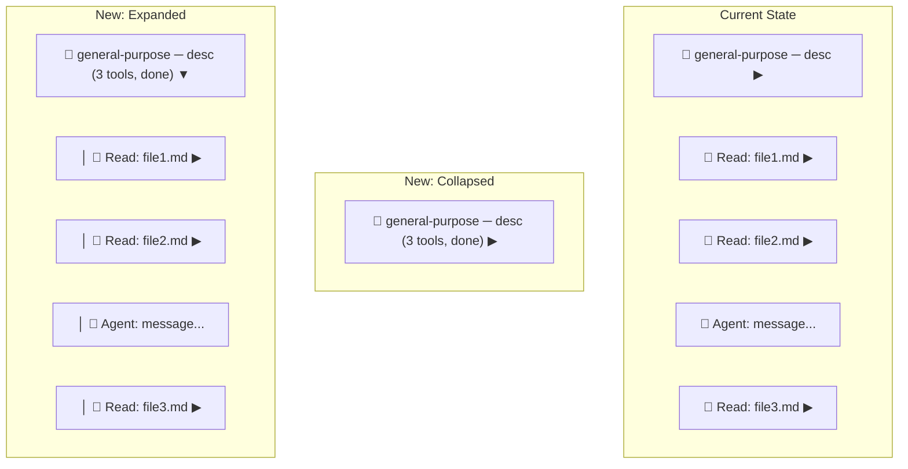

# Sub-Agent Collapsible Nesting UX

## Problem

The TUI renders all blocks -- main agent tools, sub-agent tools, AI messages -- at the same indentation level in a flat list. Once a user scrolls past the sub-agent header, there is no visual signal that a tool block belongs to a sub-agent vs. the main agent. Sub-agent content also overwhelms the screen since everything is expanded inline.

## Design Approach

Keep the flat `[]contentBlock` list (avoids rewriting scroll, focus, and line-count math) but add two capabilities:

1. **Group visibility control**: The `blockSubAgent` header's expand/collapse toggles a `hidden` field on all child blocks with matching `subAgentID`, rather than showing/hiding the task prompt.
2. **Visual nesting gutter**: When a sub-agent section is expanded, all child blocks render with a left border prefix ( `|`) so the user always knows they're inside a sub-agent context, even after scrolling.

## Target UX

**Collapsed (default):**

```
  🔀 general-purpose ─ Explore CLI sub-agent rendering  (6 tools, done) ▶
```

**Expanded:**

```
  🔀 general-purpose ─ Explore CLI sub-agent rendering  (6 tools, done) ▼
  │
  │  🤖 Agent: Let me read the relevant files...
  │
  │  📖 Read: workflows.md (810 chars, 28 lines) ▶
  │
  │  📖 Read: what-is-skill.md (16 KB, 437 lines) ▶
  │
  │  🤖 Agent: Now let me check the proto schemas...
```

## Key Design Decisions

- **Collapsed by default**: Sub-agent sections start collapsed. The header shows a live summary (tool count + status badge) so the user sees activity without noise.
- **Dynamic header updates**: As tool events arrive for a sub-agent, the header block is updated in-place with the current tool count and status -- same pattern used for todo blocks.
- **New `SubAgentCompletedEvent`**: The bridge layer detects when `SubAgentExecution.Status` transitions to a terminal state and emits a completion event, which updates the header badge from running to done/failed.
- **Gutter indentation at render time**: Applied in `renderedBlockText` as a post-processing step, not stored in block content. This ensures expand/collapse decorations and tool result expansions are all correctly indented.
- **Focus navigation skips hidden blocks**: Tab/Shift-Tab skip `hidden` blocks so the user only cycles through visible expandable items.
- **New blocks for collapsed sub-agents arrive hidden**: When a tool or AI event targets a collapsed sub-agent, the new block is created with `hidden=true` immediately, preventing flash-before-hide.

## File Changes

### Bridge Layer (1 file)

- [run_stream_subagent.go](client-apps/cli/cmd/stigmer/root/run_stream_subagent.go): Track sub-agent status per tracker. When `sa.Status` transitions to `SUB_AGENT_COMPLETED` or `SUB_AGENT_FAILED`, emit a new `SubAgentCompletedEvent`. Pass `len(sa.ToolCalls)` in the event for the header summary.

### TUI (7 files)

- [events.go](client-apps/cli/pkg/executiontui/events.go): Add `SubAgentCompletedEvent` with fields `ID`, `Status`, `ToolCount`, `Output`.
- [blocks.go](client-apps/cli/pkg/executiontui/blocks.go): Add `hidden bool` field to `contentBlock`. Modify `newSubAgentBlock` so it starts collapsed (`expanded: false`) -- this is already the case but now its expand/collapse controls group visibility, not prompt display.
- [model.go](client-apps/cli/pkg/executiontui/model.go): Add `subAgentBlockIdx map[string]int` to track header block index per sub-agent. Extend `subAgentInfo` with `ToolCount int` and `Status string` fields for dynamic header content.
- [render_blocks.go](client-apps/cli/pkg/executiontui/render_blocks.go):
  - Add `indentForSubAgent(text string) string` -- prepends `dimStyle.Render("  │ ")` to every line
  - Update `renderedBlockText`: after expand/collapse decoration, apply `indentForSubAgent` for blocks with non-empty `subAgentID` that are not `blockSubAgent` themselves
  - Update `rebuildViewportContent`: skip blocks where `hidden == true`
  - Update `renderSubAgentHeader` to include tool count and status badge: `"🔀 name ─ description  (N tools, status)"`
  - Remove the prompt-expansion logic from `renderSubAgentHeaderExpanded` / `newSubAgentBlock` -- the header no longer shows the prompt; it controls child visibility
- [handle_events.go](client-apps/cli/pkg/executiontui/handle_events.go):
  - `SubAgentStartedEvent`: Store header block index in `m.subAgentBlockIdx[e.ID]`. All subsequent child blocks for this sub-agent start with `hidden = !m.blocks[headerIdx].expanded` (collapsed by default = hidden).
  - `SubAgentCompletedEvent` (new): Update `subAgentInfo.Status` and `subAgentInfo.ToolCount`, rebuild header block preview/full in-place.
  - `updateToolBadge`: When `subAgentID != ""`, increment `subAgentInfo.ToolCount` (only on first creation, not updates), rebuild the sub-agent header, and set `hidden` on the new block if the sub-agent is collapsed.
  - AI message events: Set `hidden` based on sub-agent collapsed state when `SubAgentID != ""`.
  - Add `updateSubAgentHeader(subAgentID string)` helper that rebuilds the header block's `preview` and `full` content from current `subAgentInfo` and writes it back to `m.blocks[m.subAgentBlockIdx[subAgentID]]`.
- [focus.go](client-apps/cli/pkg/executiontui/focus.go):
  - `focusNextExpandable` / `focusPrevExpandable`: Add `!b.hidden` check alongside `b.expandable`.
  - `toggleFocusedBlock`: When the toggled block is `blockSubAgent`, call `m.toggleSubAgentChildren(b.subAgentID)` which iterates all blocks with matching `subAgentID` (excluding the header) and sets `hidden = !b.expanded`.
  - `hasExpandableBlocks`: Skip `hidden` blocks.
- [scroll.go](client-apps/cli/pkg/executiontui/scroll.go):
  - `blockStartLine`: Skip blocks where `hidden == true` (they contribute 0 height and 0 separator).
  - `blockLineCount`: Return 0 for `hidden` blocks.

## Architecture Safeguards

- **No proto schema changes**: Uses existing `SubAgentExecution.status` and `SubAgentExecution.tool_calls` length -- no `buf generate` needed.
- **No new block types**: Reuses `blockSubAgent` with changed expand/collapse semantics.
- **Backward compatible**: If a sub-agent has no header (orphaned blocks), the `needsSubAgentSeparator` fallback still works -- those blocks are never hidden because there's no header to control them.
- **No nested sub-agents in the current model**: `SubAgentExecution` doesn't contain `sub_agent_executions`, so we only need one level of nesting. The indentation and hidden logic are scoped to blocks with a non-empty `subAgentID` matching a known header.

## Visual Reference




