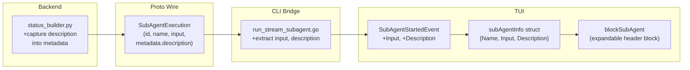

# Sub-Agent Header Block: From Dim Separator to Informative Context

## Problem

When a sub-agent executes, the CLI shows only `── general-purpose ──` -- a dim separator line with no indication of what task was delegated, what prompt was given, or when it started. The proto `SubAgentExecution` already carries `input` (the full task prompt) and `started_at`, but the bridge layer drops both fields. Additionally, the backend never captures the `description` field (3-5 word summary) from the task tool args.

## Target UX

**Collapsed (default):**

```
  🔀 general-purpose ─ Explore CLI sub-agent rendering ▶
```

**Focused + Collapsed:**

```
▸ 🔀 general-purpose ─ Explore CLI sub-agent rendering ▶
```

**Expanded:**

```
  🔀 general-purpose ─ Explore CLI sub-agent rendering ▼
     │ I need to understand how sub-agent execution is currently
     │ rendered in the Stigmer CLI. The CLI is a Go application
     │ located at /Users/suresh/scm/github.com/stigmer/stigmer/...
```

This follows the same expand/collapse pattern as tool blocks (Tab to focus, Enter to toggle), giving the user task context at a glance and full prompt on demand.

## Architecture

No proto schema changes required. The existing `SubAgentExecution.metadata` (google.protobuf.Struct) carries the `description` field. The `input` field is already populated.




## Changes by Layer

### 1. Backend: Capture `description` into metadata

**File:** `[backend/services/agent-runner/worker/activities/graphton/status_builder.py](backend/services/agent-runner/worker/activities/graphton/status_builder.py)`

In `_handle_sub_agent_start`, extract `description` from `tool_args` and store it in the `SubAgentExecution.metadata` Struct:

```python
sub_agent_description = tool_args.get("description", "")
metadata = Struct()
if sub_agent_description:
    metadata.update({"description": sub_agent_description})

sub_agent = SubAgentExecution(
    ...
    metadata=metadata if metadata.fields else None,
)
```

This avoids proto field additions while carrying the data.

### 2. Events: Enrich `SubAgentStartedEvent`

**File:** `[client-apps/cli/pkg/executiontui/events.go](client-apps/cli/pkg/executiontui/events.go)`

Add `Input` and `Description` fields to `SubAgentStartedEvent`:

```go
type SubAgentStartedEvent struct {
    ID          string
    Name        string
    Input       string // full task prompt from SubAgentExecution.input
    Description string // 3-5 word summary from metadata.description
}
```

### 3. Bridge: Thread data through

**File:** `[client-apps/cli/cmd/stigmer/root/run_stream_subagent.go](client-apps/cli/cmd/stigmer/root/run_stream_subagent.go)`

In `emitSubAgentEvents`, extract `Input` and `Description` from `sa` and populate the event:

```go
desc := ""
if sa.Metadata != nil {
    if v, ok := sa.Metadata.Fields["description"]; ok {
        desc = v.GetStringValue()
    }
}

events <- executiontui.SubAgentStartedEvent{
    ID:          sa.Id,
    Name:        sa.Name,
    Input:       sa.Input,
    Description: desc,
}
```

### 4. Model: Store sub-agent metadata struct

**File:** `[client-apps/cli/pkg/executiontui/model.go](client-apps/cli/pkg/executiontui/model.go)`

Replace `subAgentNames map[string]string` with a richer struct:

```go
type subAgentInfo struct {
    Name        string
    Input       string
    Description string
}

// In Model:
subAgentMeta map[string]subAgentInfo  // replaces subAgentNames
```

### 5. Blocks: Add `blockSubAgent` type

**File:** `[client-apps/cli/pkg/executiontui/blocks.go](client-apps/cli/pkg/executiontui/blocks.go)`

- Add `blockSubAgent` to the `blockType` enum
- Add `newSubAgentBlock(name, description, input string)` constructor that creates an expandable block:
  - `preview`: `renderSubAgentHeader(name, description)` (collapsed view)
  - `full`: `renderSubAgentHeaderExpanded(name, description, input)` (expanded view)
  - `expandable: true`, `expanded: false`
  - `subAgentID` and `subAgentName` set for context separator compatibility

### 6. Rendering: Sub-agent header rendering

**File:** `[client-apps/cli/pkg/executiontui/render_blocks.go](client-apps/cli/pkg/executiontui/render_blocks.go)`

Replace `renderSubAgentSeparator` with two functions:

- `**renderSubAgentHeader(name, description string)`**: Returns `🔀 name ─ description`. Uses `description` if available, falls back to truncated `input` (first ~80 chars, word-boundary-aware).
- `**renderSubAgentHeaderExpanded(name, description, input string)`**: Same header line, plus the full `input` rendered in gutter-bordered lines (`│ ...`), mirroring `renderStreamingTool`'s visual language.

Update `rebuildViewportContent`: The sub-agent header is now a regular block in the `blocks` slice (inserted by `SubAgentStartedEvent` handler). Remove the `needsSubAgentSeparator` check for blocks that immediately follow a `blockSubAgent` block for the same sub-agent. Keep the lightweight separator for rare context re-entry cases (returning to a sub-agent after main agent).

### 7. Event handling: Create header block on start

**File:** `[client-apps/cli/pkg/executiontui/handle_events.go](client-apps/cli/pkg/executiontui/handle_events.go)`

In the `SubAgentStartedEvent` handler:

```go
case SubAgentStartedEvent:
    info := subAgentInfo{Name: e.Name, Input: e.Input, Description: e.Description}
    m.subAgentMeta[e.ID] = info
    b := newSubAgentBlock(e.Name, e.Description, e.Input)
    b.subAgentID = e.ID
    b.subAgentName = e.Name
    m.blocks = append(m.blocks, b)
```

### 8. Scroll: Simplify separator accounting

**File:** `[client-apps/cli/pkg/executiontui/scroll.go](client-apps/cli/pkg/executiontui/scroll.go)`

The separator accounting in `blockStartLine` needs to be aware that `blockSubAgent` blocks serve as their own separator. When a block follows a `blockSubAgent` block with the same `subAgentID`, no separator should be counted. This is handled naturally if `needsSubAgentSeparator` is updated correctly in Step 6.

### 9. Backward compatibility for `subAgentNames`

All existing code that reads `m.subAgentNames[id]` (in `handle_events.go` for setting `subAgentName` on blocks) needs to be updated to read from `m.subAgentMeta[id].Name`. This is a straightforward find-and-replace.

## Scope Boundaries

- **No proto schema changes**: Uses existing `metadata` Struct field
- **No new proto field regeneration**: Zero `buf generate` needed
- **Backend change is additive**: Only adds metadata, doesn't change existing fields
- **CLI change is self-contained**: All changes within `executiontui` package + bridge layer

